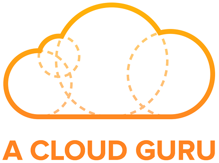

# DevOps Tips!
A Repository to concentrate all my *Notes* and *Readings* about DevOps and SRE concepts.

This repository is inspired by this [Kamranahmedse](https://github.com/kamranahmedse) DevOps Roadmap:

## 0. Code Version Control

- **GIT** 
  - [My Notes](git.md)

## 1. Learn a Programming Language

- **Developer Skills**
  - [15 Tips on How to Improve as a Junior Developer](https://www.codementor.io/learn-programming/15-ways-to-improve-as-a-junior-developer)

- **Python**
  - [PyTricks](pytricks.md)
  - [Python’s Requests Library (Guide)](https://realpython.com/python-requests/)
  - [Live de Python](https://github.com/dunossauro/live-de-python/tree/master/codigo)
  - [What exactly can you do with Python? Here are Python’s 3 main applications ](https://medium.freecodecamp.org/what-can-you-do-with-python-the-3-main-applications-518db9a68a78)
  - [Python 101: The Basics](https://medium.com/the-renaissance-developer/python-101-the-basics-441136fb7cc3)
  - [Python 101: Data Structures](https://medium.com/the-renaissance-developer/python-101-data-structures-a397bcc2bd30)
  - [Python 101: Object Oriented Programming part 1](https://medium.com/the-renaissance-developer/search?q=Python%20101)
  - [Python 101: Object Oriented Programming part 2](https://medium.com/the-renaissance-developer/python-101-object-oriented-programming-part-2-8e0db3ddd531)
  - [Learning Python: From Zero to Hero](https://medium.freecodecamp.org/learning-python-from-zero-to-hero-120ea540b567)
  - [Comparing Python Virtual Environment tools ](https://towardsdatascience.com/comparing-python-virtual-environment-tools-9a6543643a44)
  - [Replacing Bash Script with Python](https://github.com/ninjaaron/replacing-bash-scripting-with-python)
  - [10 Python File System Methods You Should Know](https://towardsdatascience.com/10-python-file-system-methods-you-should-know-799f90ef13c2)
  - [Everything About Python - Beginner To Advanced](https://medium.com/fintechexplained/everything-about-python-from-beginner-to-advance-level-227d52ef32d2)
  - [Python Systemd Tutorial](https://github.com/torfsen/python-systemd-tutorial)

- **Django**

  - [Modern Django — Part 0: Introduction and Initial Setup](https://medium.com/@djstein/modern-django-part-0-introduction-and-initial-setup-657df48f08f8)
  - [Modern Django — Part 1: Project Refactor and Meeting the Django Settings API](https://medium.com/@djstein/modern-django-part-1-project-refactor-and-meeting-the-django-settings-api-d2784efb606f)
  - [Modern Django — Part 2: REST APIs, Apps, and Django REST Framework](https://medium.com/@djstein/modern-django-part-2-rest-apis-apps-and-django-rest-framework-ea0cac5ab104)

## 2. Understand different OS Concepts

- **Process Management**
  - [lsof ](https://medium.com/@copyconstruct/lsof-f2b224eee7b5)
  - [A Guide to the Linux “Top” Command](https://www.booleanworld.com/guide-linux-top-command/)

## 3. Learn about Managing Servers

### Operating System

  - **Linux**

    - [Linux Engineer (LPI 201)](lpi201.md)

### Learn to live in Terminal
- **Text Manipulation Tools**
  - [The SED command](https://linuxacademy.com/blog/tutorials/the-sed-command-bash-basics/)

## 4. Networking and Security

- **HTTP**
  - [MDN Web Docs](https://developer.mozilla.org/pt-BR/docs/Web/HTTP)

- **TTL**
  - [time-to-live (TTL)](https://searchnetworking.techtarget.com/definition/time-to-live)  

- **Networking for Web Developers** 
  - [My Notes](nfwd.md)

- **Cisco CCNA Datacenter Concepts**
  - [My Notes](ccnadc.md)

## 5. What is and how to setup a ______

### 5.1. Web Server

- **NGINX**
  - [Nginx Fundamentals: High Performance Servers from Scratch - My Notes ](nginx.md)
  - [Nginx Admin's Handbook](https://github.com/trimstray/nginx-admins-handbook)
  - [Dynamic DNS Resolution in Nginx](https://medium.com/driven-by-code/dynamic-dns-resolution-in-nginx-22133c22e3ab)
  - [Logging HTTP Request Metadata With Nginx, Lua, Logstash, and Elasticsearch](https://dzone.com/articles/logging-http-request-metadata-with-nginx-lua-logst)

## 6. Learn Infrastructure as Code

- **Containers**
  - **Docker**
    - [My Notes](docker.md)
    - [Docker, containers, VMs and orchestration technology for the beginners](https://medium.com/faun/docker-containers-vms-and-orchestration-technology-for-the-beginners-68ae979bce5a)

  - **Kubernetes**
    - [Learn Kubernetes in Under 3 Hours: A Detailed Guide to Orchestrating Containers](https://medium.freecodecamp.org/learn-kubernetes-in-under-3-hours-a-detailed-guide-to-orchestrating-containers-114ff420e882)
    - [Kubernetes Cheat Sheet](https://linuxacademy.com/blog/containers/kubernetes-cheat-sheet/)
    - [Kubernetes basic glossary](https://blog.lelonek.me/kubernetes-basic-glossary-9ca0416e3948)

- **Configuration Management**
  - **Ansible**
      - [Getting Started With Ansible](https://dzone.com/articles/getting-started-with-ansible)
      - [How to use Ansible to document procedures](https://opensource.com/article/19/4/ansible-procedures)
      - [Adventures with Ansible: Lessons learned from real-world deployments](https://www.redhat.com/en/blog/adventures-ansible-lessons-learned-real-world-deployments)

- **Infrastructure Provisioning**
  - **Vagrant**
    - [My Notes](vagrant.md)

  - **Terraform**
    - [My Notes](terraform.md)
    - [Terraform CLI Cheat Sheet](https://dzone.com/articles/terraform-cli-cheat-sheet)

## 7. Learn some CI/CD Tool

- **[Articles]**
    - [What is CICD — Concepts in Continuous Integration and Deployment](https://medium.com/@nirespire/what-is-cicd-concepts-in-continuous-integration-and-deployment-4fe3f6625007)

## 8. Learn how to monitor software and infrastructure

### 8.2. Application Monitoring

- **New Relic**
    - [My Notes](newrelic.md)
    - [Best Practices for Monitoring Cloud-Based Applications and Infrastructure](https://newrelic.com/resource/best-practices-for-monitoring-your-move-to-the-cloud)
    - [Best Practices for Monitoring Digital Customer Experience](https://newrelic.com/resource/digital-customer-experience-best-practices)

### 8.3. Logs Management

- **ELK Stack**
  - **[Udemy] Elasticsearch 6 and Elastic Stack - In Depth and Hands On!**
    - [My Notes](elk.md)

  - **[Articles]**
    - [EFK (ElasticSearch + Filebeat + Kibana)](https://medium.com/m4u-tech/efk-elasticsearch-filebeat-kibana-23469673dd5e)
    - [Introduction to Elasticsearch and the ELK Stack, Part 1 ](https://dzone.com/articles/introduction-to-elasticsearch-and-the-elk-stack)
    - [Introduction to Elasticsearch and the ELK Stack, Part 2 ](https://dzone.com/articles/introduction-to-elasticsearch-and-the-elk-stack-pa)
    - [How To Install Elasticsearch, Logstash, and Kibana (Elastic Stack) on Ubuntu 18.04](https://www.digitalocean.com/community/tutorials/how-to-install-elasticsearch-logstash-and-kibana-elastic-stack-on-ubuntu-18-04)

- **Prometheus**

  - **[Articles]**

    - [How To Query Prometheus on Ubuntu 14.04 Part 1](https://www.digitalocean.com/community/tutorials/how-to-query-prometheus-on-ubuntu-14-04-part-1)
    - [How To Query Prometheus on Ubuntu 14.04 Part 2](https://www.digitalocean.com/community/tutorials/how-to-query-prometheus-on-ubuntu-14-04-part-2)
    - [Querying Prometheus (Basics)](https://prometheus.io/docs/prometheus/latest/querying/basics/)

## 9. Cloud Providers

### **AWS**

- **AWS Certified Solutions Architect - Preparation**
  - [A Cloud Guru - Exam Tips](acsa.md) 
  - [AWS Solutions Training for Partners: Foundations (Notes)](astpf.md) 
  - [Why and How I got 5/5 AWS Certifications in six months](https://medium.com/@anurag.dimri/why-and-how-i-got-5-5-aws-certifications-d72ea751dae2)
  - [AWS Certified Solutions Architect - Exam Guide](https://d1.awsstatic.com/training-and-certification/docs-sa-assoc/AWS_Certified_Solutions_Architect_Associate_Feb_2018_%20Exam_Guide_v1.5.2.pdf)

- **AWS Official FAQ's (To Certified Solutions Architect Exam)**
  - _[Amazon Elastic Compute Cloud - EC2](https://aws.amazon.com/pt/ec2/)_
  - _[Amazon Elastic Load Balancing - ELB](https://aws.amazon.com/pt/elasticloadbalancing/)_
  - _[Amazon Relational Database Service - RDS](https://aws.amazon.com/pt/rds/)_
  - _[Amazon Simple Storage Service - S3](https://aws.amazon.com/pt/s3/)_
  - _[Amazon Simple Queue Service - SQS](https://aws.amazon.com/pt/sqs/)_
  - _[Amazon Virtual Private Cloud - VPC](https://aws.amazon.com/pt/vpc/)_

#

- **AWS Certified Developer Associate - Preparation**
  - [How To Pass The AWS Certified Developer Associate Exam](https://medium.com/faun/passing-the-aws-certified-developer-associate-exam-c83c894cb780)

- **Amazon AWS Concepts and Resources**
  - [Amazon Web Services - A practical guide](https://github.com/open-guides/og-aws)
  - [AWS Transit Gateway Routing in Multiple Accounts](https://medium.com/driven-by-code/aws-transit-gateway-routing-in-multiple-accounts-713b10ca7b34)  

## 10. Big Data, Data Science and Machine Learning

### Data Science

- **Articles**
  - [How To Get Your Data Scientist Career Started ](https://www.forbes.com/sites/louiscolumbus/2019/04/14/how-to-get-your-data-scientist-career-started/#1e5fe9f47e5c)
  - [Learning Data Science: Our Favorite Resources To Learn Data Science From Free To Not](https://hackernoon.com/learning-data-science-our-favorite-resources-to-learn-data-science-from-free-to-not-47beb6424de1)
  - [Machine Learning for Operations](https://thenewstack.io/machine-learning-for-operations/)
  - [How 20th Century Fox uses ML to predict a movie audience](https://cloud.google.com/blog/products/ai-machine-learning/how-20th-century-fox-uses-ml-to-predict-a-movie-audience)
  - [How To Get Your Data Scientist Career Started](https://www.forbes.com/sites/louiscolumbus/2019/04/14/how-to-get-your-data-scientist-career-started/)
  - [Causal Data Science](https://medium.com/causal-data-science/causal-data-science-721ed63a4027)
  - [Introducing AresDB: Uber’s GPU-Powered Open Source, Real-time Analytics Engine](https://eng.uber.com/aresdb/)

### Apache Hadoop

- **[Coursera] Hadoop Platform and Application Framework**
  - [My Notes](hpaf.md) 
  - [Big Data in Little Spaces: Hadoop and Spark At The Edge](https://www.nextplatform.com/2019/04/09/big-data-in-little-spaces-hadoop-and-spark-at-the-edge/)

## 11. DevOps and SRE Culture and Concepts

- **DevOps**
  - [LPI DevOps Tools Engineer - Exam 701 Preparation](lpi701.md) 
  - [DevOps Essentials](devops-essentials.md) 
  - [DevOps Launch Checklist](https://sysadmincasts.com/episodes/70-devops-launch-checklist)

- **SRE**
  - [SRE fundamentals: SLIs, SLAs and SLOs](https://cloud.google.com/blog/products/gcp/sre-fundamentals-slis-slas-and-slos)
  - [How to Avoid the 5 SRE Implementation Traps that Catch Even the Best Teams](https://thenewstack.io/how-to-avoid-the-5-sre-implementation-traps-that-catch-even-the-best-teams/)
  - [When SREs and Kubernetes Are Worth It — And When They Aren’t](https://thenewstack.io/a-google-engineer-on-when-an-sre-and-kubernetes-are-and-not-worth-it/)
