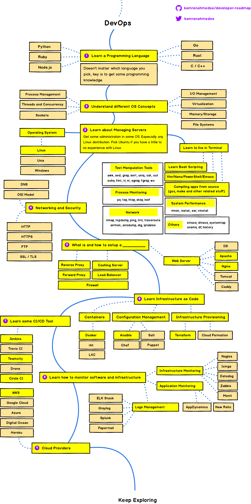

# DevOps Tips!
A Repository to concentrate all my *Tips* and *Readings* about DevOps and SRE concepts.

This repository is based in this [Kamranahmedse](https://github.com/kamranahmedse) DevOps Roadmap:

## 0. Code Version Control

- **GIT** 
  - [Tips](git.md)

#

## 1. Learn a Programming Language

- **Python**
  - [Comparing Python Virtual Environment tools ](https://towardsdatascience.com/comparing-python-virtual-environment-tools-9a6543643a44)

#

## 3. Learn about Managing Servers

- **Process Monitoring**
  - [lsof](https://medium.com/@copyconstruct/lsof-f2b224eee7b5)
  - [top](https://www.booleanworld.com/guide-linux-top-command/)

#

## 4. Networking and Security

- **HTTP**
  - [MDN Web Docs](https://developer.mozilla.org/pt-BR/docs/Web/HTTP)

- **Networking for Web Developers** 
  - [Tips](nfwd.md)

- **Cisco CCNA Datacenter Concepts**
  - [Tips](ccnadc.md)

#

## 5. What is and how to setup a ______

### 5.1. Web Server

- **NGINX** 
  - [Nginx Fundamentals: High Performance Servers from Scratch](nginx.md)

#

## 6. Learn Infrastructure as Code

- **Vagrant**
  - [Tips](vagrant.md)

#

## 8. Learn how to monitor software and infrastructure

### 8.2. Application Monitoring

- **New Relic**
  - [Tips](newrelic.md)

### 8.3. Logs Management

- **ELK Stack**
  - **[Udemy] Elasticsearch 6 and Elastic Stack - In Depth and Hands On!**
    - [My Notes](elk.md)

  - **[Articles]**
    - [Introduction to Elasticsearch and the ELK Stack, Part 1 ](https://dzone.com/articles/introduction-to-elasticsearch-and-the-elk-stack)
    - [Introduction to Elasticsearch and the ELK Stack, Part 2](https://dzone.com/articles/introduction-to-elasticsearch-and-the-elk-stack-pa)
    - [How To Install Elasticsearch, Logstash, and Kibana (Elastic Stack) on Ubuntu 18.04](https://www.digitalocean.com/community/tutorials/how-to-install-elasticsearch-logstash-and-kibana-elastic-stack-on-ubuntu-18-04)

- **Prometheus**

  - **[Articles]**

    - [How To Query Prometheus on Ubuntu 14.04 Part 1](https://www.digitalocean.com/community/tutorials/how-to-query-prometheus-on-ubuntu-14-04-part-1)
    - [How To Query Prometheus on Ubuntu 14.04 Part 2](https://www.digitalocean.com/community/tutorials/how-to-query-prometheus-on-ubuntu-14-04-part-2)
    - [Querying Prometheus](https://prometheus.io/docs/prometheus/latest/querying/basics/)

#

## 9. Cloud Providers

### **AWS**

- **AWS Certified Solutions Architecht**
  - [A Cloud Guru - Exam Tips](acsa.md) 
  - [Amazon Web Services - A practical guide](https://github.com/open-guides/og-aws)

#

## 10. Big Data, Data Science and Machine Learning

### Data Science

- **Articles**
  - [How To Get Your Data Scientist Career Started ](https://www.forbes.com/sites/louiscolumbus/2019/04/14/how-to-get-your-data-scientist-career-started/#1e5fe9f47e5c)

### Apache Hadoop

- **[Coursera] Hadoop Platform and Application Framework** 
  - [My Notes](hpaf.md)
