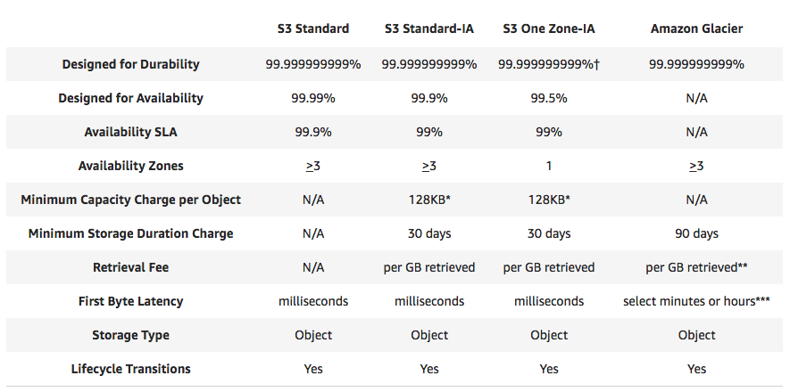

# :cloud: AWS Certified Solutions Architecht - My Notes :cloud:

## Exam Blue Print

- 130 minutes in lenght

- 60 questions _(this can change)_

- Multiple choice

- Results are between 100-1000 with a passing score of 720

- Aim for 70%

- Qualification is valid for 2 years

- Scenario based questions

#

## The 10.000 foot overview 2018

- **Region** - A geographycal area or a physical location with two or more availability zones.

- **Availability Zone** - Discrete data centers with redundant power, networking and connectivity in separate facilities.

- **Edge Location** - Endpoints for AWS for caching content. Consists in CloudFront, Amazon's Content Delivery Network (CDN). *PS: There are many more edge locations than regions*

#

## AWS Services

### Compute

- **EC2** - Elastic Cloud (Compute)
  - Virtual Machines

- **EC2 Container Services** - Containers
  - Data containers at scale

- **Elastic Beanstalk** - Autoscaling deployment tool

- **Lambda** - Serverless computing

- **Lightsail** - Amazon's VPN Service

- **Batch** - Batch computing

#

### Storage

- **S3** - Simple Storage Service
  - Object based storage
  - Upload files to buckets

- **EFS** - Elastic File System
  - Network attached storage
  - Store files in NFS volumes and mount to multiple virtual machines

- **Glacier** - Data archive

- **Snowball** - A huge storage

- **Storage Gateway** - Virtual appliances to replicate local information to S3

#

### Databases

- **RDS** - Relational Database Service
  - MySQL, Microsoft SQL and Aurora (Amazon)

- **DynamoDB** - Non-Relational databases

- **Elasticache** - A way of caching
  - Queries data from your database server

- **Redshift** - A datawarehouse or business intelligence

#

### Migration

- **AWS Migration Hub** - Application tracking service

- **Application Discovery Service** - A tool for discover services and their dependencies

- **Database Migration Service** - A tool for migrate on premise databases into AWS

- **Server Migration Service** - A tool for migrate virtual and physical servers into AWS Cloud

- **Snowball** - A tool for migrate large amounts of data into AWS Cloud _(Terabytes)_

#

### Networking & Content Delivery

- **VPC** - Virtual Private Cloud
  - A virtual datacenter (to configure firewall, availability zones and network addresses)

- **CloudFront** - Amazon's content delivery network

- **Route 53** - Amazon's DNS Service

- **API Gateway** - A tool to creating personal API's

- **Direct Connect** - A tool to stablish a dedicated connection between on-premises network and Amazon's VPC

#

### Management Tools

- **Cloudwatch** - Monitoring Service _(Very important to the exam)_ :star:

- **CloudFormation** - Infrastructure as Code tool _(Very important to the exam)_ :star:

- **CloudTrail** - A log tool for all AWS changes and operations _(Very important to the exam)_ :star:

- **Config** - Monitors the configuration of your entire AWS Environment with snapshots

- **OpsWorks** -  A tool to automate your environment, like ansible, puppet or chef

- **Service Catalog** - Manage catalogs of IT Services _(Very important to the exam)_ :star:

- **Systems Manager** - An interface to manage your AWS resources _(It's not important for the exam)_ :star:

- **Trusted Advisor** - An advisor to the possibly fails or problems in your AWS environment

- **Managed Services**

#

### Analytics

- **EMR** - Elastic MapReduce - A tool for process great amounts of data

- **Kinesis** - A tool for look and analyze real-time streaming data on AWS

- **Data Pipeline** - A tool to share data between your AWS applications

#

### Identity Access Management - 101 

_(https://aws.amazon.com/pt/iam/)_

- **What Is IAM?**

  - **IAM** allows you to manage users and their level of access to the AWS Console.

- **Key Features of IAM**

  - Identity Access Management (IAM) offers the following features:

    - Centralised control of your AWS account;

    - Shared Access to your AWS account;

    - Granular permissions;

    - Identity Federation (including Active Directory, Facebook, Linkedin etc);

    - Multifactor Authentication;

    - Provide temporary access for users/devices and services where necessary;

    - Allows you to set up your own password rotation policy;

    - Integrates with many different AWS services;

    - Supports PCI DSS Compliance.

- **Key Terminology For IAM**

  1. **Users:** End users such as people, employees of an organization, etc;

  2. **Groups:** A collection of users. Each user in the group will inherit the permissions of the group.

  3. **Policies:** Policies are made up of documents, called Policy Documents. These documents are in a format called JSON and they give pemissions as to what a User/Group/Role is able to do.

  4. **Roles:** You create roles and then assign them to AWS Resources.

#

**IAM Lab**

- **Recommendations and best practices**

  - Personallize IAM user login link;  

  - Activate MFA (Multi-factor Authentication);

  - Create users;

  - Create groups;

  - Create roles;

- **OBS:**

  - **IAM is universal**. It does note apply to regions at this time;

  - The **"root account"** is simply yhe account created when first setup your AWS account. It has complete Admin access;

  - New users have **NO permissions** when first created;

  - New users are assigned **Access Key ID & Secret Access Keys** when first created;

  - **These are not the same as a password.** You cannot use the Access Key ID & Secret Access Key to login in the console. You can use this to access AWS via the APIs and Command Line, however;

  - **You only get to view these once.** If you lose them, you have to regenerate them. So, save them in a secure location;

  - **Always setup Multifactor Authentication on your root account;**

  - **You can create and customise your own password rotation policies;**

#

- **IAM policy example (JSON):**

```
  {
    "Version":"2012-10-17",
    "Statement":[
      {
        "Effect": "Allow",
        "Action": "*",
        "Resource:" "*"
      }
    ]
  }
```

#

### S3 - 101 

_(https://aws.amazon.com/pt/s3/)_

- **What is Amazon S3 (Simple Storage Service)?**

  - **S3** provides developers and IT teams with secure, durable, highly-scalable object storage. Amazon S3 is easy to use, with a simple web services interface to store and retrieve any amount of data from anywhere on the web. S3 is a safe place to store your files. It is a Object-based storage. The data is spread across multiple devices and facilities.

- **S3 - The basics**

  - S3 is Object-based - i.e. allows you to upload files;

  - Files can be from 0 bytes to 5 terabytes;

  - There is unlimited storage. But, you have to be careful with your budget;

  - Files are storage in buckets*;

  - S3 is a universal namespace. That is, names must be unique globally;

  - https://s3-eu-west-1.amazonaws.com/acloudguru

  - When you upload a file to S3, you will receive a HTTP 200 code if the upload was successfull.

  _*Buckets: It´s basically a folder which you´re going to store all your objects and objects are simply files._

- **Data Consistency Model for S3** :star:

  - Read after write consistency for PUTS of new objects;

  - Eventual consistency for overwrite PUTS and DELETES (can take some time to propagate);

- **S3 is a simple key-value store**

  - S3 is object based. Objects consist of the following:

    - Key (This is simply the name of the object);

    - Value (This is simply the data and is made up of a sequence of bytes);

    - Version ID (Important of Versioning);

    - Metadata (Data about data you storing);

    - Subresources:

      - Access control lists;

      - Torrent.

- **S3 - The Basics (Again!!!)**

  - Built for 99.99% availability for the S3 platform;

  - Amazon guarantees 99.9% availability;

  - Amazon guarantees 99.999999999% durability for S3 information (Remember 11 x 9s);

  - Tiered storage available;

  - Lifecycle management;

  - Versioning;

  - Encryption;

  - Secure your data using Access Control Lists and Bucket Policies.

- **S3 - Storage Tiers/Classes**

  - **S3 Standard:** 99.99% availabilty, 99.999999999% durability, stored redundantly across multiple devices in multiple facilities, and is designed to sustain the loss of 2 facilities concurrently;

  - **S3 - IA:** (Infrequently Accessed): For data that is accessed less frequently, but requires rapid access when needed. Lower fee than S3, but, you are charged a retrieval fee;

  - **S3 One Zone - IA:** Want a lower-cost option for infrequently accessed data, but do not require the multiple Availability Zone data resilience;

  - **Glacier:** Very cheap, but used for archival only. Expedited, Standard or Bulk. A Standard retrieval time takes 3 - 5 hours.

<p align="center"></p>

- **S3 - Charges**

  - Charged for:

    - Storage;

    - Requests;

    - Storage Management Pricing;

    - Data Transfer Pricing;

    - Transfer Acceleration.

  - _What is S3 Transfer Acceleration?_

  Amazon S3 Transfer Acceleration enables fast, easy and secure transfers of files over long distances between your end users and an S3 bucket. Transfer Acceleration takes advantage of Amazon CloudFront´s globally distributed edge locations. As the data arrives at an edge location, data is routed to Amazon S3 over an optimized network path.

  <p align="center"></p>

- **S3 - Exam Tips For S3 101**

  - **S3 Storage Classes/Tiers*:**

    - **S3** (durable, immediatly available, frequently accessed);

    - **S3 - IA** (durable, immediatly available, infrequently accessed);

    - **S3 One Zone - IA** (even cheaper than IA, but only in one availabilty zone);

    - **Glacier -** Archived data, where you can wait 3 - 5 hours before accessing.

  - **Remember the core fundamentals of an S3 object:**

    - Key (name)

    - Value (data)

    - Version ID

    - Metadata

    - Subresources

      - ACL (Access Control List)

      - Torrent

  - Object-based storage only (for files)

  - Sucessfull uploads will generate a HTTP 200 status code

  - **Not suitable to install operating systems, databases or applications on**

  - **Read the S3 FAQs before taking the exam. It comes up A LOT!!!**

- **Create an S3 Bucket - Exam Tips**

  - Buckets are a universal name space;

  - Upload an object to S3 receive a HTTP 200 Code;

  - S3, S3 - IA, S3 Reduced Redundancy Storage;

  - Encryption:

    - Client side encryption;

    - Server side encryption:

      - Server side encryption with Amazon S3 Managed Keys (SSE-S3);

      - Server side encryption with KMS (SSE-KMS);

      - Server side encryption with Customer Provided Keys (SSE-C).

  - Control access to buckets using either a bucket ACL or using Bucket Policies;

  - BY DEFAULT, BUCKETS ARE **PRIVATE** AND ALL OBJECTS STORED INSIDE THEM ARE PRIVATE.

- **S3 - Versioning Lab (Exam Tips)**

  - Stores all versions of an object (including all writes and even if you delete an object);

  - Great backup tool;

  - Once enable, Versioning cannot be disable, only suspended;

  - Integrates with Lifecycle rules;

  - Versioning´s MFA Delete capability, which uses multi-factor authentication, can be used to provide an additional layer of security.

- **S3 - Cross Region Replication Lab**

_(https://aws.amazon.com/pt/solutions/cross-region-replication-monitor/)_

  - **Steps to do cross region replication via command line:**

    1. Install _awscli_ (https://docs.aws.amazon.com/pt_br/cli/latest/userguide/cli-chap-install.html) _Obs: I used homebrew to install it._;

    2. Create a group with administrator permissions;

    3. Add user to the administrator group;

    4. Configure glogcli with the command: `$ aws configure`;

    5. Enter the user's **AWS Access Key ID** and **AWS Secret Access Key**;

    6. Test with the command: `$ aws s3 ls`;

    7. Copy content from a bucket to another with the command: `$ aws s3 cp --recursive s3://myversioningbucket-pivorodrigues s3://pivorodrigues-sydney`

    8. Check the replication of the files and test the replication of another versions of them.

  - **S3 - Cross Region Replication Exam Tips**

    - Versioning must be enabled on both the source and destination buckets;

    - Regions must be unique;

    - Files in an existing bucket are not replicated automatically. All subsequent updated files will be replicated automatically;

    - You cannot replicate to multiple buckets or use daisy chaining (at this time);

    - Delete markers are NOT replicated;

    - Deleting individual versions or delete markers will not be replicated;

    - Understand what Cross Region Replication is at a high level.

    _(https://docs.aws.amazon.com/pt_br/AmazonS3/latest/dev/ObjectVersioning.html)_    

- **Lifecycle Management, S3 - IA and Glacier - Lab**

  - Can be used in conjunction with versioning;

  - Can be applied to current versions and previous versions;

  - Following actions can now be done:

    - Transition to the Standard - Infrequently Access Storage Class (Minimum 30 days after the creation date);

    - Archive to the Glacier Storage Class (30 days after IA, if relevant);

    - Permanently delete.
