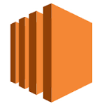
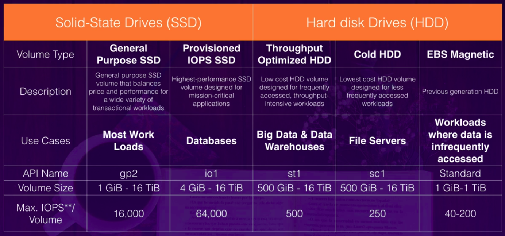
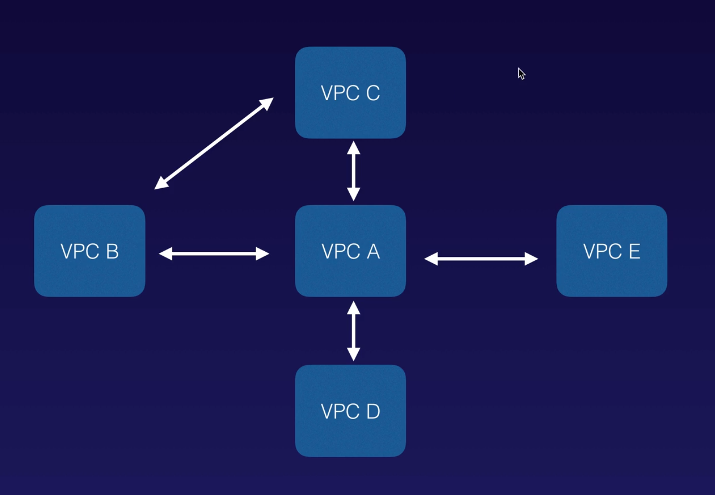

##  AWS Certified Solutions Architect - A Cloud Guru Exam Tips 

## Chapter 1: Introduction - Exam Blue Print

- 130 minutes in lenght

- 60 questions _(this can change)_

- Multiple choice

- Results are between 100-1000 with a passing score of 720

- Aim for 70%

- Qualification is valid for 3 years

- Scenario based questions


## Chapter 2: AWS - 10.000 Foot Overview (Exam Tips) 

**Understand the difference between a Region, an Availability Zone (AZ) and an Edge Location**

- A **Region** is a physical location in the world which consists of two or more Availability Zones (AZ's).

- An **Availability Zone** is one or more discrete data centers, each with redundant power, networking and connectivity, housed in separate facilities.

- **Edge Locations** are endpoints for AWS which are used for caching content. Typically this consists of CloudFront, Amazon's Content Delivery Network (CDN). *PS: There are many more edge locations than regions*

#

**What Do I Need To Know To Pass My Solutions Architect Exam?**

  - **Security, Identity & Compliance**

    - [IAM](https://github.com/pivorodrigues/devopstips/blob/master/acsa.md#chapter-3-identity-access-management--s3-)

  - **Storage**

    - [S3](https://github.com/pivorodrigues/devopstips/blob/master/acsa.md#chapter-3-identity-access-management--s3-)

  - **Compute**

    - [EC2](https://github.com/pivorodrigues/devopstips/blob/master/acsa.md#chapter-4-ec2-)

    - Lambda

  - **Databases**

    - RDS

    - DynamoDB

    - Redshift

  - **Network & Content Delivery**

    - Route 53


## Chapter 3: Identity Access Management & S3 

**Identity Access Management 101** [[FAQ](https://aws.amazon.com/pt/iam/faqs/)]

- Identity Access Management consists of the following:

	- Users

	- Groups

	- Roles

	- Policies

- **IAM is universal.** It does not apply to regions at this time.

- The **"root account"** is simply the account created when first setup your AWS account. It has complete Admin access.

- New users have **NO permissions** when first created.

- New Users are assigned **Access Key ID** & **Secret Access Keys** when first created.

- **These are not the same as password**. You cannot use the Access Key ID & Secret Access via to login into the console. You can use this to access AWS via the APIs and Command Line, however.

- You only get to view the Access Key ID and Secret Access Key once. If you lose them, you have to **regenerate** them. So, save them in a secure location.

- Always setup **Multifactor Authentication** on your root account.

- You can create and customise your own password rotation policies.

_Resources:_

  - [AWS DOC: Create a Billing Alarm](https://docs.aws.amazon.com/pt_br/AmazonCloudWatch/latest/monitoring/monitor_estimated_charges_with_cloudwatch.html)

  - [AWS DOC: Create a Free Tier Billing Alert](https://aws.amazon.com/pt/about-aws/whats-new/2017/12/aws-free-tier-usage-alerts-automatically-notify-you-when-you-are-forecasted-to-exceed-your-aws-service-usage-limits/)

#

**S3 (Simple Storage Service) 101** [[FAQ](https://aws.amazon.com/pt/s3/faqs/)]

- Remember that S3 is **Object-based**: i.e. allows you to upload files.

- Files can be from 0 Bytes to 5 TB.

- There is unlimited storage.

- Files are stored in Buckets (It´s basically a folder in the cloud).

- **S3 is a universal namespace**. That is, names must be unique globally.

- URL Example: https://s3-eu-west-1.amazonaws.com/acloudguru

- **Not suitable to install an operating system on**.

- Successful uploads will generate a HTTP 200 status code.

- By default, all newly created buckets are **PRIVATE**. You can setup access control to your buckets using:

	- Bucket Policies

	- Access Control Lists

- S3 buckets can be configured to create access logs which log all requests made to the S3 bucket. This can be sent to another bucket and even another bucket in another account.

- You can turn on **MFA Delete**.

- **The Key Fundamentals of S3 Are:**

  - Key (This is simply the name of the object).

  - Value (This is simply the data and is made up of a sequence of bytes).

  - Version ID (Important for versioning).

  - Metadata (Data about data you are storing).

  - Subresources:

    - Access Control Lists

    - Torrent

- Read after Write consistency for PUTS of new Objects.

- Eventual Consistency for overwrite PUTS and DELETES (can take some time to propagate).

- **1. S3 Standard**: 99.99% availability, 99.999999999% durability, stored redundantly across multiple devices in multiple facilities, and is designed to sustain the loss of 2 facilities concurrently.

- **2. S3 - IA** _(Infrequently Accessed)_: For data that is accessed less frequently, but requires rapid access when needed. Lower fee than S3, but you are charged a retrieval fee.

- **3. S3 One Zone - IA**: For where you want a lower-cost option for Infrequently accessed data, but do not require the multiple Availability Zone data resilience.

- **4. S3 - Intelligent Tiering**: Designed to optimize costs by automatically moving data to the most cost-effective access tier, without performance impact or operational overhead.

- **S3 Glacier**: S3 Glacier is a secure, durable, and low-cost storage class for data archiving. Retrieval time configurable from minutes to hours.

- **S3 Glacier Deep Archive**: S3 Glacier Deep Archive is Amazon S3's lowest-cost storage class where a retrieval time of 12 hours is acceptable.

<p align="center"></p>

#

**S3 Bucket Lab**

- **Buckets are a universal name space**

- Upload an object to S3 receive a HTTP 200 Code

- S3, S3 - IA, S3 IA (One Zone), Glacier

- Control access to buckets using either **bucket ACL** or using **Bucket Policies**

#

**S3 Security and Encryption**

- Encryption In Transit is achieved by:

	- SSL/TLS

- Encryption at Rest (Server Side) is achieved by:

	- S3 Managed Keys - SSE-S3

	- AWS Key Management Service, Managed Keys (SSE-KMS)

	- Server Side Encryption with Customer Provided Keys (SSE-C)

- Client Side Encryption	 

#

**S3 Versioning**

- Store all versions of an object (including all writes and even if you delete an object).

- Great backup tool.

- Once enabled, Versioning cannot be disabled, only suspended.

- Integrates with Lifecycles rules.

- Versioning's MFA Delete capability, which uses multi-factor authentication, can be used to provide an additional layer of security.

#

**S3 Lifecycle Management, S3 IA and Glacier**

- Automates moving your objects between the different storage tiers.

- Can be used in conjunction with versioning.

- Can be applied to current versions and previous versions.

#

**Cross Region Replication**

- Versioning must be enabled on both the source and destination buckets.

- Regions must be unique.

- Files in an existing bucket are not replicated automatically.

- All subsequent updated files will be replicated automatically.

- Delete markers are not replicated.

- Deleting individual versions or delete markers will not be replicated.

- Understand what Cross Replication is at a high level.

#

**S3 Transfer Acceleration**

<p align="center"></p>

- [Amazon S3 Transfer Acceleration Speed Comparison](https://s3-accelerate-speedtest.s3-accelerate.amazonaws.com/en/accelerate-speed-comparsion.html)

#

**CloudFront**

- **Edge Location** - This is the location where content will be cached. This is separate to an AWS Region/AZ.

- **Origin** - This is the origin of all the files that the CDN will distribute. This can be either an S3 bucket, an EC2 instance, an Elastic Load Balancer, or Route 53.

- **Distribution** - This is the name given the CDN which consists of a collection of Edge Locations.

- **Web Distribution** - Typically used for Websites.

- **RTMP** - Used for Media Streaming.

- Edge Locations are not just READ only - you can write to them too. (ie put an object on to them.)

- Objects are cached for the life of the **TTL (Time To Live)**.

- You can clear cached objects, but you will be charged.

- CloudFront is a global service.

- You can invalidate cached objects, but, you will be charged.

#

**Snowball**

- Understand what Snowball is.

- Understand what Snowball Can.

- Import to S3.

- Export from S3

#

**Storage Gateway**

- **File Gateway**

	- File Gateway - For flat files, stored directly on S3.

- **Volume Gateway**

	- **Stored Volumes** - Entire Dataset is store on site and is asynchronously backed to S3.

	- **Cached Volumes** - Entire Dataset is stored on S3 and the most frequently accessed data is cached on site.

- **Gateway Virtual Tape Library**


## Chapter 4: EC2 

**EC2 (Elastic Compute Cloud) 101** [[FAQ](https://aws.amazon.com/pt/ec2/faqs/)]

- **EC2 Pricing Policies:**

  - **1. On Demand**: Allows you to pay a fixed rate by the hour (or by the second) with no commitment.

  - **2. Reserved**: Provides you with a capacity reservation, and offer a significant discount on the hourly charge for an instance.

  - **3. Spot**: Enables you to bid whatever price you want for instance capacity, providing for even greater savings if your applications have flexible start and end times.

  - **4. Dedicated Hosts**: Physical EC2 server dedicated for your use. Dedicated Hosts can help you reduce costs by allowing you to use your existing server-bound software licences.

  If the Spot instance is terminated by Amazon EC2, you will not be charged for a partial hour of usage. However, if you terminate the instance yourself, you will be charged for any hour in which the instance ran.

- **EC2 Family Instance Types - Mnemonic**

  - **F** - For FPGA

  - **I** - For IOPS

  - **G** - Graphics

  - **H** - High Disk Throughput

  - **T** - Cheap general purpose (think T2 Micro)

  - **D** - For Density

  - **R** - For RAM

  - **M** - Main choice for general purpose apps

  - **C** - For Compute

  - **P** - Graphics (think Pics)

  - **X** - Extreme Memory

  - **Z** - Extreme Memory AND CPU

  - **A** - Arm-based workloads

  - **U** - Bare Metal

#

**EC2 Labs - Exam and Use Tips**

- **How to login (SSH) in the EC2 instance?**

  - Create a new key in the moment of instance creation, or use an existing key

  - Get the instance's public IP address

  - Execute the command: `$ ssh ec2-user@<public-IP-address> -i <keyname>.pem`

- Termination Protection is **turned off** by default, you must turn it on.

- On an EBS-Backed instance, the **default action is for the root EBS volume to be deleted** when the instance is terminated.

- EBS **Root** Volumes of your DEFAULT AMI´s cannot be encrypted. You can also use a third party tool (such as bit locker, etc) to encrypt the root volume, or this can be done when creating AMI´s (lab to follow) in the AWS console or using the API.

- Additional volumes can be encrypted.

#

**Security Groups Lab**

- All Inbound traffic is blocked by default.

- All Outbound traffic is allowed.

- Changes to Security Groups take effect immediately.

- You can have any number of EC2 instances within a security group.

- You can have multiple security groups attached to EC2 instances.

- Security Groups are **STATEFUL**.

- If you create an inbound rule allowing traffic in, that traffic is automatically allowed back out again.

- You cannot block specific IP addresses using Security Groups, instead use Network Access Control Lists.

- You can specify allow rules, but not deny rules.

#

**EBS (Elastic Block Storage) 101**

<p align="center"></p>

#

**Volumes & Snapshots**

- Volumes exist on EBS. Think of EBS as a virtual hard disk.

- Snapshots exist on S3. Think of snapshots as a photograph of the disk.

- Snapshots are point in time copies of Volumes.

- Snapshots are incremental - this means that only the blocks that have changed since your last snapshot are moved to S3.

- If this is your first snapshot, it may take some time to create.

- To create a snapshot for Amazon EBS volumes that serve as root devices, you should stop the instance before taking the snapshot.

- However you can take a snap while the instance is running.

- You can create AMI´s _(Amazon Machine Images)_ from both Volumes and Snapshots.

- You can change EBS volume sizes on the fly, including changing the size and storage type.

- Volumes will ALWAYS be in the same availability zone as the EC2 instance.

- To move an EC2 volume from one AZ to another, take a snapshot of it, create an AMI from the snapshot and then use the AMI to launch the EC2 instance in a new AZ.

- To move an EC2 volume from one region to another, take a snapshot of it, create an AMI from the snapshot and then copy the AMI from one region to the other. Then use the copied AMI to launch the new EC2 instance in the new region.

#

**AMI Types (EBS vs Instance Store)**

- Instance Store Volumes are sometimes called Ephemeral Storage.

- Instance store volumes cannot be stopped. if the underlying host fails, you will lose your data.

- EBS Backed instances can be stopped. You will not lose the data on this instance if it is stopped.

- You can reboot both, you will not lose your data.

- By default, both ROOT volumes will be deleted on termination. However, with EBS volumes, you can tell AWS to keep the root device volume.

#

**Encrypted Root Device Volumes & Snapshots**

- Snapshots of encrypted volumes are encrypted automatically.

- Volumes restored from encrypted snapshots are encrypted automatically.

- You can share snapshots, but only if they are **unencrypted**.

- These snapshots can be shared with other AWS accounts or made public.

- You can now encrypt root device volumes upon creation of the EC2 instance.

- _You need to know how to:_

  - Create a Snapshot of the unencrypted root device volume.

  - Create a copy of the Snapshot and select the encrypt option.

  - Create an AMI from the encrypted Snapshot.

  - Use that AMI to launch new encrypted instances.

#

**Cloudwatch 101**

- Cloudwatch is used for monitoring performance.

- CloudWatch can monitor most of AWS as well as your applications that run on AWS.

- CloudWatch with EC2 will monitor events **every 5 minutes by default**.

- You can have 1 minute intervals by turning on detailed monitoring.

- You can create CloudWatch alarms with trigger notifications.

- Cloudwatch is all about performance. CloudTrail is all about auditing.

#

**Cloudwatch Lab**

- Standard monitoring = 5 minutes.

- Detailed monitoring = 1 minute.

  - _What can I do with Cloudwatch?_

    - Dashboards: Creates awesome dashboards to see what is happening with your AWS environment.

    - Alarms - Allows you to set Alarms that notify you when particular thresholds are hit.

    - Events - Cloudwatch events helps you to respond to state changes in your AWS recourses.

    - Logs - Cloudwatch logs helps you to aggregate, monitor and store logs.

- CloudWatch monitors performance.

- CloudTrail monitors API calls in the AWS platform.

#

**AWS Command Line (CLI) Lab**

- You can interact with AWS from anywhere in the world just by using the command line (CLI).

- You will need to set up access in IAM.

- Commands themselves are not in the exam, but some basic commands will be useful to know for real life.

#

**Identity Access Management Roles LAB**

- Roles are more secure than storing your access key and secret access key on individual EC2 instances.

- Roles are easier to manage.

- Roles can be assigned to an EC2 instance after it is created using both the console and command line.

- Roles are universal - you can use them in any region.

#

**Instance Metadata**

- Command to see the content of bootstrap script inside our EC2 instance:

  - _$ curl "http://169.254.169.254/latest/user-data"_

  - Results:

    ```
      #!/bin/bash

      sudo su -

      yum update -y

      yum install httpd -y

      systemctl start httpd

      chkconfig httpd on

      cd /var/www/html

      echo '<html><h1>Hello Cloud Gurus</h1></html>' > index.html

      aws s3 mb s3://pivorodrigueskjuuenfiuiehjeiuifjheie87765

      aws s3 cp index.html s3://pivorodrigueskjuuenfiuiehjeiuifjheie87765

    ```

- Command to get information about an EC2 instance:

  - _$ curl "http://169.254.169.254/latest/meta-data"_

  - Results:

    ```
      ami-id
      ami-launch-index
      ami-manifest-path
      block-device-mapping/
      events/
      hostname
      iam/
      identity-credentials/
      instance-action
      instance-id
      instance-type
      local-hostname
      local-ipv4
      mac
      metrics/
      network/
      placement/
      profile
      public-hostname
      public-ipv4
      public-keys/
      reservation-id
      security-groups
      services/
    ```

  - _$ curl "http://169.254.169.254/latest/meta-data/local-ipv4"_

    `172.31.93.65`

#

**EFS - Elastic File System**

- Supports the Network File System version 4 (NFSv4) protocol.

- You only pay for the storage you use (no pre-provisioning required).

- Can scale up to the petabytes.

- Can support thousands of concurrent NFS connections.

- Data is stored across multiple AZ's within a region.

- Read After Write consistency.

#

**Placement Groups**

- **Three Types of Placement Groups**

  - _Clustered Placement Group_

    - Low Network Latency / High Network Throughput

  - _Spread Placement Group_

    - Individual Critical EC2 instances

  - _Partitioned Placement Group_

    - Multiple EC2 instances HDFS, HBase and Cassandra

- A clustered placement group can´t span multiple Availability Zones.

- A spread placement and partitioned group can.

- The name you specify for a placement group must be unique within your AWS account.

- Only certain types of instances can be launched in a placement group (Compute Optimized, GPU, Memory Optimized, Storage Optimized).

- AWS recommend homogenous instances within clustered placement groups.

- You can´t merge placement groups.

- You can´t move an existing instance into a placement group. You can create an AMI from your existing instance, and then launch a new instance from the AMI into a placement group.


## Chapter 5: Databases on AWS 

**Databases 101**

- **RDS (OLTP - Online Transaction Processing)(Relational Solution)**

  - SQL Server

  - MySQL

  - PostgreSQL

  - Oracle

  - Aurora

  - MariaDB

- **DynamoDB**

  - NoSQL Database Solution

- **Redshift (OLAP - Online Analytics Processing)**

  - Datawarehouse Solution

  - Used for Business Intelligence or Data Warehousing

- **Elasticache**

  - Memcache

  - Redis

  - Caching Solution

  - Used to speed up performance of existing databases (frequent identical queries)

#

**Databases 101 - Relational Databases**

- Remember the following points:

  - RDS runs on virtual machines

  - You cannot log in to these operating systems however

  - Patching of the RDS Operating System and DB is Amazon's responsibility

  - RDS is NOT Serverless

  - Aurora Serverless IS Serverless

#

**RDS -  Backups, Multi-AZ and Read Replicas**

**Backups**

- There are two different types of Backups for RDS:

  - Automated Backups

  - Database Snapshots

**Read Replicas**

- Can be Multi-AZ

- Used to increase performance

- Must have backups turned on

- Can be in different regions

- Can be MySQL, PostgreSQL, MariaDB, Oracle, Aurora

- SQL Server doesn´t support Read Replicas

- Can be promoted to master, this will break the Read Replica

**Multi-AZ**

- Used for Data Replication

- You can force a failover from one AZ to another by rebooting the RDS instance

Encryption at rest is supported for MySQL, Oracle, SQL Server, PostgreSQL, MariaDB and Aurora. Encryption is done using the AWS Key Management Service (KMS). Once your RDS instance is encrypted, the data stored at rest in the underlying storage is encrypted, as are its automated backups, read replicas and snapshots.

#

**DynamoDB**

- **The basics of DynamoDB** are as follows:

  - Stored on SSD Storage

  - Spread across 3 geographically distinct data centers

  - Eventual Consistent Reads (Default)

  - Strongly Consistent Reads

#

**Redshift**

- Redshift is a Data Warehouse used for business intelligence

- Available in only 1 AZ

- **Backups:**

  - Enabled by default with a 1 day retention period

  - Maximum retention period is 35 days

  - Redshift always attempts to maintain at least three copies of your data (the original and replica on the compute nodes and a backup in Amazon S3)

  - Redshift can also asynchronously replicate your snapshots to S3 in another region for disaster recovery

#

**Amazon Aurora**

- 2 copies of your data is contained in each availability zone, with minimum of 3 availability zones. 6 copies of your data

- You can share Aurora Snapshots with other AWS accounts

- 2 types of replicas available. Aurora Replicas and MySQL replicas. Automated failover is only available with Aurora Replicas

- Aurora has automated backups turned on by default. You can also take snapshots with Aurora. You can share these snapshots with other AWS accounts

<p align="center"></p>

#

**Elasticache**

- Use Elasticache to increase database and web application performance

- Two flavors: Memcached and Redis

- Redis is Multi-AZ

- You can do backups and restore of Redis


## Chapter 6: Route 53 

- _How to discover a DNS name server record:_ `$ nslookup -type=ns globo.com`

- _How to discover the TTL of a server:_ `$ dig +nocmd +noall +answer +ttlid a google.com`

**Route 53**

- ELBs do not have pre-defined IPv4 addresses; you resolve to them using a DNS name

- Understand the difference between an **Alias Record** and a **CNAME** [[Medium](https://medium.com/@Constellix/whats-the-difference-between-aname-aaaa-a-and-cname-records-656c1ca2cb73)]

- Given the choice, always choose an **Alias Record** over a **CNAME**

- **Common DNS Types:**

  - SOA Records

  - NS Records

  - A Records

  - CNAMES

  - MX Records

  - PTR Records

#

**Register a Domain Name - Lab**

- You can buy domain names directly with AWS

- It can take up to 3 days to register depending on the circumstances

#

**Route 53 Routing Policies Available on AWS**

- Simple Routing

- Weighted Routing

- Latency-based Routing

- Failover Routing

- Geolocation Routing

- Geoproximity Routing (Traffic Flow Only)

- Multivalue Answer Routing

#

**Simple Routing Policy - Lab**

- If you choose the simple routing policy, you can only have one record with multiple IP addresses. If you specify multiple values in a record, Route53 returns all values to the user in a random order.

#

**Weighted Routing Policy - Lab**

<p align="center"></p>

**Health Checks**

- You can set health checks on individual record sets

- If a record set fails, a health check it will be removed from Route 53 until it passes the health check

- You can set SNS notifications to alert you if a health check is failed

#

**Latency-Based Routing**

<p align="center"></p>

#

**Failover Routing Policy**

<p align="center"></p>

#

**Geolocation Routing Policy**

<p align="center"></p>

#

**Geoproximity Routing (Traffic Flow Only)**

- Geoproximity routing lets Amazon Route 53 route traffic to your resources based on the geographic location of your users and your resources. You can also optionally choose to route more traffic or less to a given resource by specifying a value, known as Bias. A Bias expands or shrinks the size of the geographic region from which traffic is routed to a resource.

**To use geoproximity routing, you must use Route 53 traffic flow.**

#

**Multivalue Answer Policy**

<p align="center"></p>

## Chapter 7: VPCs 

**Introduction to VPCs**

[Interactive IP Address and CIDR Range Visualizer](https://cidr.xyz/)

_Note:_ Before you go and do your exam, you should be able to build out your own VPC from memory. If you can do that, then you'll be able to pass the Certified Solutions Architect Associate Exam.

_Private IP Address Ranges:_

  ```
    10.0.0.0 - 10.255.255.255 (10/8 prefix)
    172.16.0.0 - 172.31.255.255 (172.16/12 prefix)
    192.168.0.0 - 192.168.255.255 (192.168/16 prefix)
  ```

**OBS:** Amazon don't allow /8 prefix. The **larger subnet** that you can have inside a VPC is a **/16**. The **smallest subnet** that you can have inside a VPC is **/28**.

_Remember the following:_

  - Think of VPC as a logical datacenter in AWS

  - Consists of IGWs (Internet Gateways)(Or Virtual Private Gateways), Route Tables, Network Access Control Lists, Subnets and Security Groups

  - 1 Subnet = 1 Availability Zone

  - Security Groups are Stateful; Network Access Control Lists are Stateless

  - NO TRANSITIVE PEERING

<p align="center"></p>

#

**Build a Custom VPC - Lab Notes**

[VPCs and Subnets](https://docs.aws.amazon.com/vpc/latest/userguide/VPC_Subnets.html)

[Troubleshooting Connecting to Your Instance](https://docs.aws.amazon.com/AWSEC2/latest/UserGuide/TroubleshootingInstancesConnecting.html)

[SSH Agent Forwarding](https://aws.amazon.com/pt/blogs/security/securely-connect-to-linux-instances-running-in-a-private-amazon-vpc/)

- Steps:

  **1.** Set the basic VPC information - Name and IPv4 CIDR Block: `10.0.0.0/16`

  _The range of IPv4 addresses for our VPC in CIDR block format. As mentioned in the earlier topic, block sizes must be between a /16 and /28 netmask._

  **2.** Choose _Amazon provided IPv6 CIDR block_.

  _After the new VPC creation, AWS created Security Group, Network ACL and Route Table. After this, we need to create subnets:_

  <p align="center"></p>

  **3.** Create subnet with basic information - Name, VPC, AZ and IPv4 CIDR block (required): `10.0.1.0/24`

  **4.** Create another subnet with basic information - Name, VPC, AZ and IPv4 CIDR block (required): `10.0.2.0/24`

  **5.** In order to automatically request a public IPv4 or IPv6 address for an instance launched in a subnets, enable auto-assign IP settings for first subnet.

  <p align="center"></p>

  **6.** Create an internet gateway and attach it to the VPC created.

  _OBS:You can have only one attached internet gateway to a VPC._

  **7.** Create a new route table and associate it to the public subnet: 0.0.0.0/0 to created internet gateway.

  **8.** Associate the public route table to the `10.0.1.0/24` subnet.

  **9.** Create 2 EC2 instances and select public subnet settings for one of them.

  **10.** Create a security group to the private instance allowing.

  **11.** Change the private instance network to the new security group.

  **12.** Create a NAT EC2 instance and disable Source/Destination check.

  **13.** Add a route in the VPC's route table to communicate the NAT instance and the private instance.

  _OBS: Create an New WebDMZ security group for the Web instance with SSH and HTTP protocols._  

  <p align="center"></p>

  <p align="center"></p>

  _Remember the following:_

    - When you create a VPC a default Route Table, Network Access Control List (NACL) and a default Security Group are created

    - It won't create any subnets, nor will it create a default internet gateway

    - US-East-1A in your AWS account can be completely different availability zone to US-East-1A in another AWS account. The AZ's are randomized

    - Amazon always reserve 5 IP addresses within your subnets

    - You can only have 1 Internet Gateway per VPC

    - Security Groups can't span VPC's

#

**NAT Instances & NAT Gateways**

[Nat Instances](https://docs.aws.amazon.com/vpc/latest/userguide/VPC_NAT_Instance.html)

<p align="center"></p>

- **Nat Instances:**

  - When creating a NAT instance, disable Source/Destination Check on the instance

  - NAT instances must be in a public subnet

  - There must be a route out of the private subnet to the NAT instance, in order for this to work

  - The amount of traffic that NAT instances can support depends on the instance size. If you are bottlenecking, increase the instance size

  - You can create high availability using Autoscaling Groups, multiple subnets in different AZs, and a script to automate failover

  - Behind a Security Group

- **Nat Gateways:**

  - Redundant inside the Availability Zone

  - Preferred by the enterprise

  - Starts at 5Gbps and scales currently to 45Gbps

  - No need to patch

  - Not associated with security groups

  - Automatically assigned a public ip address

  - Remember to update your route tables

  - No need to disable Source/Destination Checks

  - _If you have resources in multiple Availability Zones and they share one NAT Gateway, in the event that the NAT gateway's Availability Zone is down, resources in the other Availability Zones lose internet access. To create an Availability Zone-independent architecture, create a NAT gateway in each Availability Zone and configure your routing to ensure that resources use the NAT gateway in the same Availability Zone._

#

**Network Access Control Lists (ACL) vs Security Groups**

[Ephemeral Ports](https://docs.aws.amazon.com/vpc/latest/userguide/vpc-network-acls.html#nacl-ephemeral-ports)

- Your VPC automatically comes with a default network ACL and by default it allows all outbound and inbound traffic.

- You can create custom network ACLs. By default, each custom network ACL denies all inbound and outbound traffic until you add rules.

- Each subnet in your VPC must be associated with a network ACL. If you don't explicitly associate a subnet with a network ACL, the subnet is automatically associated with the default network ACL.

- Block IP Addresses using network ACLs not Security Groups.

- You can associate a network ACL with multiple subnets; however, a subnet can be associated with only one network ACL at a time. When you associate a network ACL with a subnet, the previous association is removed.

- Network ACLs contain a numbered list of rules that is evaluated in order, starting with the lowest numbered rule.

- Network ACLs have separate inbound and outbound rules, and each rule can either allow or deny traffic.

- Network ACLs are stateless; responses to allowed inbound traffic are subject to the rules for outbound traffic (and vice versa).

#

**Custom VPCs and ELBs**

- **[Important to Exam]** When you're provisioning a load balancer, you're gonna need at least two public subnets.

#

**VPC Flow Logs**

_What Are VPC Flow Logs?_

VPC Flow Logs is a feature that enables you to capture information about the IP traffic going to an from network interfaces in your VPC. Flow log data is stored using Amazon CloudWatch Logs. After you've created a flow log, you can view and retrieve its data in Amazon CloudWatch Logs.

- You cannot enable flow logs for VPCs that are peered with your VPC unless the peer VPC is in your account.

- You cannot tag a flow log.

- After you've created a flow log, you cannot change its configuration; for example, you can't associate a different IAM role with the flow log.

**Not all IP Traffic is monitored:**

- Traffic generated by instances when they contact the Amazon DNS server. If you use your own DNS server, then all traffic to that DNS server is logged.

- Traffic generated by a Windows instance for Amazon Windows licence activation.

- Traffic to and from 169.254.169.254 for instance metadata.

- DHCP traffic.

- Traffic to the reserved IP address for the default VPC router.

#

**Bastion Hosts**

[SSH Agent Forwarding](https://aws.amazon.com/pt/blogs/security/securely-connect-to-linux-instances-running-in-a-private-amazon-vpc/)

**A Bastion Host:** A Bastion Host is a special purpose computer on a network specifically designed and configured to withstand attacks. The computer generally hosts a single application, for example a proxy server, and all other services are removed or limited to reduce the threat to the computer. It is hardened in this manner primarily due to its location and purpose, which is either on the outside of a firewall or in a demilitarized zone (DMZ) and usually involves access from untrusted networks or computers.

<p align="center"></p>

- A NAT Gateway or NAT Instance is used to provide internet traffic to EC2 instances in a private subnets.

- A Bastion is used to securely administer EC2 instances (Using SSH or RDP). Bastions are called Jump Boxes in Australia.]

- You cannot use a NAT Gateway as a Bastion Host.

#

**Direct Connect**

**Direct Connect:** AWS Direct Connect is a cloud service solution that makes it easy to stablish a dedicated network connection from your premises to AWS. Using AWS Direct Connect, you can stablish private connectivity between AWS and your datacenter, office, or colocation environment, which in many cases can reduce your network costs, increase bandwidth throughput, and provide a more consistent network experience than Internet-based connections.

<p align="center"></p>

- Direct Connect directly connects your data center to AWS

- Useful for high throughput workloads (i.e lots of network traffic)

- Or if you need a stable and reliable secure connection

#

**VPC Endpoints**

**A VPC Endpoint:** A VPC endpoint enables you to privately connect your VPC to supported AWS services and VPC endpoint services powered by PrivateLink without requiring an internet gateway, NAT device, VPN connection, or AWS Direct Connect connection. Instances in your VPC do not require public IP addresses to communicate with resources in the service. Traffic between your VPC and the other service does not leave the Amazon Network.

Endpoints are virtual devices. They are horizontally scaled, redundant, and highly available VPC components that allow communication between instances in your VPC and services without imposing availability risks or bandwidth constraints on your network traffic.

<p align="center"></p>

**There are two types of VPC Endpoints:**

  - Interface Endpoints

  - Gateway Endpoints

**Currently Gateway Endpoints Support:**

  - Amazon S3

  - DynamoDB
