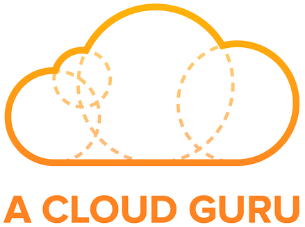

##  AWS Certified Solutions Architecht - A Cloud Guru Exam Tips 

## Chapter 1: Introduction - Exam Blue Print

- 130 minutes in lenght

- 60 questions _(this can change)_

- Multiple choice

- Results are between 100-1000 with a passing score of 720

- Aim for 70%

- Qualification is valid for 3 years

- Scenario based questions

## Chapter 2: AWS - 10.000 Foot Overview (Exam Tips)

**Understand the difference between a Region, an Availability Zone (AZ) and an Edge Location**

- A **Region** is a physical location in the world which consists of two or more Availability Zones (AZ's).

- An **Availability Zone** is one or more discrete data centers, each with redundant power, networking and connectivity, housed in separate facilities.

- **Edge Locations** are endpoints for AWS which are used for caching content. Typically this consists of CloudFront, Amazon's Content Delivery Network (CDN). *PS: There are many more edge locations than regions*

#

**What Do I Need To Know To Pass My Solutions Architect Exam?**

  - **Security, Identity & Compliance**

    - [IAM](https://github.com/pivorodrigues/devopstips/blob/master/acsa.md#identity-access-management---101-)

  - **Storage**

    - S3

  - **Compute**

    - EC2

    - Lambda

  - **Databases**

    - RDS

    - DynamoDB

    - Redshift

  - **Network & Content Delivery**

    - Route 53

## Chapter 3: Identity Access Management & S3

**Identity Access Management 101 - Exam Tips**

- **IAM is universal.** It does not apply to regions at this time.

- The **"root account"** is simply the account created when first setup your AWS account. It has complete Admin access.

- New users have **NO permissions** when first created.

- New Users are assigned **Access Key ID** & **Secret Access Keys** when first created.

- **These are not the same as password**. You cannot use tha Access Key ID & Secret Access via to login into the console. You can use this to access AWS via the APIs and Command Line, however.

- Always setup **Multifactor Authentication** on your root account.

- You can create and customise your own password rotation policies.

_Resources:_

  - [AWS DOC: Create a Billing Alarm](https://docs.aws.amazon.com/pt_br/AmazonCloudWatch/latest/monitoring/monitor_estimated_charges_with_cloudwatch.html)

  - [AWS DOC: Create a Free Tier Billing Alert](https://aws.amazon.com/pt/about-aws/whats-new/2017/12/aws-free-tier-usage-alerts-automatically-notify-you-when-you-are-forecasted-to-exceed-your-aws-service-usage-limits/)

#

  
