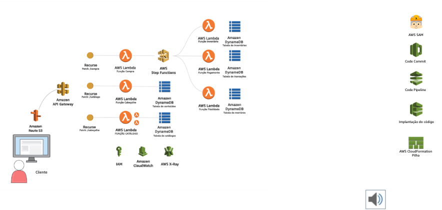

#  AWS Solutions Training for Partners: Foundations 

# Seção 1: Introdução e fundamentos do arquiteto de soluções da AWS

## Módulo 1: Clientes estão mudando para a AWS

**Cinco benefícios fundamentais da computação em nuvem:**

  - Agilidade;

  - Elasticidade;

  - Redução de custos;

  - Alcance Global;

  - Variedade de serviços.

## Módulo 2: AWS Solution Architects

**Princípios de liderança da Amazon:**

  - Obsessão pelo cliente;

  - Aprender a ser curioso;

  - Conquistar confiança;

  - Envolver-se profundamente;

  - Inventar e simplificar;

  - Pensar grande;

  - Estar pronto para agir;

  - Entregar resultados.

#

**Os SA's da Amazon tornam os clientes bem-sucedidos quando:**

  - Definem o escopo;

  - Envolvem-se profundamente;

  - Projetam as soluções do "Well-architected";

  - Conquistam confiança;

  - Ensinam;

  - Inventam, simplificam e inovam.

#

**Para gerar sucesso em longo prazo, os SA's da Amazon devem saber:**

  - Que a migração para a nuvem é um processo;

  - Que os clientes precisam de experiência e ajuda do SA;

  - Conhecer seus clientes;

  - Conhecer a plataforma e os serviços da AWS;

  - Agir no melhor interesse em longo prazo do cliente;

  - Usar a estratégia de longo prazo.

## Módulo 3: Você sabe mais do que imagina

#

**AWS Lambda**

  - Seviço de computação stateless;

  - Executa o código em resposta a um evento;

  - Acionamento em milissegundos;

  - Baixo custo - faturado em incrementos de 100 ms + memória;

  - Foco no aplicativo, não na infraestrutura.

**Amazon Machine Learning (Amazon ML)**

  - Machine Learning (ML) como um serviço;

  - Criação de modelos de ML usando APIs simples;

  - Permite que desenvolvedores de todos os níveis de habilidade criem aplicativos de ML.

**Modelos de AWS Blockchain**

  - Comece rapidamente com o blockchain;

  - Experimente estruturas de blockchain - Ethereum, Hyperledger Fabric e outras;

  - Controle o acesso a recursos da AWS com políticas de permissão granulares;

  - Casos de uso:

      - Cadeia de fornecimento;

      - Transações financeiras;

      - Identidade e compatibilidade.

#

**O todo é maior que a soma das partes**

## Módulo 4: Conceitos de Arquitetura AWS

**Regiões e Zonas de disponibilidade da AWS**

#

**Mapa de regiões da AWS**

#

**Conceitos:**

  - **Região:** Área geográfica específica no globo;

  - **Zona de disponibilidade:** Múltiplas locações isoladas (datacenters);

  - **Edge Locations:** Pontos de presença da AWS, AWS Cloudfront (CDN).

#

**Pontos de presença da AWS**

#

**Robustez regional da AWS**

  - Dois centros de trânsito redundantes;

  - Instalações altamente espelhadas e conectadas;

  - 16 (agora 18) regiões;

  - As regiões estão localizadas em áreas geográficas separadas;

  - As regiões são isoladas umas das outras;

  - Cada região tem várias zonas de disponibilidade;

  - Os dados nunca são movidos de uma região para outra pela AWS;

  - As zonas de disponibilidade estão em locais isolados (energia, rede, zona de inundação, etc.) dentro das regiões;

  - As zonas de disponibilidade têm um ou mais datacenters (algumas têm até 8);

  - As zonas de disponibilidade são projetadas para oferecer alta disponibilidade dos serviços aos clientes;

  - As zonas de disponibilidade em uma região têm uma latência inferior a 1ms entre elas;

  - Cada criação de datacenter da AWS possui entre 50.000 e 80.000 servidores físicos;

#

**O gerenciamento contínuo**

#

**Serviços gerenciados: Global, regional e zonal**

#

**Modelo de segurança compartilhada**

#

**Infrastructure as Code**

 - O AWS é baseado em APIs;

 - Os SDKs são usados para criar e operar.

## Módulo 5: Elementos fundamentais

**Serviços fundamentais da AWS: Computação**

#

**Amazon Elastic Compute Cloud (Amazon EC2)** [[link](https://aws.amazon.com/pt/ec2/)]

  - Instância de máquina virtual em execução em um hipervisor da AWS;

  - Suporte para várias distribuições do Linux ou Microsoft Windows;

  - O cliente controla o sistema operacional do host com contas root e de administrador;

  - O cliente é responsável por todos os aplicativos instalados.

**Famílias do EC2** [[link](https://aws.amazon.com/pt/ec2/instance-types/)]

  - [Uso geral](https://aws.amazon.com/pt/ec2/instance-types/#General_Purpose)

  - [Computação otimizada](https://aws.amazon.com/pt/ec2/instance-types/#Compute_Optimized)

  - [Memória otimizada](https://aws.amazon.com/pt/ec2/instance-types/#Memory_Optimized)

  - [Armazenamento denso](https://aws.amazon.com/pt/ec2/instance-types/#Storage_Optimized)

  - E/S otimizada

  - [GPU](https://aws.amazon.com/pt/ec2/instance-types/#Accelerated_Computing)

  - Micro

#

**Nomes de instâncias do Amazon EC2**

#

**Opções de definição de preço do Amazon EC2** [[link](https://aws.amazon.com/pt/ec2/pricing/)]

#

**Auto Scaling do Amazon EC2** [[link](https://aws.amazon.com/pt/autoscaling/)]

  - Escale as instâncias do Amazon EC2 de forma contínua e automática;

  - Inicie ou encerre instâncias para atender à capacidade desejada;

  - Mantenha a capacidade balanceada pelas AZs;

  - Substitua instâncias não íntegras ou inacessíveis;

  - Baseado em políticas;

  - Integrado com outros serviços da AWS;

  - Casos de uso:

    - Escalabilidade dinâmica - otimize recursos do EC2 rapidamente;

    - Reduza custos e gerencie a definição de preço;

    - Gerenciamento de frotas - balanceamento, recuperação de falhas.

**Amazon Container Services (ECS)** [[link](https://aws.amazon.com/pt/ecs/)]

  - Amazon Elastic Container Service (ECS) e Amazon Elastic Container service for Kubernetes (EKS);

  - A AWS executa o gerenciamento do cluster do Amazon EC2 para os clientes;

  - Elimina a complexidade da infraestrutura de contêineres em operação;

  - Casos de uso:

      - Implante os microsserviços para acelerar a inovação;

      - Execute processos em lote;

      - Migre os aplicativos legados sem precisar de alterações de código;

      - Acelere o Machine Learning.

**AWS Fargate** [[link](https://aws.amazon.com/pt/fargate/)]

  - Permite que os clientes executem contêineres sem gerenciar um cluster;

  - Expande o Amazon ECS e o EKS;

  - Executa dezenas de milhares de contêineres em segundos;

  - Integra-se ao Auto Scaling para uso ideal.

**AWS Lambda** [[link](https://aws.amazon.com/pt/lambda/)]

  - Serviço de computação stateless, executa o código em resposta a um evento;

  - Acionamento em milissegundos;

  - Faturado em incrementos de 100 ms + memória;

  - Pague somentte pelo o que usar;

  - Os servidores virtuais não são necessários;

  - Casos de uso:

    - Criar aplicativos modulares, escaláveis e leves;

    - Processamento de dados sem servidor sob demanda;

    - Use o AWS Step Functions para orquestrar arquiteturas do Lambda;

    - Execute a validação dos dados, filtragem, classificação e outras transformações;

    - Miniaturas de imagem, atividade no aplicativo, cliques no website e saída do dispositivo.

#

**Serviços fundamentais da AWS: Armazenamento** [[link](https://aws.amazon.com/pt/products/storage/)]     

#

**Amazon Elastic Block Storage (EBS)** [[link](https://aws.amazon.com/pt/ebs/)]

  - Volumes de armazenamento de bloco para uso com instâncias do Amazon EC2;

  - Armazenamento persistente anexado a instâncias do EC2 como disco nativo;

  - Formatado usando um sistema de arquivos padrão do SO (como ext4 ou NTFS);

  - Armazenamento escalável e de alta performance para aplicativos;

  - Casos de uso:

    - Volumes de inicialização/raiz para instância do Amazon EC2;

    - Volumes de dados para aplicativos corporativos, como SAP, Microsoft Exchange e Microsoft Sharepoint;

    - Bancos de dados relacionais ou NoSQL que oferecem suporte a milhões de usuários.

#

**Amazon Simple Storage Service (Amazon S3)** [[link](https://aws.amazon.com/pt/s3/?nc=sn&loc=0)]

  - Armazenamento de objetos altamente escalável, confiável, rápido e durável;

  - Armazene e recupere qualquer quantidade de dados em qualquer lugar online, usando HTTP e HTTPS;

  - Um serviço laborioso que serve para muitos propósitos;

  - Integrado com serviços de segurança da AWS, fornece acesso granular e criptografia transparente;

  - Casos de uso:

    - Hospedagem de arquivos de aplicativos;

    - Backup para recuperação de desastres;

    - Hospedagem na web estática;

    - Dados de streaming;

    - Data lakes.

**Classes de armazenamento do Amazon S3** [[link](https://aws.amazon.com/pt/s3/storage-classes/?nc=sn&loc=3)]    

**Amazon Data Lakes** [[link](https://aws.amazon.com/pt/big-data/datalakes-and-analytics/)]

#

**Serviços fundamentais da AWS: Rede** [[link](https://aws.amazon.com/pt/products/networking/)]

#

**Amazon Virtual Private Cloud (Amazon VPC)** [[link](https://aws.amazon.com/pt/vpc/)]

  - Sub-redes virtuais isoladas na Nuvem AWS;

  - Seguro, com alta performance, altamente configurável;

  - Suporte de segurança sofisticado;

  - Casos de uso:

    - Hospedar recursos públicos e privados;

    - Organizar/isolar componentes do aplicativo;

    - Isolar recursos por entidade lógica, grupo, sensibilidade ou função;

    - Estender redes locais para a nuvem.

**Amazon VPC definida**

  - Seção logicamente isolada da Nuvem AWS;

  - Por padrão, não há acesso à internet e as instâncias não são endereçáveis pela internet;

  - Controle completo sobre o ambiente de rede virtual;

  - Conceitos de redes comprovados e bem compreendidos:

    - Intervalo de endereços IP definidos pelo usuário;

    - Sub-redes;

    - Tabelas de rotas;

    - Listas de acesso de controle;

    - Gateways de rede;

  - Uma forma de obter agilidade e segurança adicional.  

  

**Amazon VPCs como estratégia**

  - Como qualquer aplicativo de produção, as soluções dos serviços da AWS devem ser implantadas em um cenário de vários ambientes.

    - Cada "ambiente" deve estar em sua própria Amazon VPC;

    - No mínimo, considere os ambientes de produção e desenvolvimento de VPC;

    - Se fizer sentido, adicione ambientes para teste, desenvolvimento futuro ("dev + 1"), preparação e outros propósitos;

    - Lembre-se de que os ambientes da AWS com uso intermitente (como teste) podem ser interrompidos quando não estão em uso, ajudando a limitar os custos.

    

**Conectividade do datacenter corporativo da Amazon VPC** [[link](https://docs.aws.amazon.com/pt_br/vpc/latest/userguide/what-is-amazon-vpc.html)]    

- Formas de se conectar a recursos em uma Amazon VPC:

  - Pela internet;

  - Rede privada virtual (VPN) usando IPSec;

    - _Configurada em minutos._

  - AWS Direct Connect;

    - _Serviço prestado pelos parceiros da Amazon Partner Network (APN);_

    - _A instalação pode levar semanas._

  - AWS Direct Connect Gateway;

  - AWS PrivateLink;

  - Interface de rede elástica (ENI).  

  

**Elastic Load Balancing (ELB)** [[link](https://aws.amazon.com/pt/elasticloadbalancing/)]

  - Distribui automaticamente tráfego de aplicativos de entrada;

  - Automaticamente incorpora novos recursos à medida que os aplicativos são escalados, automaticamente;

  - Provisiona segurança robusta como Amazon VPC;

  - Detecta e responde a falhas do aplicativo;

  - Integra-se a outros serviços da AWS:

    - Amazon Route 53;

    - Internet Gateway;

    - AWS Identity and Access Management (IAM).

**Application Load Balancer (ALB)** [[link](https://docs.aws.amazon.com/pt_br/elasticloadbalancing/latest/application/introduction.html)]

  - Parte do Elastic Load Balancing (ELB);

  - Equilibra a carga na camada de aplicativo _(Camada 7)_;

  - Oferece suporte à finalização e ao descarregamento de HTTPS;

  - Aprimora a segurança do aplicativo;

  - Roteia solicitações com base no conteúdo solicitado (URL);

  - Casos de uso:

    - Tráfegos HTTP e HTTPS;

    - Roteamento de solicitação avançado;

    - Microsserviços e aplicativos baseados em contêiner.

**Network Load Balancer (NLB)** [[https://docs.aws.amazon.com/pt_br/elasticloadbalancing/latest/network/introduction.html](link)]

  - A latência ultrabaixa lida com dezenas de milhões de solicitações por segundo;

  - O recurso "IP por AZ" melhora a performance e a tolerância a falhas;

  - Preserva o endereço IP de origem e as portas para conexões de entrada;

  - As conexões podem ficar abertas por meses ou anos;

  - Oferece suporte para failover entre endereços IP em e entre regiões;

  - Casos de uso:

    - Endereço IP codificado;

    - Microsserviços.

**Amazon CloudFront** [[link](https://aws.amazon.com/pt/cloudfront/)]

  - Rede de entrega de conteúdo (CDN) com otimização;

  - Distribui conteúdo para usuários finais com baixa latência e altas taxas de transferência de dados;

  - Presença geográfica ampla além das Regiões da AWS;

  - Acelera os dados enviados pelos usuários finais;

  - Melhora a segurança aplicando a política na borda;

  - Casos de uso:

    - Como acelerar a performance de aplicativos Web;

    - Armazenamento em cache de conteúdo da Web estático e resultados de consulta de banco de dados frequentes;

    - Descarregamento de terminação TLS.

**Amazon Route 53** [[link](https://aws.amazon.com/pt/route53/)]

  - Serviço global de Domain Name System (DNS);

  - Altamente disponível e escalável - SLA de disponibilidade 100%;

  - Ferramenta crítica integrada com muitos serviços da AWS;

  - Casos de uso:

    - Roteamento otimizado;

    - Distribuição ponderada;

    - Failover;

    - Compatibilidade de geolocalização;

    - Integrado com outros serviços da AWS;

      - Microssegmentação.

#

**Serviços fundamentais da AWS: Banco de Dados** [[link](https://aws.amazon.com/pt/products/databases/)]      

#

**Amazon Relational Database Service (RDS)** [[link](https://aws.amazon.com/pt/rds/)]

  - Serviço gerenciado para MySQL, Oracle, Microsoft SQL Server, MariaDB e Amazon Aurora;

  - Lida com tarefas demoradas de gerenciamento de banco de dados, como backups, gerenciamento de patches e replicação;

  - Funciona com códigos, aplicativos e ferramentas existentes;

  - Casos de uso:

    - Aplicativos que requerem bancos de dados relacionais;

    - Melhorando a performance, a disponibilidade e a escalabilidade do banco de dados.

**Amazon Aurora** [[link](https://aws.amazon.com/pt/rds/aurora/)]

  - Serviço de banco de dados relacional compatível com MySQL/PostgreSQL;

  - Parte do Amazon RDS;

  - Maior performance que o MySQL padrão e o PostgreSQL;

  - Alta disponibilidade sem gerenciamento de servidor complexo;

  - Escala e otimiza o armazenamento automaticamente;

  - Casos de uso:

    - Aplicativos usando bancos de dados relacionais;

    - Substituir o MySQL ou o PostgreSQL hospedados no local ou no Amazon EC2.

**Amazon DynamoDB** [[link](https://aws.amazon.com/pt/dynamodb/)]

  - Serviço de banco de dados NoSQL rápido, flexível e gerenciado;

  - Latência de milissegundos com um dígito em qualquer escala;

  - Altamente disponível, replicado em várias Zonas de disponibilidade e entre as Regiões;

  - Casos de uso:

    - Aplicativos de banco de dados de alta performance;

    - Ad tech;

    - Big data;

    - Jogos;

    - Celular/IoT.

**Amazon ElastiCache** [[link](https://aws.amazon.com/pt/elasticache/)]

  - Um serviço de Redis e Memcached totalmente gerenciado e compatível com código aberto;

  - Melhora a performance entregando dados armazenados em memória com alta taxa de transferência e baixa latência;

  - Casos de uso:

    - Jogos;

    - Ad tech;

    - Serviços financeiros;

    - Serviços de saúde;

    - Internet das Coisas (IoT).

#

**Serviços fundamentais da AWS: Segurança** [[link](https://aws.amazon.com/pt/security/)]      

#

**AWS Identity and Access Management (IAM)** [[link](https://aws.amazon.com/pt/iam/)]

  - É um serviço fundamental de segurança da AWS;

  - Cria e gerencia usuários, roles e grupos da AWS;

  - Gerencia o controle de acesso refinado para recursos da AWS;

  - Integra-se ao Microsoft Active Directory usando a federação de identidades SAML e o AWS Directory Service AD (AD Connector);

  - Habilita o Single Sign-On (SSO);

  - Permite segurança e capacidade de auditoria escaláveis e consistentes;

  - Oferece suporte à autenticação multifator para usuários altamente privilegiados.

**Identidades - Usuários, grupos e funções**

  - **ID do proprietário da conta (conta raiz)**

    - Acesso a todos os serviços;

    - Acesso ao faturamento;

    - Acesso ao console e às APIs;

    - Acesso ao suporte de atendimento ao cliente.

  - **Usuários, grupos e funções do IAM**

    - Acesso a serviços específicos;

    - Acesso ao console e/ou às APIs;

    - Acesso ao suporte de atendimento ao cliente (negócios e empresas).

  - **Credenciais de segurança temporárias**

    - Acesso a serviços específicos;

    - Acesso ao controle e/ou às APIs;

    - Data de expiração de acesso pré-definida pelo administrador.

**AWS Key Management Service (KMS)** [[link](https://aws.amazon.com/pt/kms/)]

  - Serviço gerenciado que simplifica o gerenciamento e o uso de chaves de criptografia;

  - Integrado com muitos serviços da AWS;

  - Integrado com o AWS CloudTrail para provisionar logs auditáveis de uso de chave para atividades regulatórias e de compatibilidade.

**AWS Web Application Firewall (WAF)** [[link](https://aws.amazon.com/pt/waf/)

  - Protege aplicativos Web;

  - Filtra o tráfego com base em regras personalizadas;

  - Implanta facilmente como parte do Amazon CloudFront ou ELB;

  - Provisiona métricas e dados detalhados de solicitações em tempo real;

  - Configura manualmente ou via API da AWS;

  - Integra regras de configuração do AWS WAF de terceiros, otimizadas para carga de trabalho;

  - Oferece suporte para o AWS Firewall Manager para sincronizar as regras do AWS WAF em várias contas.

**AWS Shield (Standard e Advanced)** [[link](https://aws.amazon.com/pt/shield/)]

  - Protege contra ataques de negação de serviço distribuído (DDoS);

  - AWS Shield Standard:

    - Aborda incidentes comuns de DDoS de camada 3-4;

    - Monitora os fluxos de rede para detecção rápida de ataques;

    - Mitiga os impactos do serviço automaticamente.

  - AWS Shield Advanced:

    - Fornece detecção e resposta à DDoS aprimorados;

    - Tem suporte para regras personalizadas contra ataques sofisticados;

    - Inclui uma equipe da AWS de resposta à DDoS disponível ininterruptamente;

    - Cobre o custo do uso de recursos aumentado devido ao ataque.   

#

**Serviços fundamentais da AWS: Gerenciamento** [[link](https://aws.amazon.com/pt/products/management-tools/)]      

#

**Amazon Cloudwatch** [[link](https://aws.amazon.com/pt/cloudwatch/)]

- Monitora recursos e aplicativos em nuvem da AWS;

- Coleta e rastreia métricas, monitora arquivos de log e define alarmes;

- Fornece visibilidade sobre o uso de recursos, perfomance de aplicativos e integridade operacional;

- Permite que os clientes definam alarmes para enviar notificações ou realizar outras ações automatizadas;

- Casos de uso:

  - Gerenciamento de custos;

  - Alertas de pagamento.

**AWS CloudTrail** [[link](https://aws.amazon.com/pt/cloudtrail/)]

- Serviço gerenciado que registra todos as chamadas da API da AWS para uma conta;

- Registra informações sobre chamadas de API para o serviço da AWS;

- Entrega resultados em arquivos de log para resposta automática;

- Casos de uso:

  - Segurança, alertar e compatibilidade;

  - Solução de problemas;

  - Correção.

**AWS CloudFormation** [[link](https://aws.amazon.com/pt/cloudformation/)]

- Cria e gerencia uma coleção de recursos relacionados da AWS para consistência de duplicação de ambientes;

- Descreve conjuntos de recursos da AWS usando um arquivo de modelo chamado _pilhas_;

- Personaliza valores para diferentes ambientes e regiões de aplicativos;

- Mantém e atualiza a Infrastructure as Code (IaC);

- Casos de uso:

  - Padroniza implantações de aplicativos para escala e consistência;

  - Testa, projeta e reverte automaticamente os recursos recém-provisionados;

  - Replica arquiteturas de serviço globalmente em minutos.

**AWS Config** [[link](https://aws.amazon.com/pt/config/)]

- Serviço configurado para rastreamento de inventário da AWS, configuração e notificação de alteração de configuração.

**AWS Marketplace** [[link](https://aws.amazon.com/marketplace)]

- 4.200 listas de software;

- Mais de 1.280 ISVs participantes;

- Mais de 481 milhões de horas por mês;

- Implantado em 14 regiões da AWS;

- Software de código aberto e comercial;

- Traga sua própria licença;

- Novas aquisições;

- Integrado com o faturamento e o gerenciamento de custos da AWS;

- Agrupa produtos no AWS Service Catalog.

**Fornecedores populares do AWS Marketplace por categoria**

# Seção 2: Perguntas do cliente e o Well-Architected Framework

## Módulo 6: Perguntas do cliente

**Pergunta 1: O que mudará ao migrar para a AWS?**

- Operações de TI;

- Como a engenharia se aproxima do desenvolvimento, teste e implantação de aplicativos;

- A velocidade de inovação;

- Despesas de capital para um modelo que depende de despesas operacionais;

- Contratação e treinamento;

- Segurança, monitoramento e compatibilidade.

**Pergunta 2: Qual o nível de segurança da minha carga de trabalho da AWS?**

- Quem está acessando o serviço?

- Quais direitos eles precisam?

- Como eles estão acessando?

- Quais dados o aplicativo está usando?

- Algum dos dados é confidencial?

- Os dados foram criptografados?

- Como o aplicativos está sendo monitorado?

- O aplicativo está sujeito a ataques?

- Quais ameaças são esperadas?

**Pergunta 3: Como a AWS pode melhorar a continuidade dos negócios e a recuperação de desastres?**

- Quão crítico é o aplicativo?

- Quais são os objetivos de recuperação da empresa?

- Como a AWS pode melhorar a continuidade dos negócios e a recuperação de desastres?

**Pergunta 4: Como medir e comparar a performance de carga de trabalho na nuvem versus local?**

- Quais métricas atuais são mais relevantes?

- Quais são as métricas atuais de latência de rede?

- Quais são as métricas de performance de banco de dados?

- Quais informações o cliente precisa coletar e monitorar?

- O cliente pode usar as mesmas ferramentas e métricas quando o aplicativo está na nuvem?

**Pergunta 5: A execução de uma carga de trabalho na AWS versus no local custa mais ou menos?**

- A organização considera o custo total de propriedade, ou TCO?

- Despesas do Datacenter?

- Imóveis?

- Potência e refrigeração?

- Hardware?

- Software?

- Mão de obra?

- Período de inatividade?

#

## Módulo 7: O AWS Well-Architected Framework

[[link](https://aws.amazon.com/pt/architecture/well-architected/)]

**O AWS Well-Architected Framework: Finalidade**

- O **AWS** Well-Architected **Framework**:

  - Aumenta a conscientização sobre as melhores práticas arquitetônicas;

  - Aborda áreas de base que são frequentemente negligenciadas;

  - Fornece uma abordagem consistente para avaliar arquiteturas;

  - É composto de:

    - Perguntas;

    - Pilares;

    - Princípios de design.

**O AWS Well-Architected Framework: Pilares**

 **Excelência Operacional (OE)** 

Excelência operacional é a capacidade de executar e monitorar sistemas para provisionar valor empresarial e melhorar continuamente os processos e procedimentos de suporte. Ele envolve:

  - Preparar

  - Operar

  - Evoluir

 **Segurança** 

Segurança é a capacidade de proteger informações, sistemas e ativos, ao mesmo tempo em que agrega valor empresarial por meio de avaliações de risco e estratégias de mitigação. Ela envolve:

  - Gerenciamento de identidade e acesso;

  - Controles de detetive;

  - Proteção de infraestrutura;

  - Proteção de dados;

  - Resposta a incidentes.

**Pergunta sobre segurança:** _SEC 12: Como garantir que você tenha a resposta adequada a incidentes?_

  - **Resposta:** Instaurar as ferramentas e o acesso antes do incidente de segurança, além de praticar regularmente a resposta a acidentes, garantirá que a arquitetura seja atualizada para acomodar a investigação e a recuperação em tempo hábil.

      - **Melhores práticas:**

          - **Acesso pré-provisionado:** A Infosec tem o acesso adequado ou conta com meios para obter acesso rapidamente. Isso deve ser pré-provisionado para que uma resposta apropriada possa ser dada a um incidente.

          - **Ferramentas pré-implantadas:** A Infosec tem as ferramentas certas pré-implantadas na AWS para que uma resposta possa ser apropriada ser dada a um incidente.

          - **Simulações não relacionadas à produção:** Simulações de resposta a incidentes são conduzidas regularmente no ambiente de não produção e as lições aprendidas são incorporadas à arquitetura e às operações.

          - **Simulações na produção:** Simulações de respostas a incidentes são realizadas regurlarmente no ambiente de produção e o aprendizado incorporado na arquitetura e nas operações.

 **Confiabilidade** 

Confiabilidade é a capacidade de um sistema de recuperar-se de falhas de infraestrutura ou serviço, adquirir dinamicamente recursos de computação para atender à demanda e mitigar interrupções, como configurações incorretas ou problemas de rede temporários. Ela envolve:

  - Fundamentos;

  - Gerenciamente de alterações;

  - Gerenciamento de falhas.

**Pergunta sobre confiabilidade (Gerenciamento de falhas):** _REL 7: Como o seu sistema suporta falhas de componentes?_

  - **Resposta:** Seus aplicativos conta com algum requisito, implícito ou explícito, para alta disponibilidade e baixo MTTR? Se sim, projete seus aplicativos com resiliência e distribua-os para que resistam às interrupções. Para atingir níveis superiores de disponibilidade, esta distribuição deve abranger localizações físicas diferentes. Arquitete camadas individuais (por exemplo, servidor da web, banco de dados) para obter resiliência, o que inclui monitoramento, autorrecuperação e notificação de interrupções e falhas significativas de eventos.

    - **Melhores práticas:**

      - **Múltiplas regiões e zonas de disponibilidade:** Distribua as cargas de aplicativos em múltiplas regiões e zonas de disponibilidade (usando por exemplo, DNS, ELB, Application Load Balance e API Gateway).

      - **Dependências de baixo acoplamento:** Por exemplo, use sistemas de enfileiramento, sistemas de streamig, load balancers etc.

      - **Degradação normal:** Quando as dependências de um componente não estão íntegras, o componente em si não é relatado como não íntegro. Ele é capaz de continuar a atender à solicitação de maneira degradada.

 **Eficiência de Performance (PE)** 

Eficiência de performance é a capacidade de usar recursos computacionais de maneira eficiente para atender aos requisitos do sistema e manter essa eficiência à medida que as alterações na demanda e as tecnologias evoluem. O pilar de Eficiência de performance envolve:

  - Seleção;

  - Revisão;

  - Monitoramento;

  - Compensações.

**Pergunta sobre eficiência de performance:** _PERF 4: Como escolher sua solução de banco de dados?_

  - **Resposta:** A solução de banco de dados ideal para um sistema específico pode variar com base nos requisitos de disponibilidade, consistência, tolerância de partição, latência, durabilidade, escalabilidade e capacidade de consulta. Muitos sistemas usam diferentes soluções de banco de dados para vários subsistemas e permitem diferentes recursos para melhorar a performance. Selecionar a solução de banco de dados e os recursos inadequados para um sistema pode levar à diminuição da eficiência da performance.

    - **Melhores práticas:**

        - **Considere as características:** Considere as diferentes características (por exemplo, disponibilidade, consistência, tolerância de partição, latência, durabilidade, escalabilidade, capacidade de consulta) para que voc~e possa selecionar a abordagem de banco de dados com melhor desempenho a ser usada (relacional, No-SQL, warehouse, memória).

        - **Considere as opções de configuração:** Considere as opções de configuração, como otimização de armazenamento, configurações de nível de banco de dados, memória e cache.

        - **Considere os padrões de acesso:** Otimize a forma como você usa sistemas de banco de dados com base em seu padrão de acesso (por exemplo: índices, distribuição de chaves e partição, escalabilidade horizontal).

 **Otimização de custos (CO)** 

Otimização de custos é a capacidade de evitar ou eliminar custos desnecessários ou recursos subaproveitados. Ela envolve:

  - Recursos mais econômicos;

  - Otimização em longo prazo;

  - Fornecimento e demanda combinados;

  - Conscientização sobre despesas.

**Pergunta sobre otimização de recursos:** _CUSTO 1: Você está considerando os custos ao selecionar os serviços da AWS para sua solução?_

  - **Resposta:** O Amazon EC2, Amazon EBS, Amazon S3, etc. são serviços da AWS. Serviços gerenciados, como Amazon RDS, Amazon DynamoDB, etc., são serviços da AWS de "nível superior". Ao selecionar os serviços básicos e os serviços gerenciados apropriados, você pode reduzir ou remover grande parte de sua sobrecarga administrativa e operacional, ficando livre para trabalhar em aplicativos e atividades relacionadas aos negócios.

    - **Melhores práticas:**

      - **Serviços selecionados para redução de custos:** Analise os serviços para ver quais você pode usar para reduzir os custos.

      - **Otimização para custos de licença.**

      - **Otimize usando uma abordagem sem servidor e baseada em contêiner:** Use o AWS Lambda, o Amazon S3, o Amazon DynamoDB e o Amazon ECS para reduzir custos.

**Princípios de design**

- O Well-Architected Framework identifica os princípios de design para facilitar um bom design na nuvem, incluindo:

  - Princípios gerais de design

  - Princípios de design específicos para pilares.

**Habilitar rastreabilidade:** Registrar e auditar todas as ações e alterações em um ambiente; para responder automaticamente e agir.

**Proposta de valor**

- Ajudar  os clientes:

  - Abordagem consistente para analisar as arquiteturas;

  - Compreender e reduzir os riscos em uma arquitetura;

  - Aprender as melhores práticas;

  - Influenciar arquiteturas futuras.

#

## Módulo 8: Como arquitetar uma solução da AWS

**Princípios orientadores para os SAs da AWS**

- A migração para a nuvem é um processo;

- Os clientes precisam da experiência e da ajuda do SA;

- Conhecer o cliente é fundamental;

- Os serviços e ofertas da AWS;

- Como agir no melhor interesse em longo prazo do cliente;

- A primeira arquitetura não é a arquitetura final.

**Arquitete uma solução para o cliente**

- Compreenda os impactos nos negócios:

  - Em que setor está o cliente?

  - Qual valor o aplicativo tem para a empresa?

  - De que forma isso é importante?

- Identifique as partes interessadas;

- Determine o ramo de atividade:

  - Qual é o problema da empresa?

- Compreenda os casos de estudo:

  - Quem o usa?

  - O que ele faz?

  - Como os usuários acessam?

- Como outros clientes fizeram isso?

  - Encontre um [estudo de caso](https://aws.amazon.com/solutions/case-studies/) e [uma arquitetura de referência similar](https://aws.amazon.com/architecture/?awsf.quickstart-architecture-page-filter=highlight%23new).

**Gerencie o escopo**

- Os clientes estão entusiasmados com a AWS;

- Muitas partes interessadas, muitos objetivos;

- Concentrar a conversa em resultados específicos;

- Identificar aplicativos candidatos à migração;

- Identificar as velocidades e os feeds de um aplicativo;

- Compreender o contexto comercial e operacional;

- Desenvolver uma solução que aborde os dois contextos;

- Definir critérios de sucesso mensuráveis e com prazo definido;

- Entregar!

#

## Módulo 9: Estudo de caso: Engajamento com o cliente.

**Empresa fictícia:** _CSI (Customer Satisfaction INC.)_ [[Link](https://content.aws.training/wbt/pttech/pt/m9/1.0.0/story_content/external_files/STPTF-Case_Study_Guide.pdf)]

**Produto fictício:** _Persona_

**Conheça o cliente**

- Introduções;

- Metas do panorama geral;

- Projeto Shape Shift e o aplicativo Persona;

- Requisitos funcionais:

  - Crescer de 10 milhões para mais de 50 milhões de usuários.

- Requisitos não funcionais:

  - Agilidade

- Arquitetura atual:

  - Cluster de quatro hosts físicos com hypervisor VMWare;

  - Firewall;

  - Load Balancer;

  - Oracle RAC - Master/Slave.

**Compreenda os problemas**

Problemas que levam a mudanças:

  - Tempo;

  - Disponibilidade;

  - Recursos de nuvem limitados;

  - Gerenciamento de riscos;

  - Interrupções - falha de hardware e erro humano;

  - Recuperação de desastres;

  - Custos do segundo datacenter;

  - Performance com número de usuários aumentado;

  - Custos - software, hardware, instalações, transparência e outros.

**Identifique as capacidade futuras**

As capacidades futuras incluem:

  - Velocidades de liberação do aplicativo e novas features;

  - Habilidades do sistema de mensagens - novos canais, inovação de máquina, mobile;

  - Java no Tomcat ou outras opções de código aberto;

  - Segurança;

  - Big Data;

  - Flexibilidade.

**Resuma as descobertas**

**Avarias críticas**

  - Prazo;

  - Habilidades de nuvem limitadas;

  - Escalabilidade;

  - Custos.

**Requisitos funcionais**

  - Balanceamento de carga;

  - Firewalls;

  - Servidores Web;

  - Banco de dados relacional.

**Solução preliminar**

Recomendação sobre a solução preliminar:

  - Migração do tipo lift-and-shift;

  - Única VPC;

  - Única região;

  - Pelo menos duas Zonas de disponibilidade;

  - Elastic Load Balancing;

  - Recursos de segurança de VPC, como os security groups;

  - Instâncias do EC2 executando o Linux e o Apache Tomcat;

  - Grupos de Auto Scaling do EC2;

  - Aurora;

  - Modelos do AWS CloudFormation;

  - Futuro Crescimento

  

#

## Módulo 10: Como engajar clientes e arquitetar soluções

**Funcional e não funcional**

- **Requisitos Funcionais** - elementos técnicos específicos de uma arquitetura de soluções:

  - Quanto armazenamento o aplicativo precisa? Qual o tipo de armazenamento?

  - O aplicativo usa um banco de dados? Quais tipos de dados o aplicativo consome?

  - Que quantia de dados o aplicativo gera?

  - Como o usuário acessa o aplicativo?

- **Requisitos não funcionais** - metas organizacionais maiores, não específicas para um determinado aplicativo:

  - Redução de custos;

  - Aprimoramento de disponibilidade;

  - Cumprimento de mandatos legais;

  - Adição de recursos.

**Estudo de caso: análise de requisitos**

Projeto Shape Shift / Aplicativo Persona

**Perguntas funcionais importantes**

Para qualquer aplicativo, um arquiteto precisa compreender o valor que o aplicativo provisiona.

- Por que o cliente deseja migrar um aplicativo para a nuvem?

- Como esse aplicativo ajuda a organização a cumprir sua missão?

- Como ele:

  - Aumenta a receita?

  - Diminui as despesas?

  - Fornece um serviço fundamental às partes interessadas (clientes, fornecedores, reguladores, outros)?

**Viabilidade**

- Por que a computação em nuvem é a melhor abordagem à necessidade específica do cliente?

- Por que usar um aplicativo para resolver o problema é do interesse do cliente?

- Por que o aplicativo deve estar na nuvem?

**Requisitos funcionais**

Os requisitos funcionais definem o que um aplicativo faz.

**Requisitos não funcionais**

Requisitos não funcionais definem como o aplicativo opera.

**Perguntas não funcionais**

- Como o aplicativo atenderá aos requisitos de performancem escalabilidade e elasticidade?

  - Como a performance é medida? Como as necessidades mudam com o tempo?

- Como o aplicativo será gerenciado e monitorado?

  - Como você saberá se o aplicativo está funcionando? Como você lida com os problemas?

- Como o aplicativo oferecerá durabilidade, confiabilidade e continuidade dos negócios?

  - Qual é o requisito de tempo de atividade? Como o aplicativo atenderá a isso?

- Como o aplicativo será protegido? Como ele atenderá aos padrões de compatibilidade e privacidade?

  - Como você saberá se o aplicativo é seguro?

- Como o aplicativo fornecerá usabilidade e globalização?

  - Como você dará suporte a usuários com necessidades especiais (visão, mobilidade, desafios cognitivos)?

  - Como você dará suporte para idiomas diferentes do inglês? Quais?

- Documentação

  - Como você manterá as informações sobre o aplicativos íntegras e atualizadas?

**Estudo de caso: requisitos funcionais**

- Finalidade do aplicativo

  - Permite que os usuários se registrem e façam login na organização, permitindo o acesso a outros aplicativos

- Entradas e saídas

  - Humanos criam novos registros, usando a Web e dispositivos móveis

    - Alguns dados são gerados por máquina (registros de data e hora)

    - Um registro bem-sucedido gera um e-mail ou sms de boas-vindas

  - Máquinas passam uma solicitação para um login

    - Os humanos são convidados a provisionar um nome de usuário e senha

    - O login bem-sucedido gera um token de autenticação para uso por outros aplicativos

**Estudo de caso: requisitos não funcionais**

- Escalabilidade: 100.000.000 usuários

- Privacidade e compatibilidade: proteja seus dados pessoais confidenciais

- Tempo de atividade: sempre ativo - sem interrupções planejadas ou não planejadas

  - Meta: 100%, mas, 99,99% é aceitável

- Usabilidade: tem suporte para os principais navegadores da Web e móvel

  - Tem suporte para usuários com problemas de visão e mobilidade

  - Suporte para inglês, francês, espanhol, alemão, italiano e japonês

#  

**Decidindo quais serviços da AWS devem ser usados**

Para (quase) qualquer aplicativos, as decisões devem ser tomadas em áreas-chave.

**Bancos de dados e análise da AWS** [[link](https://aws.amazon.com/pt/dms/)]

**Serviços de computação da AWS** [[link](https://aws.amazon.com/pt/products/compute/)]

- Sem servidor (Serverless)

  - AWS Lambda

- Contêineres

  - Amazon ECS, Amazon EKS

  - AWS Fargate

- Instâncias

  - Amazon EC2    

**Serviços de Armazenamento da AWS** [[link](https://aws.amazon.com/pt/products/storage/?nc2=h_m1)]

Quais variedades de armazenamento você precisará?

**Bloco:**

- O Amazon EBS oferece a mais alta performance

**Arquivo:**

- O Amazon EFS permite várias montagens simultâneas

**Objeto:**

- Amazon S3 é o mais durável, escalável e econômico

  - _No mínimo, use o Amazon S3 para backups_

- Amaxon Glacier = armazenamento de longo termo  

**Gerenciamento e monitoramento** [[link](https://aws.amazon.com/pt/products/management-tools/?nc2=h_m1)]

- Amazon CloudWatch e AWS CloudTrail

  - Você precisa de métricas avançadas?

  - Defina limites e alertas

- Log Analytics

  - Aplicativos devem emitir logs

  - Correlacionar logs de infraestrutura e aplicativo

  - Pode usar o Amazon Elasticsearch Service (Amazon ES)

**Serviços de rede da AWS** [[link](https://aws.amazon.com/pt/products/networking/?nc2=h_m1)]

**Segurança** [[link](https://aws.amazon.com/pt/products/security/?nc2=h_m1)]

- Quais padrões de segurança existem na organização do cliente? Como o cliente as atenderá?

- Quais são os requisitos regulamentares? Como você vai cumprir e comprovar compliance?

**Considerações adicionais: implantação** [[link](https://aws.amazon.com/devops/)]

- Você gerenciará:

  - Código

  - Desenvolvimento

  - Teste

  - Produção

- Como você implantará o código?  

**Elasticidade**

- Como será a escala do aplicativo?

  - Escalar para aumentar o uso

  - Diminuir a escala para contenção de custos

- Como a escalabilidade afeta cada serviço em uso?

**Disponibilidade e durabilidade**

- Como você atenderá aos requisitos de disponibilidade?

- O que acontece quando um componente falha?

- O que acontece quando uma zona de disponibilidade fica indisponível?

- O que acontece com os dados durante uma falha?

- Como você vai testar?

**Considerações da migração**

- Quase todos os projetos do mundo real têm alguns elementos legados, geralmente executados em sistemas locais.

- A migração de dados, armazenamento e recursos de computação legados para a Nuvem AWS pode ser feita com o mínimo de interrupção.

  - O AWS Server Migration Service (AWS SMS) replica máquinas virtuais VMWare para Amazon Machine Images (AMI) que podem ser lançadas nas instâncias do Amazon EC2.

  - O AWS Storage Gateway e o AWS Snowball copiam dados do armazenamento local para o armazenamento na nuvem.

  - O AWS Database Migration Service (AWS DMS) replica os dados de maneira que não cause interrupção.

    - Pode usar o mesmo mecanismo (como o MySQL -> MySQL) para diferentes mecanismos (como Oracle -> PostegreSQL).

**Comparação das estratégias de migração**

**Os "seis Rs" da migração**

#

## Módulo 11: Estudo de Caso - Como arquitetar uma solução

**Estudo de caso: serviços de dados**

- Elementos de dados são simples

  - Nome de usuário, senha, algumas informações adicionais

  - 1 KB ou menos por usuário registrado

    - _Este é um problema transacional, não analítico, por isso, não usaremos o [Amazon EMR](https://aws.amazon.com/pt/emr/), o [Amazon Redshift](https://aws.amazon.com/pt/redshift/) nem o [Amazon Athena](https://aws.amazon.com/pt/athena/). Este não é um problema gráfico, por isso, não usaremos o [Amazon Neptune](https://aws.amazon.com/pt/neptune/)_.

- A escala total é difícil de prever, mas, pode ser grande

  - Quer ter suporte para 100 milhões de usuários; esse número pode aumentar

  - Precisa de performance rápida, mas, não em milissegundos

    - _Não precisamos do [Elasticache](https://aws.amazon.com/pt/elasticache/) para uma latência extremamente baixa. É possível atender melhor às necessidade de escala e performance rápida e consistente com o [Amazon Aurora](https://aws.amazon.com/pt/rds/aurora/) ou o [Amazon DynamoDB](https://aws.amazon.com/pt/dynamodb/)_.

- Quer aumentar ou diminuir a escala para atender às necessidades em constante mudança

    - _O [Amazon DynamoDB](https://aws.amazon.com/pt/dynamodb/) faz isso muito bem; o [Amazon Aurora](https://aws.amazon.com/pt/rds/aurora/) também pode atender ao requisito_.

- A equipe atual tem fortes habilidade em banco de dados relacional

    - _O [DynamoDB](https://aws.amazon.com/pt/dynamodb/) não é relacional. [Aurora](https://aws.amazon.com/pt/rds/aurora/) é a melhor escolha_.

    - _A AWS lança novos serviços com ferquência, portanto, verifique novas abordagens e serviços a serem usados. Suas suposições de design podem mudar_.

#

**Estudo de caso: computação e armazenamento**

- A equipe atual tem fortes habilidades em Java

  - Preferência para manter aplicativos em Java

    - _Pode gerenciar Java usando o Apache Tomcat de código aberto_.

- A escala total é difícil de prever, mas, pode ser grande

- Deseja aumentar e reduzir a escala para atender às necessidades em constante mudança

    - _O [Amazon EC2](https://aws.amazon.com/pt/ec2/) pode ser escalado automaticamente. Os contêineres ([Amazon ECS](https://aws.amazon.com/pt/ecs/), [Amazon EKS](https://aws.amazon.com/pt/eks/)) podem ser escalados automaticamente de uma maneira melhor, mas podem adicionar muita complexidade_.

- Sem servidor poderia funcionar

  - Quer minimizar a mudança do sistema de registro legado

    - _O [AWS Fargate](https://aws.amazon.com/pt/fargate/) e o [AWS Lambda](https://aws.amazon.com/pt/lambda/) podem funcionar bem, mas, mudar para Serverless é uma grande mudança. O [Amazon EC2](https://aws.amazon.com/pt/ec2/) com grupos de Auto Scaling é a melhor escolha_.

- Somente as necessidades de armazenamento são para o banco de dados

  - Será necessário armazenamento local para servidores so aplicativo

  - Serão necessários backups

    - _Use o [Amazon EBS](https://aws.amazon.com/pt/ebs/) para armazenamento local e o [Amazon S3](https://aws.amazon.com/pt/s3/) para backups_.

#

**Estudo de caso: rede e segurança**

- Precisa de balanceamento de carga entre servidores Web, servidores de aplicativos e servidores de dados.

  - _Fornecido por [Amazon ELB](https://aws.amazon.com/pt/elasticloadbalancing/) para servidores Web e de aplicativos. O [Amazon Aurora](https://aws.amazon.com/pt/rds/aurora/) fornece um único endpoint com balanceamento automatizado_.

- Somente os servidores Web devem ser acessíveis pela Internet.

  - _Precisa definir security groups e permissões do [IAM](https://aws.amazon.com/pt/iam/) corretamente. Existem sub-redes privadas e públicas?_  

- Todos os dados devem ser criptografados, estar em movimento e estar em repouso.

  - _O uso de [Amazon VPCs](https://aws.amazon.com/pt/vpc/) garante que todos os dados em movimento sejam criptografados. Você deve optar por habilitar a criptografia para o banco de dados e para o [Amazon S3](https://aws.amazon.com/pt/s3/)_.

- Deve ser capaz de passar pela auditoria de segurança corporativa.

  - _Considere o uso do [Amazon Inspector](https://aws.amazon.com/pt/inspector/), do [Amazon GuardDuty](https://aws.amazon.com/pt/guardduty/), do [AWS WAF](https://aws.amazon.com/pt/waf/) e do [AWS Shield](https://aws.amazon.com/pt/shield/)_.

#

**Estudo de caso: monitoramento e gerenciamento**

- Deve ser capaz de alertar e mitigar quando o aplicativo falhar

  - Falha técnica - Quando um serviço não opera ou atinge um limite (por exemplo, um servidor sem espaço de armazenamento).

    - _Falhas técnicas causam, eventos no [Cloudwatch](https://aws.amazon.com/pt/cloudwatch/), o que pode levar a notificações e uma resposta usando o [AWS Lambda](https://aws.amazon.com/pt/lambda/)_.

  - Falha de negócios - Quando a ação do usuário causa uma falha (por exemplo, não usando um endereço de e-mail válido no campo de e-mail).

    - _A atenuação de falhas de negócios requer uma função de verificação de validação no código do aplicativo_.

- Deve ser capaz de monitorar a atividade

  - Painel para mostrar a atividade atual

  - Método para compreender erros e encontrar causas raiz

    - _O aplicativo deve emitir logs para um bucket do S3. Esses logs combinam com os dados do [Cloudwatch](https://aws.amazon.com/pt/cloudwatch/) e do [CloudTrail](https://aws.amazon.com/pt/cloudtrail/) no Amazon ES para criar painéis e pesquisa forense_.

#

**Estimativa de economia de custos**

[AWS Simple Month Calculator](https://calculator.s3.amazonaws.com/index.html)

#

**Do conceito à produção**

- Implementação de um piloto

  - A nuvem facilita a realização de experiências. Sempre que possível, crie a solução, teste-a e implante-a em um subconjunto da comunidade de usuários.

- Estratégias de transição - Canary vs. Blue-Green  

#

**Estudo de caso: migração e transição**

- Dados legados devem ser movidos do Oracle para o Amazon Aurora

  - Precisa de tempo de inatividade próximo de zero para migração

    - _O [AWS DMS](https://aws.amazon.com/pt/dms/) torna fácil a migração dos dados. Não causa interrupção, portanto, não será necessário tempo de inatividade_.

    - _Usar uma implantação Canary criará grandes dificuldades na consistência dos dados, portanto, uma implantação Blue-Green é a melhor escolha. Depois de configurar e testar a nova solução (verde) e a migração de dados, use o DNS para alternar a resolução do site dos sistemas antigos (azuis) para os serviços verdes_.

- Necessidade de substituir os servidores legados Web e de aplicativos para novos sistemas

  - Precisa de tempo de inatividade próximo de zero

  - Deve ter capacidade de failback, caso apareçam problemas no novo sistema

    - _Se o failback for necessário, alterne de verde para azul e use o DMS para replicar os dados de volta para o servidor Oracle azul_.
#

## Módulo 12 - Estudo de caso: Arquitetura de solução proposta

**Migração para a Nuvem**

#

**Pilar da Confiabilidade**

#

**Eficiência de Performance**

#

**Pilar da otimização dos custos**

#

**Pilar da segurança**

#

**Pilar de excelência operacional**

#

**Proposta de arquitetura de soluções do CSI**

#

**Iterar, Inventar, Simplificar e Inovar**

- **Microsserviços** - Contêineres, AWS Lambda;

- **Big Data** - Amazon S3, Amazom EMR, Amazon ML;

- **DevOps e CI/CD** - AWS Codestar;

- **Banco de Dados** - Amazon DynamoDB e Amazon ElastiCache;

- **Gerenciabilidade e escala** - AWS CloudFormation;

- **Segurança** - Amazon GuardDuty, AWS WAF, Microssegmentãção etc;

- **Performance e alcance global** - Amazon CloudFront, descarregamento TLS, localização etc;

- **Definição de preço do Amazon EC2** - Reserve instâncias, spot, sob demanda.

#

## Módulo 13: Casos de uso e padrões do cliente

**Arquitetura híbrida de aplicativos Web**

#

**Arquitetura híbrida modificada**

#

**Arquitetura de microsserviços de contêiner**

#

**Arquitetura de microsserviços sem servidor**

#
