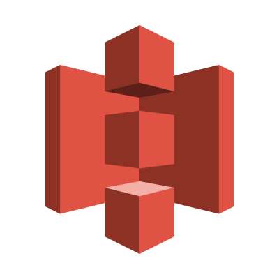

## AWS Certified Solutions Architect - Study and Quiz Notes

### Amazon S3 

**Amazon S3 Bucket Properties**

  - **Versioning -** Versioning enables you to keep multiple versions of an object in one bucket. By default, versioning is disabled for a new bucket.

  - **Server access logging –** Server access logging provides detailed records for the requests that are made to your bucket. By default, Amazon S3 does not collect server access logs.

  - **Static website hosting –** You can host a static website on Amazon S3. To enable static website hosting, choose **Static website hosting** and then specify the settings you want to use.

  - **Object-level logging –** Object-level logging records object-level API activity by using CloudTrail data events.

  - **Tags –** With AWS cost allocation, you can use bucket tags to annotate billing for your use of a bucket. A tag is a key-value pair that represents a label that you assign to a bucket. To add tags, choose Tags, and then choose **Add tag**.

  - **Transfer acceleration –** Amazon S3 Transfer Acceleration enables fast, easy, and secure transfers of files over long distances between your client and an S3 bucket.

  - **Events –** You can enable certain Amazon S3 bucket events to send a notification message to a destination whenever the events occur. To enable events, choose **Events** and then specify the settings you want to use.

  - **Requester Pays** – You can enable Requester Pays so that the requester (instead of the bucket owner) pays for requests and data transfers.

#

**Amazon S3 Object Properties**

  - **Storage class –** Each object in Amazon S3 has a storage class associated with it. The storage class that you choose to use depends on how frequently you access the object. The default storage class for S3 objects is STANDARD. You choose which storage class to use when you upload an object.

  - **Encryption –** You can encrypt your S3 objects.

  - **Metadata –** Each object in Amazon S3 has a set of name-value pairs that represents its metadata.

  - **Tags –** You can add tags to an S3 object.

#

**Amazon S3 Data Consistency Model**

  - Amazon S3 provides *read-after-write* consistency for PUTS of **NEW** objects in buckets.

  - Amazon S3 offers *eventual* consistency for **OVERWRITE** PUTS and DELETES in all regions.

  - A process replaces existing object and immediately attempts to read it. Until the change is fully propagated, Amazon S3 might return the prior data. This is because _Updates to an object_ are atomic i.e. when you do PUT for an object after that you GET (read) that updated object or the old one (before the update), you will never get partial or corrupt or no data.

  - Read-after-write consistency allows you to retrieve objects immediatly after creation in Amazon S3.

#

**File Gateway**

  - The File Gateway presents a file interface that enables you to store files as objects in Amazon S3 using the industry-standard NFS and SMB protocols and access those files via NFS and SMB from your datacenter or Amazon EC2, or access those files as objects with the S3 API.

#

**Request Rate and Performance Guidelines**

  - Amazon S3 automatically scales to high request rates. For example, your application can achieve at least 3.500 PUT/POST/DELETES and 5.500 GET requests per second per prefix in a bucket. There are no limits to the number of prefixes in a bucket. It is simple to increase your read or write performance exponentially. For example, if you create 10 prefixes in an Amazon S3 bucket to parallelize reads, you could scale your read performance to 55.000 read requests per second.

#

**Uploading Objects (Multi-parts Uploading)**

  - Depending on the size of the data you are uploading, Amazon S3 offers the following options:

    - **Upload objects in a single operation -** With a _single PUT operation_, you can upload up to **5 GB** in size.

    - **Upload objects in parts -** using the _multipart upload API_, you can upload large objects, up to **5 TB**. The multipart upload API is designed to improve the upload experience for larger objects. You can upload objects in parts. These object parts can be uploaded independently, in any order, and in parallel. You can use a multipart upload for objects from **5 MB** to **5TB** in size.

  - Amazon recommends that you use multipart uploading in the following ways:

    - If you're uploading large objects over a **stable high-bandwidth network**, use multipart uploading to **maximize** the use of your available bandwidth by uploading object parts in parallel for mult-threaded performance.

    - If you're uploading over a **spotty network**, use multipart uploading to increase **resiliency** to network errors by avoiding upload restarts. When using multipart uploading, you need to retry uploading only parts that are interrupted during the upload. You don't need to restart uploading your object from the beginning.

  - The total volume of data and number of objects you can store are unlimited. Individual Amazon S3 objects can range in size from a minimum of 0 bytes to a maximum of 5 terabytes. The largest object that can be uploaded in a single PUT is 5 gigabytes. For objects larger than 100 megabytes, customers should consider using the **Multipart Upload** capability.  

#

**Amazon S3 Object-Level Actions Tracked by CloudTrail Logging**

  - Using the information collected by CloudTrail, you can determine what request was made to Amazon S3, the source IP address from which the request was made, who made the request, when its made, and so on. This information helps you to track changes made to your AWS resources and to troubleshoot operational issues.

  - You can also get CloudTrail logs for object-level Amazon S3 actions. To do this, specify the Amazon S3 object for your trail. When an object-level action occurs in your account, CloudTrail evaluates your trail settings. If the event matches the object that you specified in a trail, the event is logged.

#

**Object Metadata**

  - There are two kinds of metadata: ***system metadata*** and ***user-defined metadata***.

    - **System-Defined Object Metadata:**

      1. Metadata such as object creation date is system controlled where only Amazon S3 can modify the value.

      2. Other system metadata, such as the storage class configured for the object and whether the object has server-side encryption enabled, are examples of system metadata whose values you control. If your bucket is configured as a website, sometimes you might want to redirect a page request to another page or an external URL. In this case, a webpage is an object in your bucket. Amazon S3 stores the page redirect value as system metadata whose value you control. When you create objects, you can configure values of these system metadata items or update the values when you need to.

    - **System-Defined Metadata list:**

      - Date

      - Content-Length

      - Last-Modified

      - Content-MD5

      - x-amz-server-side-encryption _(the user can modify this metadata value)_

      - x-amz-version-id

      - x-amz-delete-marker

      - x-amz-storage-class	_(the user can modify this metadata value)_

      - x-amz-website-redirect-location	_(the user can modify this metadata value)_

      - x-amz-server-side-encryption-aws-kms-key-id	_(the user can modify this metadata value)_

      - x-amz-server-side-encryption-customer-algorithm	_(the user can modify this metadata value)_

    - **User-Defined Object Metadata:**

      - When uploading an object, you can also assign metadata to the object. You provide this optional information as a name-value (key-value) pair when you send a PUT or POST request to create the object. When you upload objects using the REST API, the optional user-defined metadata names must begin with "x-amz-meta-" to distinguish them from other HTTP headers. When you retrieve the object using the REST API, this prefix is returned. When you upload objects using the SOAP API, the prefix is not required. When you retrieve the object using the SOAP API, the prefix is removed, regardless of which API you used to upload the object.

      - When metadata is retrieved through the REST API, Amazon S3 combines headers that have the same name (ignoring case) into a comma-delimited list. If some metadata contains unprintable characters, it is not returned. Instead, the x-amz-missing-meta header is returned with a value of the number of unprintable metadata entries.

      - User-defined metadata is a set of key-value pairs. Amazon S3 stores user-defined metadata keys in lowercase. Each key-value pair must conform to US-ASCII when you are using REST and to UTF-8 when you are using SOAP or browser-based uploads via POST.

#      

**About to Enable Server Access Logging**

- To track requests for access to your bucket, you can enable server access logging. Each access log record provides details about a single access request, such as the requester, bucket name, request time, request action, response status, and an error code, if relevant.

- By default, logging is disabled. When logging is enabled, logs are saved to a bucket in the same AWS Region as the source bucket. You can have logs delivered to any bucket that you own that is in the same Region as the source bucket, including the source bucket itself.

- Both the source and target buckets must be owned by the same AWS account, and the buckets must both be in the same Region.

- Amazon S3 only supports granting permission to deliver access logs via bucket ACL, not via bucket policy.

- Adding deny conditions to a bucket policy may prevent Amazon S3 from delivering access logs.

- Default bucket encryption on the destination bucket may only be used if AES256 (SSE-S3) is selected. SSE-KMS encryption is not supported.

#

**About S3 and Cross-origin resource sharing (CORS)**

- Cross-origin resource sharing (CORS) defines a way for client web applications that are loaded in one domais to interact with resources in a different domain. With CORS support, you can build rich client-side web applications with Amazon S3 and selectively allow cross-origin access to your Amazon S3 resources.

#

**Accessing a Bucket (Bucket URL types)**

- **Virtual Hosted Style Access**

  - In a **virtual-hosted–style** request, the bucket name is part of the domain name in the URL. Amazon S3 virtual hosted style URLs follow the format shown below.

    - `https://bucket-name.s3.Region.amazonaws.com/key name`

  - In this example, my-bucket is the bucket name, US West (Oregon) is the Region, and puppy.png is the key name:

    - `https://my-bucket.s3.us-west-2.amazonaws.com/puppy.png`  

- **Path-Style Access**

  - In Amazon S3, path-style URLs follow the format shown below.

    - `https://s3.Region.amazonaws.com/bucket-name/keyname`

  - For example, if you create a bucket named mybucket in the US West (Oregon) Region, and you want to access the puppy.jpg object in that bucket, you can use the following path-style URL:

    - `https://s3.us-west-2.amazonaws.com/mybucket/puppy.jpg`

#

**About the Amazon S3 Storage classes**

- AWS says: _"S3 One Zone-Infrequent Access (S3 One Zone-IA; Z-IA) is a new storage class designed for customers who want a lower-cost option for infrequently accessed data, but do not require the multiple Availability Zone data resilience model of the S3 Standard and S3 Standard-Infrequent Access (S3 Standard-IA; S-IA) storage classes"_.

#

**Versioning and Deleting objects**

- When you delete an object in a versioning-enabled bucket, all versions remain in the bucket and Amazon S3 creates a delete marker for the object. To undelete the object, you must delete this delete marker.

- When versioning is enabled, a simple DELETE cannot permanently delete an object. Instead, Amazon S3 inserts a delete marker in the bucket, and that marker becomes the current version of the object with a new ID. When you try to GET an object whose current version is a delete marker, Amazon S3 behaves as though the object has been deleted (even though it has not been erased) and returns a 404 error.

- To permanently delete versioned objects, you must DELETE Object versionId.

#

**Amazon S3 Notifications**

The Amazon S3 notification feature enables you to receive notifications when certain events happen in your bucket. To enable notifications, you must first add a notification configuration that identifies the events you want Amazon S3 to publish and the destinations where you want Amazon S3 to send the notifications. You store this configuration in the notification subresource that is associated with a bucket.

If two writes are made to a single non-versioned object at the same time, it is possible that only a single event notification will be sent. If you want to ensure that an event notification is sent for every successful write, you can enable versioning on your bucket. With versioning, every successful write will create a new version of your object and will also send an event notification.

**Overview of Notifications**

Currently, Amazon S3 can publish notifications for the following events:

- **New object created events** — Amazon S3 supports multiple APIs to create objects. You can request notification when only a specific API is used (for example, `s3:ObjectCreated:Put`), or you can use a wildcard (for example, `s3:ObjectCreated:*`) to request notification when an object is created regardless of the API used.

- **Object removal events** — Amazon S3 supports deletes of versioned and unversioned objects. You can request notification when an object is deleted or a versioned object is permanently deleted by using the `s3:ObjectRemoved:Delete` event type. Or you can request notification when a delete marker is created for a versioned object by using `s3:ObjectRemoved:DeleteMarkerCreated`. You can also use a wildcard `s3:ObjectRemoved:*` to request notification anytime an object is deleted.

- **Restore object events** — Amazon S3 supports the restoration of objects archived to the GLACIER storage class. You request to be notified of object restoration completion by using `s3:ObjectRestore:Completed`. You use `s3:ObjectRestore:Post` to request notification of the initiation of a restore.

- **Reduced Redundancy Storage (RRS) object lost events** — Amazon S3 sends a notification message when it detects that an object of the RRS storage class has been lost.

- **Replication events** — Amazon S3 sends event notifications for replication configurations that have S3 Replication Time Control (S3 RTC) enabled. It sends these notifications when an object fails replication, when an object exceeds the 15-minute threshold, when an object is replicated after the 15-minute threshold, and when an object is no longer tracked by replication metrics. It publishes a second event when that object replicates to the destination Region.

Amazon S3 supports the following destinations where it can publish events:

- **Amazon Simple Notification Service (Amazon SNS) topic** - Amazon SNS is a flexible, fully managed push messaging service. Using this service, you can push messages to mobile devices or distributed services. With SNS you can publish a message once, and deliver it one or more times.

- **Amazon Simple Queue Service (Amazon SQS) queue** - Amazon SQS is a scalable and fully managed message queuing service. You can use SQS to transmit any volume of data without requiring other services to be always available. In your notification configuration, you can request that Amazon S3 publish events to an SQS queue. Currently, Standard SQS queue is only allowed as an Amazon S3 event notification destination, whereas FIFO SQS queue is not allowed.

- **AWS Lambda** - AWS Lambda is a compute service that makes it easy for you to build applications that respond quickly to new information.AWS Lambda runs your code in response to events such as image uploads, in-app activity, website clicks, or outputs from connected devices.
You can use AWS Lambda to extend other AWS services with custom logic, or create your own backend that operates at AWS scale, performance, and security. With AWS Lambda, you can easily create discrete, event-driven applications that execute only when needed and scale automatically from a few requests per day to thousands per second. 
AWS Lambda can run custom code in response to Amazon S3 bucket events. You upload your custom code to AWS Lambda and create what is called a Lambda function. When Amazon S3 detects an event of a specific type (for example, an object created event), it can publish the event to AWS Lambda and invoke your function in Lambda. In response, AWS Lambda executes your function.
