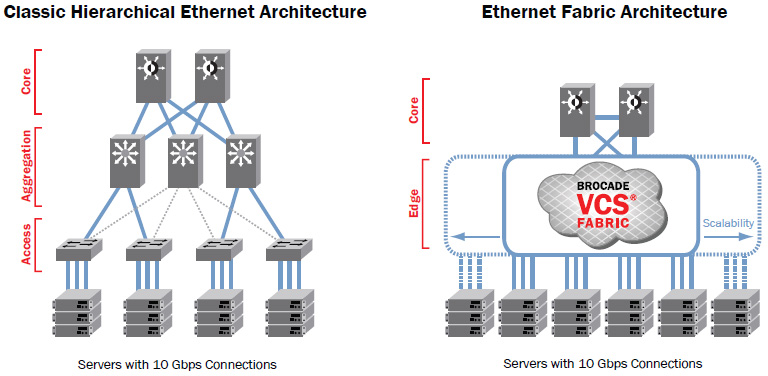

# Cisco CCNA Datacenter Concepts

*Based on the Udemy´s course - [Cisco CCNA Datacenter]* (https://www.udemy.com/cisco-ccna-data-center-completo-dcicn-dcict/)

#

## Network fundamental principles

- Network: Bidirectional communication (the interconnected devices must be able to send and receive data)

- Hierarchy: (3 layers classic model)
  - Core (Fast forward) `Routers`
  - Distribution (Filters, VLans, Services and QOS) `Switches`
  - Access (Provides port density and performance) `Switches`

#

## Classic Ethernet Network x Fabric Ethernet Network (Datacenters)

