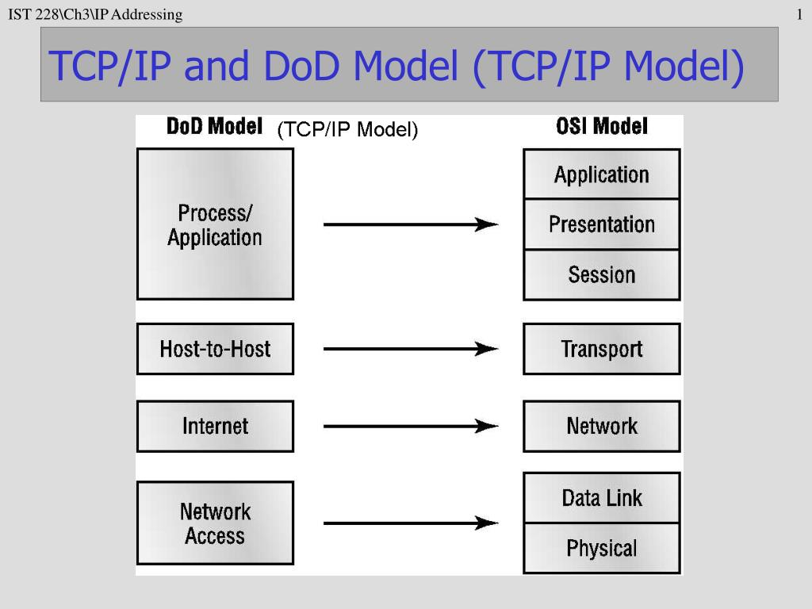

# Cisco CCNA Datacenter Concepts

*Based on the Udemy´s course - [Cisco CCNA Datacenter]* (https://www.udemy.com/cisco-ccna-data-center-completo-dcicn-dcict/)

#

## Network fundamental principles

- Network: Bidirectional communication (the interconnected devices must be able to send and receive data)

- Hierarchy: (3 layers classic model)
  - Core (Fast forward) `Routers`
  - Distribution (Filters, VLans, Services and QOS) `Switches`
  - Access (Provides port density and performance) `Switches`

#

## Classic Ethernet Network x Fabric Ethernet Network (Datacenters)

#

## History of the Ethernet Networks

- Born in Xerox, in 1972;

- Coaxial Cables;

- 2,94 Mbps of transfer rate (by serial connections);

- Ethernet -> Network Alto Aloha;

- In 1980, IEEE (Institute of Electrical and Electronic Engineers) assumed and standardized the Ethernet;

#

## OSI Reference Model

**8** - User

**7** - Application

**6** - Presentation

**5** - Session

**4** - Transport

**3** - Network

**2** - Data Link

**1** - Physical

#

## TCP/IP Model (DOD 4)

**4** - Application/Process (Session, Presentation and Application)

**3** - Host (Transport, Port Communication)

**2** - Internet (Network)

**1** - Network (Physical,Data Link)

#

