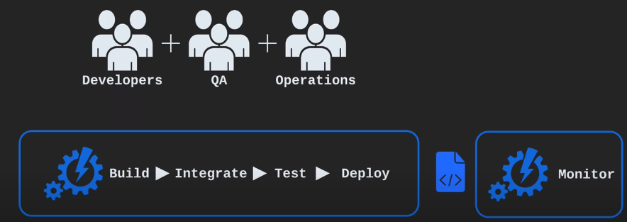
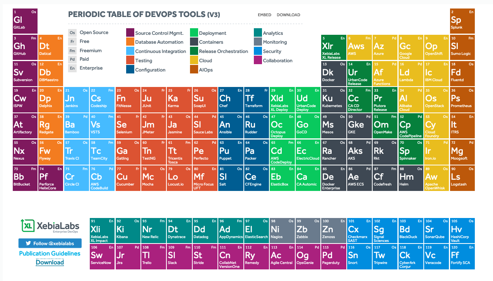

#  DevOps Essentials 

_Based on Linux Academy's Course DevOps Essentials_

## Introduction 

**What is DevOps?**

- Defining DevOps

  - DevOps = **Dev** (Development) + **Ops** (Operations)

  - Different people define DevOps in a variety of ways

  - _"DevOps is a software engineering Culture and Practice that aims at unifying software development (Dev) and software operation (Ops)..."_

  - _DevOps aims at shorter development cycles, increased deployment frequency, more dependable releases, in close alignment with business objectives."_ (Wikipedia, 2018)

  - DevOps is first a **Culture** of colaboration between developers and operations people

  - This culture has given rise to a set of **Practices**

  - DevOps is a grassroots movement, by practitioners, for practitioners

#

**DevOps Is NOT...**

- DevOps is NOT tools, but **Tools** are essential to success in DevOps

- DevOps is NOT a standard

- DevOps is NOT a product

- DevOps is not a job title

#

**Agile Software Development**

- DevOps grew out of Agile software development movement

- Agile seeks to develop software in small, frequent cycles in order to deliver functionality to customers quickly and quickly respond to changing business goals

- DevOps and Agile often go hand-in-hand

## DevOps Culture 

**The Goals of DevOps**

- DevOps Culture

  - DevOps Culture is about **collaboration** between Dev and Ops.

  - Under the traditional separation between Dev and Ops, Dev and Ops have **different** and **opposing** goals.

  - With DevOps, Dev and Ops work together and share the same goals.

- With DevOps:

  - Dev and Ops are playing on the same team

  - Dev and Ops share the same goals

  - The goals include things like:

    - Fast time-to-market (TTM)

    - Few production failures

    - Immediate recovery from failures

- DevOps is about Dev and Ops work together.

- In a DevOps culture, devs care about stability as well as speed, and ops care about speed as well as stability.

- The traditional roles of developers and operational engineers can even become blurred under DevOps.

- Instead of "throwing code over the wall", dev and ops work together to create and use tools and processes that support both speed and stability.

- DevOps recognizes that dev and ops are more powerfull when they are together.

#

**A Story of DevOps vs Traditional Silos**

- The Story of Some Code: **Traditional Silos**

  - Devs write code

  - _"throw it over the wall"_ to QA

  - Code bounces back and forth between Dev and QA as QA discovers problems and Devs fix them

  - Finally, it is ready for production

  - QA/Dev _"throws the code over the wall"_ to Operations

  - Oh No! There´s a problem. Ops throws it back over the wall to Dev

    - Each group´s domain is a "black box" to the other groups

    - _"Our systems are fine; It´s your code!"_

    - _"But the code works on my machine!"_

- _Traditional Silos - What Went Wrong?_

  - Dev and Ops are black boxes to each other, which leads to finger pointing:

    - Because Ops is a black box, Devs don´t really trust them

    - And Ops doesn´t really trust Dev

  - Dev and Ops have different priorities, which pits them against each other:

    - Ops views Devs as breaking stability

    - Devs see ops as an obstacle to delivering their code

  - Even if they WANT to work together:

    - Dev is measured by delivering features, which means deploying changes

    - Ops is measured by uptime, but changes are bad for stability

- _Downsides of Traditional Silos_

  - "Black boxes" lead to finger pointing

  - Lengthy process means slow time-to-market

  - Lack of automation means things like builds and deployments are inconsistent

  - It takes a long time to identify and fix problems

  

- The Story of Some Code: **DevOps**

  - Devs write code

  - Code commit triggers automated build, integration, and tests

  - QA can get their hands on it almost immediately

  - Once it is ready, kick off an automated deployment to production

  - Since everything is automated, it is much easier to deploy while keeping things stable

  - Deployments can occur much more frequently, getting features into the hands of customers faster

  - Oh no! The latest development broke something in production!

    - Fortunately, automated monitoring notified the team immediately

    - The team does a rollback by deploying the previous working version, fixing the problem quickly

    - An hour later, the dev team was able to deploy a fixed version of the new code

  - _DevOps - What Went Right?_

    - Dev and Ops worked together to build a robust way of changing code quickly and reliably:

      - Both Dev and Ops worked together to prioritize both speed of delivery and stability

    - Automation led to consistency:

      - Building, testing, and deploying happened the same way every time

      - Building, testing, and deploying happened much more quickly and more often

    - Good monitoring, plus the swift deployment process, ensured problems could be fixed even before users noticed them:

      - Dev and Ops worked together up front to build good processes

      - Even though a code change caused a problem, users experienced little or no downtime

  - _Why do DevOps?_

    - Happier teams:

      - Tech employees tend to be happier doing DevOps than under traditional silos

      - More time innovating and less time putting out fires

      - Devs don´t feel like they have to fight to get their work out there

      - Operations people don´t have to fight Dev to keep the system stable

    - Happier customers:

      - DevOps lets you give customers the features they want quickly

      - And you don´t have to sacrifice stability to do it

      

## DevOps Concepts an Practices 

**Build Automation**

- _What is build automation?_

  - **Build automation:** automation of the process of preparing code for deployment to a live environment.

  - Depending on what languages are used, code needs to be compiled, linted, minified, transformed, unit tested, etc.

  - Build automation means taking these steps and doing them in a consistent, automated way using a script or tool.

  - The tools of build automation often differ depending on what programming languages and frameworks are used, but, they have one thing in common: **automation**!

- _What does build automation look like?_

  - Usually, build automation looks like running a command-line tool that builds code using configuration files and/or scripts that are treated as part of the source code.

  - Build automation is independent of an IDE.

  - Even if you can build within the IDE, it should be able to work the same way outside of the IDE.

  - As much as possiblem build automation should be agnostic of the configuration of the machine that it is built on.

  - Your code should be able to build on someone else's machine the same way it builds on yours.

- _Why do build automation?_

  - Build automation is **fast** - Automation handles tasks that would otherwise need to be done manually.

  - Build automation is **consistent** - The build happens the same way every time, removing problems and confusion that can happen with manual builds.

  - Build automation os **repeatable** - The build can be done multiple times with the same result. Any version of the source code can always be transfomed into deployable code in a consistent way.

  - Build automation is **portable** - The build can be done the same way on any machine. Anyone on the team can build on their machine, as well as on shared build server. Building code doesn't depend on specific people or machines.

  - Build automation is more **reliable** - There will be fewer problems caused by bad builds.

#

**Continuous Integration**

- _What is Continuous Integration?_

  - **Continuous Integration (CI):** the practie of frequently merging code changes done by developers.

  - Traditionally, developers would work separately, perhaps for weeks at a time, and the merge all of their work together at the end in one large effort.

  - Continuous integration means merging constantly throughout the day, usually with the execution of automated tests to detect any problems caused by merge.

  - Merging all the time could be a lot of work, so to avoid that it should be **automated**!

- _What does Continuous Integration look like?_

  - Continuous integration is usually done with the help of a **CI server**.

  - When a developer commits a code change, the CI server sees the change and automatically performs a build, also executing automated tests.

  - This occurs multiple times a day.

  - If there is any problem with the build, the CI server immediately and automatically notifies the developers.

  - If anyone commits code that "breaks the build" they are responsible for fixing the problem or rolling back their changes immediately so that other developers can continue working.

- _Why do Continuous Integration?_

  - **Early detection** of certain types of bugs - If code doesn't compile or an automated test fails, the developers are notified and can fix it immediately. The sooner the bugs are detected, the easier they are to fix.

  - **Eliminate the scramble** to integrate just before a big release - The code is constantly merged, so there is no need to do a big merge at the end.

  - Makes **frequent releases** possible - Code is always in a state that can be deployed to production.

  - Makes **continuous testing** possible - Since the code can always be run, QA testers can get their hands on it all throughout the development process, not just at the end.

  - Encourages **good coding practices** - Frequent commits encourages simple, modular code.

#

**Continuous Delivery and Continuous Deployment**

- _What is Continuous Delivery?_

  - **Continuous Delivery (CD):** the practice of continuously maintaining code in a deployable state.

  - Regardless of whether or not the decision is made to deploy, the code is always in a state that is able to be deployed.

  - Some use the terms continuous delivery and continuous deployment interchageably, or simply use the abbreviation CD.

- _What is Continuous Deployment?_

  - **Continuous Deployment:** the practice of frequently deploying small code changes to production.

  - Continuous delivery is keeping the code in a deployable state. Continuous deployment is actually doing the deployment frequently.

  - Some companies that do continuous deployment deploy to production multiple times a day.

  - There is no standard for how often you should deploy, but in general, the more often you deploy the better!

  - With continuous deployment, deployments to production are routine and commonplace. They are not a big, scary event.

- _What does Continuous Delivery and Continuous Deployment look like?_

  - Each version of the code goes through a series of stages such as automated build, automated testing, and manual acceptance testing. The result of this process is an artifact or package that is able to be deployed.

  - When the decision is made to deploy, the deployment is **automated**. What the automated deployment looks like depends on the architecture, but no matter what the architecture is, the deployment is automated.

  - If a deployment causes a problem, it is quickly and reliably **rolled back** using an automated process (hopefully before a customer even noices the problem!).

  - Rollbacks aren't a big deal because the developers can redeploy a fixed version as soon as they have one available.

  - No one grips their desk in fear during a deployment, even if the deployment does cause a problem.

- _Why do Continuous Delivery and Continuous Deployment?_

  - **Faster time-to-marke** - Get features into the hands of customers more quickly rather than waiting for a lengthy deployment process that doesn't happen often.

  - **Fewer problems caused by the deployment process** - Since the deployment process is frequently used, any problems with the process are more easily discovered.

  - **Lower risk** - The more changes are deployed at once, the higher the risk. Frequent deployments of only a few changes are less risky.

  - **Reliable rollbacks** - Robust automation means rollbacks are a reliable way to ensure stability for customers, and rollbacks don't hurt developers because they can roll forward with a fix as soon as they have one.

  - **Fearless deployments** - Robust automation plus the ability to rollback quickly means deployments are commonplace, everyday events rather than big, scary events.

#

**Infrastructure as Code**

- _What is Infrastructure as Code?_

  - **Infrastructure as Code** (IAC): manage and provision infrastructure through code and automation.

  - With Infrastructure as Code, instead of doing things manually, you use automation and code to create and change:

    - Servers

    - Instances

    - Environments

    - Containers

    - Other infrastructure

- _What does Infrastructure as Code look like?_

  - Without Infrastructure as Code you might:

    - ssh into a host

    - Issue a series of commands to perform the change

  - With Infrastructure as Code:

    - Change some code or configuration files that can be used with an automation tool to perform changes

    - Commit them to source control

    - Use an automation tool to enact the changes defined in the code and/or configuration files

  - With IaC, provisioning new resources and changing existing resources are both done through automation

- _Why do Infrastructure as Code?_

  - **Consistency** in creation and management of resources - The same automation will run the same way every time.

  - **Reusability** - Code can be used to make same change consistently across multiple hosts and can be used again in the future.

  - **Scalability** - Need a new instance? You can have one configured exactly the same way as the existing instances in minutes (or seconds).

  - **Self-documenting** - With IaC, changes to infrastructure document themselves to a degree. The way a server is configured can be viewed in source control, rather than being a matter of who logged in to the server and did something.

  - **Simplify the complexity** - Complex infrastructure can be stood up quickly once they are defined as code. A group of several interdependent servers can be provisioned on demand.

#

**Configuration Management**

- _What is Configuration Management?_

  - **Configuration Management:** maintaining and changing the state of pieces of infrastructure in a consistent, maintainable, and stable way.

  - Changes always need to happen -  configuration management is about doing them in a maintainable way.

  - Configuration management allows you to minimize **configuration drift** - the small changes that accumulate over time and make systems different from one another and harder to manage.

  - Infrastructure as Code is very beneficial for configuration management.

- _What does Configuration Management look like?_

  - **Here is an example:**

    - **You need to upgrade a software package on a bunch of servers:**

      - Without good configuration management, you log into each server and perform the upgrade. However, this can lead to a lot of problems. Perhaps one server was missed due to poor documentation, or perhaps something doesn´t work while the versions are temporarily mismatched between servers, causing a lot of downtime while you do the upgrade.

      - With good configuration management, you define the new version of the software package in a configuration file or tool and automatically roll out the change to all of the servers.

    - Configuration management is about managing your configuration somewhere outside of the servers themselves

- _Why do configuration management?_

  - **Save time** - It takes less time to change the configuration.

  - **Insight** - With good configuration management, you can know about the state of all pieces of a large and complex infrastructure.

  - **Maintainability** - A more maintainable infrastructure is easier to change in a stable way.

  - **Less configuration drift** - It is easier to keep a standard configuration across a multitude of hosts.

#

**Orchestration**

- _What is Orchestration?_

  - **Orchestration:** automation that supports processes and workflows, such as provisioning resources.

  - With Orchestration, managing a complex infrastructure is less **like being a builder** and more like **conducting an orchestra**.

  - Instead of going out and creating a piece of infrastructure, the conductor simply signals what needs to be done and the orchestra performs it:

    - The conductor does not need to control every detail;

    - The musicians (automation) are able to perform their piece with only a little bit of guidance.

- _What does Orchestration look like?_

  - **Here is an example:**

    - A customer requests more resources for a web service that is about to see a heavy increase in usage due to a planned marketing effort.

    - Instead of manually standing up new nodes, operations engineers use an orchestration tool to request five more nodes to support the service.

    - A few minutes later, the tool has five new nodes up and running.

  - **A much cooler example:**

    - A monitoring tool detects an increased load on the service.

    - An orchestration tool responds to this by spinning up additional resources to handle the load.

    - When the load decreases again, the tool spins the additional resources back down, freeing them up to be used by something else.

    - All of this happens while the engineer is getting coffee.

- _Why do orchestration?_

  - **Scalability** - Resources can be quickly increased or decreased to meet changing needs.

  - **Stability** - Automation tools can automatically respond to fix problems before users see them.

  - **Save time** - Certain tasks and workflows can be automated, freeing up engineers´ time.

  - **Self-Service** - Orchestration can be used to offer resources to customers in a self-service fashion.

  - **Granular insight into resource usage** - Orchestration tools give greater insight into how many resources are being used by what software, services or customers.

#

**Monitoring**

- _What is Monitoring?_

  - **Monitoring:** The collection and presentation of data about the performance and stability of services and infrastructure.

  - Monitoring tools collect data over things such as:

    - Usage of memory

    - cpu

    - disk i/o

    - Other resources over time

    - Application logs

    - Network traffic

    - etc.

  - The collected data is presented in various forms, such as charts and graphs, or in the form of real-time notifications about problems.

- _What does Monitoring look like?_

  - **Real-time notifications:**

    - Performance on the website is beginning to slow down

    - A monitoring tool detects that response times are growing

    - An administrator is immediately notified and is able to intervene before downtime occurs

  - **Postmortem analysis:**

    - Something went wrong in production last night

    - It´s working now, but we don´t know what caused it

    - Luckily, monitoring tools collected a lot of data during the outage

    - With that data, developers and operations engineers are able to determine the root cause (a poorly performing SQL query) and fix it      

- _Why do Monitoring?_

  - **Fast Recovery** - The sooner a problem is detected, the sooner it can be fixed. You want to know about a problem before your customer does!

  - **Better root cause analysis** - The more data you have, the easier is it to determine the root cause of a problem.

  - **Visibility across teams** - Good monitoring tools give useful data to both developers and operations people about the performance of code in production.

  - **Automated response** - Monitoring data can be used alongside orchestration to provide automated responses to events, such as automated recovery from failures.

#

**Microservices**

- _What are Microservices?_

  - **Microservices:** A Microservice architecture breaks an application up into a collection of small, loosely-coupled services.

  - Traditionally, apps used a monolithic architecture. In a monolithic architecture, all features and services are part of one large application.

  - Microservices are small: each microservice implements only a small piece of an application´s overall functionality.

  - Microservices are **loosely coupled**: Different microservices interact with each other using stable and well-defined APIs. This means that they are independent of one another.

- _What do microservices look like?_

  - There are many different ways to structure and organize a microservice architecture.

  - For example, a pet shop application might have:

    - A pet inventory service

    - A customer details service

    - An authentication service

    - A pet adoption request service

    - A payment processing service

  - Each of these is its own codebase and a separate running process (or processes). They can all be built, deployed and scaled separately.

- _Why use Microservices?_

  - **Modularity** - Microservices encourage modularity. In monolithic apps, individual pieces become tightly coupled, and complexity grows. Eventually, it´s very hard to change anything without breaking something.

  - **Technological flexibility** - You don´t need to use the same languages and technologies for every part of the app. You can use the best tool for each job.

  - **Optimized scalability** - You can scale individual parts of the app based upon resource usage and load. With a monolith, you have to scale up the entire application, even if only one aspect of the service actually needs to be scaled.

  - Microservices aren´t always the best choice. For smaller, simpler apps a monolith might be easier to manage.

## DevOps Tools 

**Introduction to DevOps Tools**

- _The Role of Tools in DevOps_

  - DevOps is NOT a set of tools.

  - But how can we achieve high speed of delivery while maintaining stability? **TOOLS**!

  - The DevOps community has created a wide range of powerful tools.

  - Part of doing DevOps is identifying the tools you need and learning how to use them.

#

**Tools for Build Automation and Continuous Integration**

- **Build Automation Tools**

  - **Build Automation** - Automated processing of code in preparation for deployment.

  - What tools you use for Build Automation usually depend on programming languages and frameworks.

  - A few examples:

    - Java - ant, maven, gradle

    - Javascript - npm, grunt, gulp

    - Make - widely used in Unix-based systems

    - Packer - build machine images and containers

- **Continuous Integration Tools**

  - **Continuous Integration** - Continuously merging code into a single branch or mainline.

  - Continuous Integration tools usually consist of a server that integrates with source control.

  - When source code is changed, the server responds by executing an automated build.

  - **Jenkins:**

    - Open source - fork of Hudson

    - Widely used

    - Java servlet-based

  - **TravisCI:**

    - Open source

    - Built around Github integration

    - Executes builds in clean VMs

  - **Bamboo:**

    - Enterprise product by Atlassian

    - Out-of-the-box integration with other Atlassian products like JIRA and Confluence

#

**Tools for Configuration Management**

- _Configuration Management Tools_

  - **Configuration Management** - Managing and changing the state of pieces of infrastructure in a consistent and maintainable way.

  - Configuration Management tools are a great way to implemement **infrastructure as code**.

- **Ansible:**

  - Open Source

  - Declarative configuration

  - YAML configuration files

  - No control server needed - but Ansible Tower is available

  - No agents neede, just Python and SSH

- **Puppet:**

  - Declarative configuration

  - Manage state through a UI

  - Custom modules use Puppet DSL (Domain-Specific Language)

  - Pushes changes to clients using a control server and agents installed on clients

- **Chef:**

  - Procedural configuration

  - Agent/Server

  - Uses Chef DSL

- **Salt:**

  - Declarative configuration

  - Agent(minions)/Server(master) - but can support agentless

  - Uses YAML

  - Support for event-driven automation

#

**Tools for Virtualization and Containerization**

- _Virtualization Tools_

  - **Virtualization** - Managing resources by creating virtual rather than physical machines

  - Hypervisor - Runs on bare metal and manages virtual machines (VMs)

  - Examples:

    - VMWare ESX and ESXi

    - Microsoft Hyper-V

    - Citrix Xen Server

- _Containerization_

  - **Containers:** Lightweight, isolated packages containing everything needed to run a piece of software

  - Require fewer resources than VMs - VMs contain an entire OS plus virtual versions of all the hardware

  - Containers have the bare minimum needed to run the Software

  - Docker - Docker is currently the leading container technology

  - Containers are still relatively new but very useful for DevOps!
