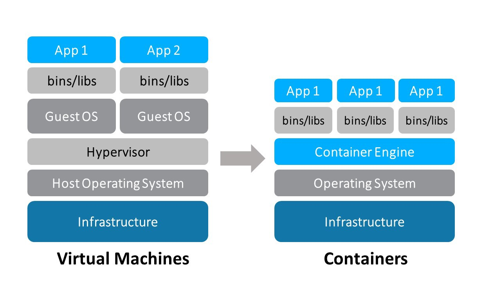

# My Docker Cheat Sheet

*Based on some courses, lessons, studies and articles*

### How Containers Work

<p align="center"></p>

docker run hello-world

docker run --detach --publish=80:80 --name=webserver nginx

docker ps

docker exec -it webserver bash

docker stop webserver

docker kill webserver

docker pull nginx:1.14

docker images

docker history hello-world

docker logs -f fce289e99eb9

**Dockerfile**

```
FROM ubuntu:14.04
RUN apt-get update
RUN apt-get install -y curl nginx
WORKDIR /etc/nginx
ENV MY_ENV=hello_world
COPY nginx.conf ./
CMD ["nginx", "-g", "daemon off;"]
```

**Nginx.conf**

```
worker_processes  1;
pid        /var/run/nginx.pid;
events {
   worker_connections  1024;
}
http {
   server {
   listen 80;
   location /  {
      return 200 "my test";
   }
 }
}
```

docker build -t pivorodrigues/course .

docker ps

docker run -d --publish=80:80 pivorodrigues/course

docker ps

docker exec -it 9a45a19aed61 bash

docker ps -a | grep -i course

docker stop 9a45a19aed61

docker rm 9a45a19aed61

docker run -it --rm pivorodrigues/course bash

docker inspect pivorodrigues/course

docker login

docker push pivorodrigues/course


**Docker Volume (Bind Mount)**

mkdir /tmp/mydir

docker run -it -v /tmp/mydir:/mydir ubuntu:14.04 bash


**Docker Volume (Named Volume)**

docker run -it -v myvolume:/myvolumedir ubuntu:14.04 bash

docker volume ls


**Docker Volume (docker management)**

docker volume inspect myvolume


**Docker Prune**

docker container prune

docker volume prune

docker image prune


docker top 9a45a19aed61

while sleep 3; do docker top 4ad2d3219596; done

docker stats


**Docker Compose**

mkdir composetest

cd composetest


**App Python** (app.py)

```
import time
import redis
from flask import Flask
app = Flask(__name__)
cache = redis.Redis(host='redis', port=6379)
def get_hit_count():
 retries = 5
 while True:
     try:
         return cache.incr('hits')
     except redis.exceptions.ConnectionError as exc:
         if retries == 0:
             raise exc
         retries -= 1
         time.sleep(0.5)

@app.route('/')
def hello():
 count = get_hit_count()
 return 'Hello World! I have been seen {} times.\n'.format(count)

if __name__ == "__main__":
 app.run(host="0.0.0.0", debug=True)
```

cat << 'EOF' > requirements.txt
redis
flask
EOF

cat << 'EOF' > Dockerfile
FROM python:3.4-alpine
ADD . /code
WORKDIR /code
RUN pip install -r requirements.txt
CMD ["python", "app.py"]
EOF

cat << 'EOF' > docker-compose.yml
version: '3'
services:
 web:
   build: .
   ports:
    - "5000:5000"
 redis:
   image: "redis:alpine"
EOF

docker-compose up -d

docker-compose down

**Dockerfile with bind-mount**
