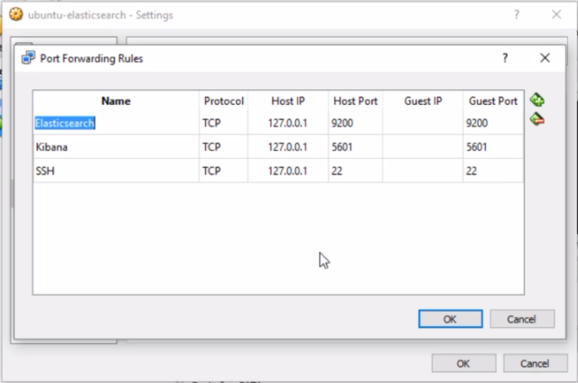
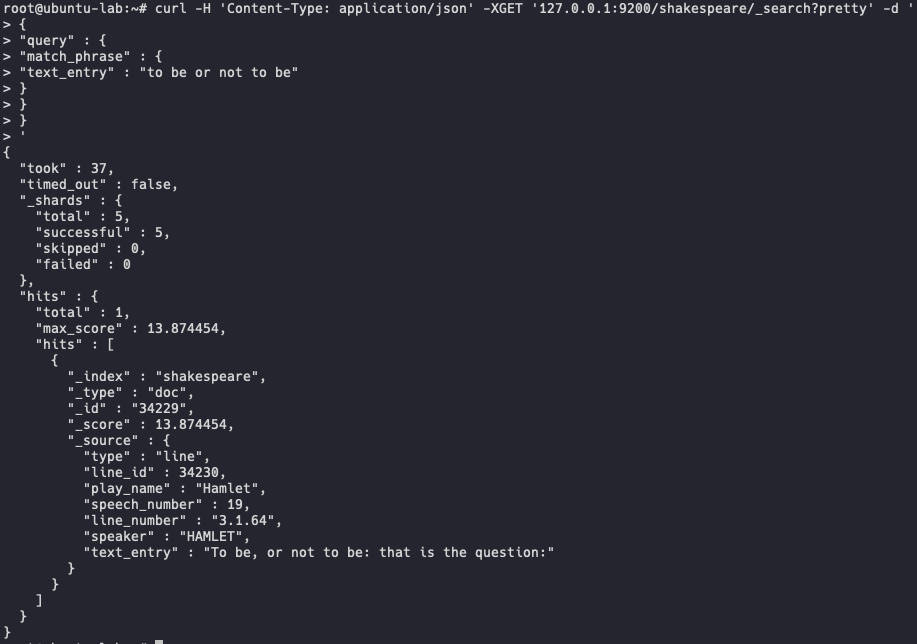
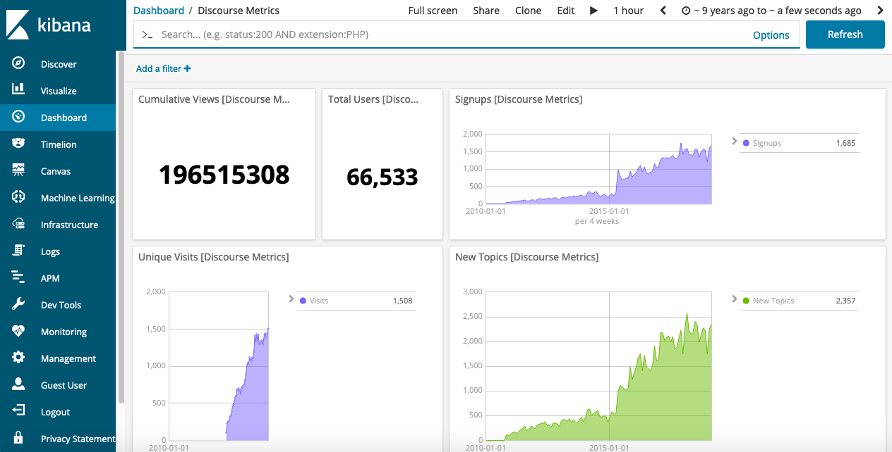

# Elasticsearch 6 and Elastic Stack

*Based on the Udemy´s course - [Elasticsearch 6 and Elastic Stack - In Depth and Hands On!]*
(https://www.udemy.com/elasticsearch-6-and-elastic-stack-in-depth-and-hands-on/)

#

## 1. Installing and Understanding Elasticsearch

- **Configure Port-Forwarding in VirtualBox (To access our Ubuntu VM):**

<p align="center"></p>

- **Install Java:**

  `# apt install openjdk-8-jre-headless -y`

  `# apt install openjdk-8-jdk-headless -y`

- **Install Elasticsearch:**

  `# wget -qO - https://artifacts.elastic.co/GPG-KEY-elasticsearch | apt-key add -`

  `# apt install apt-transport-https`

  `# echo "deb https://artifacts.elastic.co/packages/6.x/apt stable main" | tee -a /etc/apt/sources.list.d/elastic-6.x.list`

  `# apt update`

  `# apt install elasticsearch`

- **Change the Network Host´s IP:**

  `# vim /etc/elasticsearch/elasticsearch.yml`

  `network.host: 0.0.0.0` _(Uncomment this line and change the standard IP for this)_

- **Set Elasticsearch to run automatically:**  

  `# /bin/systemctl daemon-reload`

  `# /bin/systemctl enable elasticsearch.service`

- **Start Elasticsearch:**

  `# /bin/systemctl start elasticsearch.service`

- **Test Elasticsearch status:**

  `# curl 127.0.0.1:9200`

  - This command should return this:

    ```
      {
        "name" : "MMsXfz0",
        "cluster_name" : "elasticsearch",
        "cluster_uuid" : "3mxi2fFSRf20HvafvVi3TQ",
        "version" : {
          "number" : "6.7.1",
          "build_flavor" : "default",
          "build_type" : "deb",
          "build_hash" : "2f32220",
          "build_date" : "2019-04-02T15:59:27.961366Z",
          "build_snapshot" : false,
          "lucene_version" : "7.7.0",
          "minimum_wire_compatibility_version" : "5.6.0",
          "minimum_index_compatibility_version" : "5.0.0"
        },
        "tagline" : "You Know, for Search"
      }
    ```  

- **Just for fun, let´s install the complete works of William Shakespeare and index it to our Elasticsearch index:**

  `# wget http://media.sundog-soft.com/es6/shakes-mapping.json`

  `# curl -H "Content-Type: application/json" -X PUT 127.0.0.1:9200/shakespeare --data-binary @shakes-mapping.json`

- **Let´s retrieve the Shakespeare data itself and index it to our Elasticsearch index:**

  `# wget http://media.sundog-soft.com/es6/shakespeare_6.0.json`  

  `# curl -H 'Content-Type: application/json' -X POST 'localhost:9200/shakespeare/doc/_bulk?pretty' --data-binary @shakespeare_6.0.json`

- **Let´s test a simple search in our William Shakespeare's works:**

  ```
    $ curl -H 'Content-Type: application/json' -XGET '127.0.0.1:9200/shakespeare/_search?pretty' -d '
      {
      "query" : {
      "match_phrase" : {
      "text_entry" : "to be or not to be"
      }
      }
      }
      '
  ```

  [[Sundog ELK Resources]](https://sundog-education.com/elasticsearch/)

#

**Elasticsearch Overview**

  - Started off as scalable Lucene;

  - Horizontally scalable search engine;

  - Each "shard" is an inverted index of documents;

  - But not just for full text search!

  - Can handle structured data and can aggregate data quickly;

  - Often a faster solution than Hadoop/Spark/Flink/etc.

  <p align="center"></p>

**Kibana Overview**

  - Web UI for searching and visualizing;

  - Complex aggregations, graphs, charts;

  - Often used for log analysis.

  <p align="center"></p>

**Logstash/Beats Overview**

  - Ways to feed data into Elasticsearch;

  - FileBeat can monitor log files, parse them and import into Elasticsearch in near-real-time;

  - Logstash also pushes data into Elasticsearch from many machines;

  - not just log files.

**X-Pack Overview (Paid Elasticsearch add on)**

  - Security;

  - Alerting;

  - Monitoring;

  - Reporting;

  - Machine Learning;

  - Graph Exploration.

#

**Intro to HTTP and RESTful API's**

  - **METHOD:** the _"verb"_ of the request. GET, POST, PUT or DELETE;

  - **PROTOCOL:** what _flavor_ or _version_ of HTTP (HTTP/1.1);

  - **HOST:** what web server you want to talk to;

  - **URL:** what resource is being requested;

  - **BODY:** extra data needed by the server;

  - **HEADERS:** user-agent, content-type, etc.

**Pragmatic definition of RESTful API's:** _using HTTP requests to communicate with web services._

  - **Examples:**

    - GET requests retrieve information (like search results);

    - PUT requests insert or replace new information;

    - DELETE requests delete information.

**REST fancy-speak**

  - Representational State Transfer (Six guiding constraints):

    - Client-server architecture;

    - Statelessness;

    - Cacheability;

    - Layered system;

    - Code on demand (ie, sending Javascript);

    - Uniform interface.

**Why REST?**

  - Language and system independent.

**The curl command:**

  - A way to issue HTTP requests from the command line. From code, you´ll use whatever library you use for HTTP/REST in the same way.

  _$ curl -H "Content-Type:application/json" <URL> -d '<BODY>'_

**Examples:**

  ```
      $ curl -H "Content-Type: application/json" -XGET '127.0.0.1:9200/shakespeare/_search?pretty' -d'
      {
      "query":{
      "match_phrase":{
      "text_entry":"to be or not to be"
      }
      }
      }
      '
  ```
