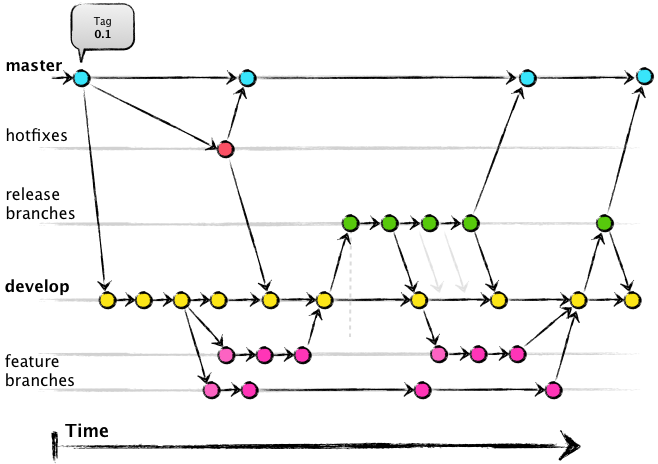

# GIT

### GIT Basic Workflow

<p align="center"></p>

#

### GIT Basic Operations

```$ git clone <project_url>``` *(Clone remote repository to local repository)*

```$ git add <file>``` *(Add files to the staging area)*

```$ git status``` *(Show the local repository status)*

```$ git commit -m "comment"``` *(Make a commit and add a comment)*

```$ git push origin master``` *(Update the branch master of remote repository)*

```$ git log``` *(Show the commit history)*

```$ git pull``` *(Update the local repository)*

```$ git checkout master && git pull origin master && git submodule update --init``` (git pull with esteroids :smile:)

#

### GIT diff / revert / reset / checkout

```$ git diff``` *(Show changes between commits)*

```$ git diff <commit>``` *(Show the difference between the local repo and a single commit)*

```$ git diff HEAD~1``` *(Show the difference between the local repo and the last commit)*

```$ git revert <commit>``` *(Undo the changes of a specific commit)*

```$ git reset --hard <commit>``` *(Delete a commit completely)*

```$ git checkout <commit>``` *(Back to a specific commit)*

```$ git checkout master``` *(Back to the current master commit)*

```$ git checkout --<file>``` *(Undo changes in a file off the staging area)*

```$ git checkout HEAD --<file>``` *(Back a local file to the current master commit)*

#

### GIT Branches

<p align="center"></p>
