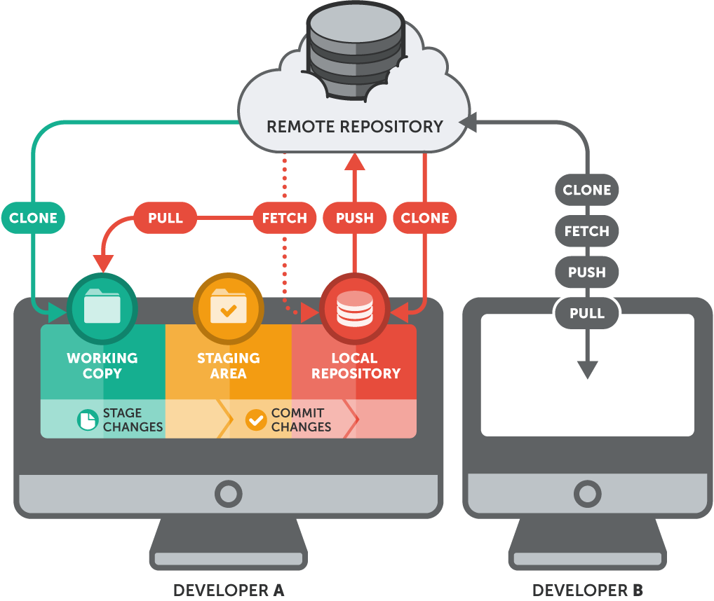

# GIT

### GIT Basic Workflow

<p align="center"></p>

#

### GIT Basic Operations

```$ git clone <project_url>``` *(Clone remote repository to local repository)*

```$ git add <file>``` *(Add files to the staging area)*

```$ git status``` *(Show the local repository status)*

```$ git commit -m "comment"``` *(Make a commit and add a comment)*

```$ git push origin master``` *(Update the branch master of remote repository)*

```$ git log``` *(Show the commit history)*

```$ git pull``` *(Update the local repository)*

```$ git checkout master && git pull origin master && git submodule update --init``` (git pull with   steroids :smile:)

#

### GIT diff / revert / reset / checkout

```$ git diff``` *(Show changes between commits)*

```$ git diff <commit>``` *(Show the difference between the local repo and a single commit)*

```$ git diff HEAD~1``` *(Show the difference between the local repo and the last commit)*

```$ git revert <commit>``` *(Undo the changes of a specific commit)*

```$ git reset --hard <commit>``` *(Delete a commit completely)*

```$ git checkout <commit>``` *(Back to a specific commit)*

```$ git checkout master``` *(Back to the current master commit)*

```$ git checkout --<file>``` *(Undo changes in a file off the staging area)*

```$ git checkout HEAD --<file>``` *(Back a local file to the current master commit)*

#

### GIT Branches

<p align="center"></p>

#

```$ git branch``` *(Show the current work branch)*

```$ git branch <branch_name>``` *(Create a new branch)*

```$ git branch -d <branch_name>``` *(Delete a branch)*

```$ git checkout -b <branch_name>``` *(Create a branch and change the current work branch)*

```$ git checkout <branch_name>``` *(Change the current work branch)*

```$ git merge <branch_name>``` *(Merge content from other branch)*

#

### GIT Tags

<p align="center"></p>

#

```$ git tag <tag_name>``` *(Create a tag)*

```$ git tag``` *(Show all the project tags)*

```$ git show-ref --tag``` *(List which commits belong to what tags)*

```$ git checkout <tag_name>``` *(Checkout to a tag)*

#

### Some other features

~/.gitconfig *(Git User configuration file)*

```$ git log --pretty =``` *(Customize the git log)*

```$ git log --graph``` *(Show the logs in graphics)*

```$ git cherry-pick <commit>``` *(Make the merge with a specific commit)*

`$ git rebase <branch>` *(It takes all the changes commited in one branch and replicates to another)*
