## Site Reliability Engineering: Measuring and Managing Reliability 

### Course Structure

- Targeting Reliability

- Operating for Reliability

- Choosing a Good SLI

- Developing SLOs and SLIs

- Quantifying Risks to SLOs

- Consequences of SLO Misses

#

### Course introduction: What is SRE? How does It differ from DevOps?

**Whats the difference between DevOps and SRE? (class SRE implements DevOps)**

- **DevOps Objectives:**

  - Reduce Organization Silos

  - Accept Failure as Normal

  - Implement Gradual Change

  - Leverage Tooling and Automation

  - Measure Everything

- **SRE Objectives:**

  - Share ownership

  - SLOs and Blameless PMs

  - Reduce costs of failure

  - Automate this year's job away

  - Measure toil and reliability

#

### Who are CREs (Customer Reliability Engineering)? How can they help you be more reliable?

**CRE's Three Reliability Principles**

- **1.** Reliability is the most important feature

- **2.** Users, not monitoring, decide reliability

- **3.** Well-engineered...

  - _software_ = 99.9%

  - _operations_ = 99.99%

  - _business_ = 99.999%

**Reliability in the cloud**

- 28-day error budget **99.9%** = 40 min

- 28-day error budget **99.99%** = 4 min

#

### Why are SLOs important for your organization?

**How SLOs help you balance operational and project work**

***Question:*** _What is the right level of reliability for the system you support?_

- SLOs with executive support turn arguments into data-driven decisions.

- SLOs can drive Ops response and long-term priorization.

#  

### Targeting Reliability

**Three Principles**

  1. What to promise to whom

  2. What metrics to measure

  3. How much reliability is good enough

#  

**SLOs vs SLAs**

- **SLA:** Service Level Agreement

  - Agreements with customers about the reliability of your service

- **SLO:** Service Level Objectives

  - Thresholds that catch an issue before it breaches your SLA

#

**The Happiness Test**

_There are many characteristics of reliable services. But the common theme is that users perceive a service to be unreliable
when it fails to meet their expectations, whatever those may be. Users whose expectations have not been met tend to get grumpy. So we think a good rule of thumb to help you set SLO targets is what we call the happiness test.
The test states that services need target SLOs that capture the performance and availability levels that if barely met would keep a typical customer happy. Simply put, if your service is performing exactly at its target SLOs, your average user would be happy with that performance. If it were any less reliable, you'd no longer be meeting their expectations and they would become unhappy. If your service meets target SLO, that means you have happy customers. If it misses the target SLO, that means you have sad customers._

#

**How do we measure reliability?**

- Measuring Reliability - Example: Netflix Service

  - Time to start playing

  - No interruptions or issues with playback

- Time to start playing = Latency

  - SLIs, like request latency, are a quantitative measurement or metric of a user experience.

- Error rate = ratio errors or successes/total requests

or

- Error rate = errors or successes/throughput

- SLI: **good** events / valid events

- _How do you set SLOs for your SLIs?_

  - An SLO is just a target that you get to pick, so once you've decided on that target, you measure the performance of the SLIs against it over a period of time. Such as 28 days, last quarter, etc. Depending on what our target SLO is, our SLI will instantly tell us whether or not a certain point in time was good or bad.

#

**How Reliable Should a Service Be? Setting Targets for Reliability**

- **100% is Wrong**

  - If you're trying to run your service much more reliably than it needs to be, you're slowing down development velocity for features that will make your customers happier, for a minor increase in reliability.

  
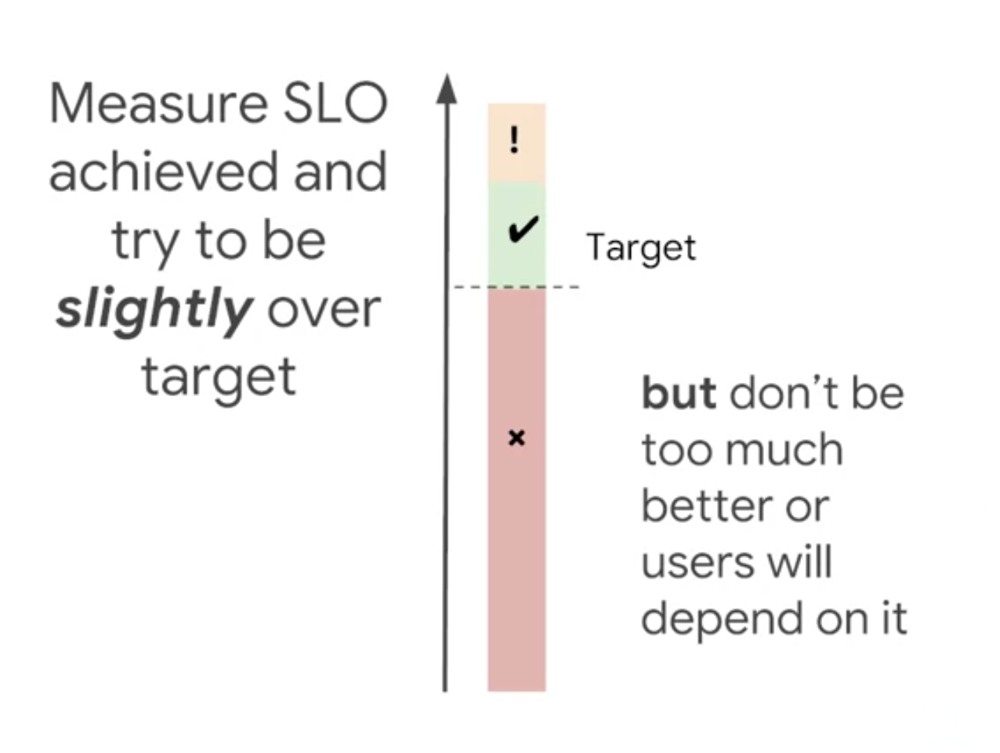

- **Iteration of SLOs is important**

  

#

### Operating for Reliability

**When Do We Need to Make a Service More Reliable? Error Budgets**

  - An Error Budget is basically the inverse of availability, and it tell us how unreliable your service is **allowed** to be.

  - 99.9% success = 0.1% failure

  - Tolerable errors accommodate:

    - Rolling out new software versions

    - Releasing new features

    - Planned Downtime

    - Inevitable hardware failures

  - 0.1% unavailability x 28 days = 40.32 mins (downtime per month)

  - ***Benefits:***

    - Common incentives for Devs and SREs :white_check_mark:

    - Dev team can self-manage risk :white_check_mark:

    - Unrealistic goals become unattractive :white_check_mark:

#

**Trading off Reliability Against Features**

**Everything is a trade-off**

- 99% reliability :arrow_right: (10x effort) 99.**9**% :arrow_right: (10x effort) :arrow_right: 99.9**9**%

- Align Incentives

  - :white_check_mark: Devs can take risks and push more quickly

  - :white_check_mark: SRE team can work more proactively

- Effective SLOs

  - :white_check_mark: Have executive buy-in

  - :white_check_mark: Have consequences

  - :white_check_mark: Are accurately measured?

#

**Error budgets: advanced concepts**

**Advanced Techniques**

- :white_check_mark: Dynamic release cadence

  - _Based on remaining error budget_

- :white_check_mark: "Rainy Day" fund

  - _Covers unexpected events_

- :white_check_mark: Error budget-based alerts

  - _Exhaustion rate drives alerting_

- :white_check_mark: "Silver Bullets"

  - _For critical new features_

#

**How Do We Make a Service More Reliable**

**Axes of improvement**

- Improve reliability by:

  **1.** Reducing detection time

    - :arrow_down: time-to-detect / TTD

  **2.** Reducing repair time

    - :arrow_down: time-to-resolution / TTR

  **3.** Reducing impact %

    - :arrow_down: users/functionality

  **4.** Reducing frequency

    - :arrow_down: time-to-failure/TTF

#

**Operational approach to increase reliability**

- Report on uneven error budget spend

- Provide input on achieving targets

- Standardize Infrastructure

- Consult on system design

- Build safe release and rollback

- Author postmortens

- Use phased rollouts

#

**Module Summary**

1. Define your problem space: SLO and SLIs.

2. Make your system as reliable as it must be, but no more.

3. Error budgets are your primary basis of communication.

4. SLOs are not set in stone forever.

5. The team relationship has to be strong to make this work.

#

### Choosing a Good SLI

**Metrics and Measurement**

**User happiness in metric form**

- If we can find a way of quantifying the website does not load or this website is too slow from our monitoring data, we can use this data to approximate how happy or unhappy our users are in aggregate.

- These quantifiable metrics become our SLIs. Ideally, you wanted to define SLIs that have a predictable, mostly linear relationship with happiness of your users. The predictability of the relationship is crucial because you'll be making important engineering decisions based on this data.

#

**The properties of a good SLI metrics**

- Bad metrics:

  - :x: System metrics

  - :x: Internal state

- Good metrics

  - :white_check_mark: Has predictable relationship with user happiness.

  - :white_check_mark: Shows service is working as users expect it to.

  - :white_check_mark: Expressed as: _good events/valid events_.

  - :white_check_mark: Aggregated over a long time horizon.

- Why is the lower metric better for use as an SLI than the upper one?  

#

**Ways of measuring SLIs**

- The accuracy of your measurement of that experience increases the closer you get to a user's interactions with your system.
So a key engineering decision underlying any SLI is the choice of where and how to measure it. Broadly speaking, there are five ways to measure an SLI and each has their own set of advantages and disadvantages. We'll talk about them in the order of increasing proximity to the user.

- The client-side instrumentation provides far and away the most accurate measure of your user experience and can even help you gauge the reliability of the third parties like CDNs or payment providers in your user journeys. So why isn't this is the default approach? Adjusting the telemetry from your clients can incur significant measurement latency, especially for mobile clients where waking the radio every few seconds to report home, is detrimental to both battery life and user trust. Just like logs processing, this latency makes SLIs based on client instrumentation unsuitable for triggering a short-term operational response. Measuring from the client's perspective also captures a lot of factors that are outside of your direct control, which can lower the signal to noise ratio of prospective SLIs. To give an example, you might be interested to know that mobile clients suffer poor latency and higher error rates, but because you can't do a whole lot about it, you have to relax your SLO targets to accommodate it instead.

#

**Commonly Used SLIs**

**The SLI Menu**

- :arrows_counterclockwise: **Request/Response**

  - Availability

  - Latency

  - Quality

- :clock1: **Data Processing**

  - Coverage

  - Correctness

  - Freshness

  - Throughput

- :inbox_tray: Storage

  - Durability

#

**The SLI Equation**

- **SLI:** **good** events / **valid** events

- :white_check_mark: SLIs fall between 0 and 100%

- :white_check_mark: Consistency makes building common tooling easier

#

**Request/Response SLIs**

- **Availability**

  - The proportion of valid requests served successfully

  - The proportion of minutes a virtual machine was booted and accessible

- **Latency**

  - The proportion of work-queue tasks are completed faster than a threshold

  - The proportion of valid requests served faster than a threshold

- **Quality**

  - The proportion of valid requests served without degrading quality

  

#

**Data processing SLIs**

- **Freshness**

  - The proportion of valid data updated more recently than a threshold

  

  

  

- **Correctness**

  - The proportion of valid data producing correct output

  

- **Coverage**

  - The proportion of valid data processed successfully  

  

- **Throughput**

  - The proportion of time where the data processing rate is faster than a threshold

  

#

**Managing Complexity**

**"But my system is really complex!"**

You should aim to only have **one to three SLIs** covering each user journey, even if your system and user journeys are relatively complex.

:x: Not all metrics make good SLIs.

:x: More SLIs result in higher cognitive load.

:x: More SLIs lower signal-to-noise ratio...

... and can drive up time to resolution.

- Your metrics still have value!

  - **SLIs:** Something is broken!

  - **Metrics:** _This thing_ is broken!

#

**Managing complexity with aggregation**

:white_check_mark: Simple aggregation works much of the time

:x: Except when request rates differ significantly

#

**Managing Complexity with bucketing**

#

**Setting Reliable Targets**

**Achievable SLOs**

:white_check_mark: It's OK to wait and gather data before setting targets!

:white_check_mark: **Achievable** SLOs are ones based on historical data...

:x: ...but assume that users are happy with the status quo...

:astonished: ...without any **evidence** to back up this claim!

#

**Aspirational SLOs**

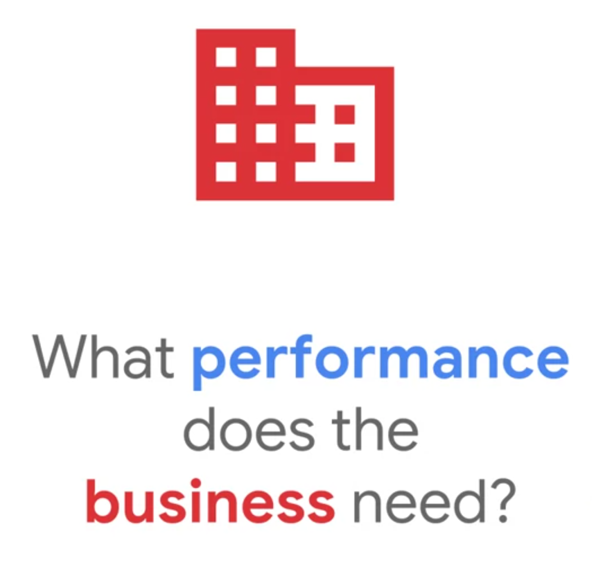

- We call SLOs based on business requirements aspirational SLOs because it's entirely reasonable for you not to be able to meet them at first.

-  If you have good indications that your users are unhappy with your past performance, that's a sign you need to set your aspirational targets higher than the achievable ones derived from your monitoring data.

- If you've got no historical data at all because you don't have any users yet, starting from your product teams' best guesses about what will keep your potential users happy is your best option.

- Once you launch, you can gather data and set an achievable target. Setting a reasonable target and beginning to measure as soon as possible is more important than getting the target exactly right the first time because you should revisit your SLO targets regularly.

#

**Continuous Improvement**

:white_check_mark: **Aspirational** targets represent business needs.

:white_check_mark: **Achievable** targets represent past performance.

:white_check_mark: Can diverge, but are _ideally_ the same number...

:white_check_mark: ...so we need a process to drive convergence.

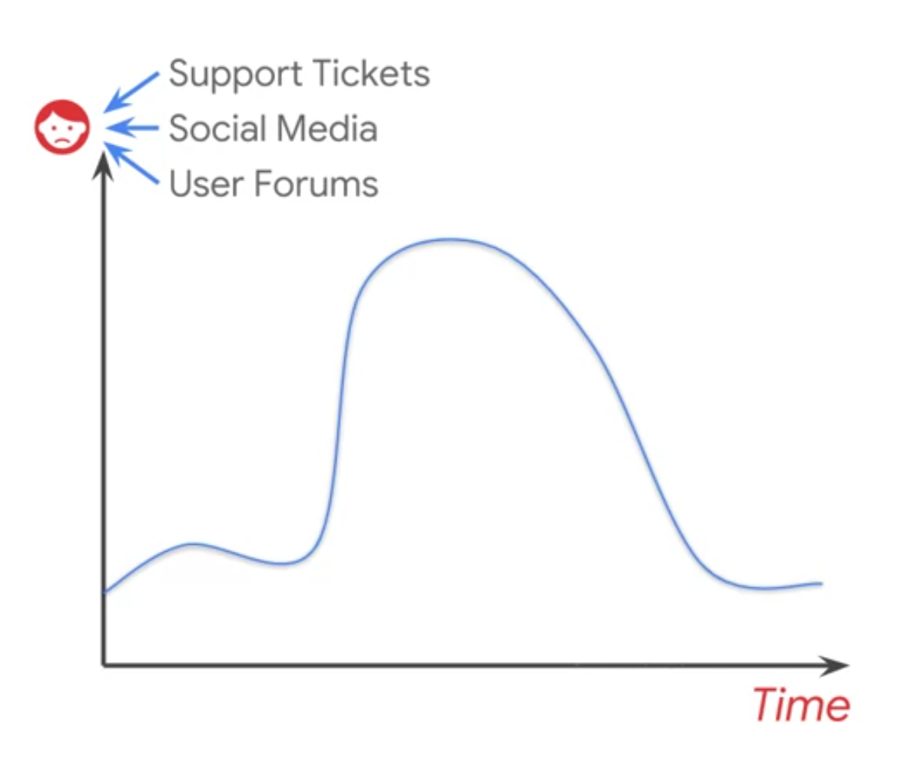

When the time comes to revisit your SLO's, you can compare the times your users were less happy to your performance against your targets. Tracking down and understanding the reasons behind any discrepancies between the two, where your users were sad but you are still in SLO or vice versa, will help you refine your SLO targets, so you can be sure you're drawing the line in the right place.

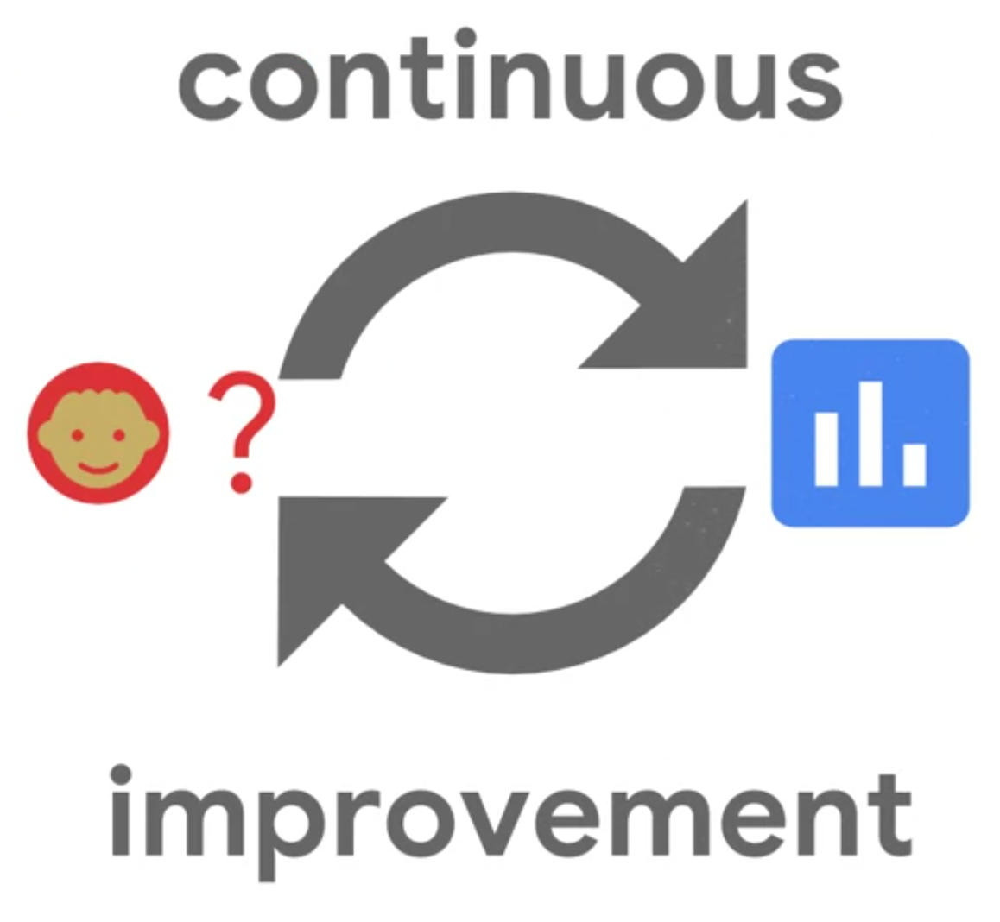

You don't want to wait a whole year to find out the first shot at setting reliability targets was way off. As you gain more confidence that your targets are in the right place, you can revisit them less frequently. We recommend doing so at least once a year. A lot can happen in one year. Your user-based may grow dramatically, or your business might pivot to a new market with different requirements. Remember, what we said in module one, your SLO's are not set in stone.

#

### Developing SLOs and SLIs

**The 4 step process**

**1.** Choose an **SLI specification** from the SLI menu.

_What are the differences between SLI specifications and implementations?_

- SLI specifications are **high-level descriptions** of a dimension of reliability that we would like to measure about our service, ideally taking the form "the proportion of valid events that were good".

- SLI implementations have **concrete definitions** of what the events are, what makes them valid for inclusion into the SLI, what makes them good, and how/where they are measured.

**2.** Refine the specification into a detailed **SLI implementation**.

- The refined SLI implementations need to be detailed enough that someone could build or configure monitoring infrastructure to gather the data without needing to ask any further questions. With your SLI implementations in hand, you'll need to critically examine how your infrastructure serves the interactions that make up the user journey.

**3.** Walk through the user journey and look for **coverage gaps**.

- Pay careful attention to how that infrastructure could fail and the implications for your chosen implementations. Any failure modes that your SLIs won't capture, hopefully there won't be many, and they'll be low probability, should be documented carefully. If you find something that's too high risk, it's a signal you need to go back and rework your implementation, likely by changing your measurement strategy or augmenting it with a second one.

**4.** Set aspirational **SLO targets** based on business needs.

- Once you're happy with the SLI implementations, you can choose your measurement window and set some SLO targets. If you've got time, you can wait for a couple of measurement windows to gather performance data before setting your initial targets or you can estimate targets based on your business needs and already existing signals of user happiness. Sounds easy, right? Well, it can be if your user journeys are simple and your infrastructure is architected to make SLI measurement fast and cheap, but the devil is always in the details.

#

**Refining SLI specifications**

:white_check_mark: **Where** is SLI measured?

:white_check_mark: **What** does SLI measure?

:white_check_mark: What metrics should be **included** or **excluded**?

:white_check_mark: Is there **enough detail** to **implement** this SLI?

- **Availability**

  - The proportion of **HTTP GET** requests for **/profile/{user}** or **/profile/{user}/avatar** that have **2xx, 3xx,** or **4xx (excl.429) response codes** measured at the **load balancer**.

- **Latency**

  - The proportion of **HTTP GET** requests for **/profile/{user}** that send **their entire response within Xms** measured at the **load balancer**.

#

**Do the SLIs cover the failure modes of the service?**

**Looking for observability gaps**

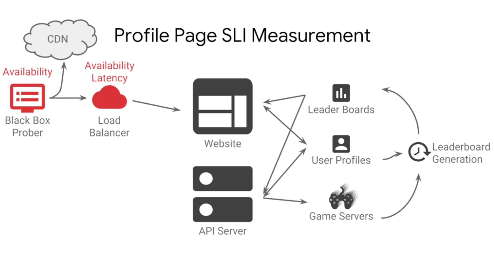

**1.** Do the SLIs adequately capture the user journey and its failure modes?

**2.** Are there any exceptions or edge cases to consider?

**3.** Do the SLIs capture multiple journeys with differing needs?

:white_check_mark: 100% coverage of complex system is unrealistic.

:white_check_mark: Pay for rare failure modes from your error budget.

:white_check_mark: Exclude factors outside your control from your SLIs.

:white_check_mark: Does the cost-benefit analysis add up?

#

### Quantifying Risks to SLOs

**Is your error budget realistic?**

- Availability **99.95%** _over the past 28 days_.

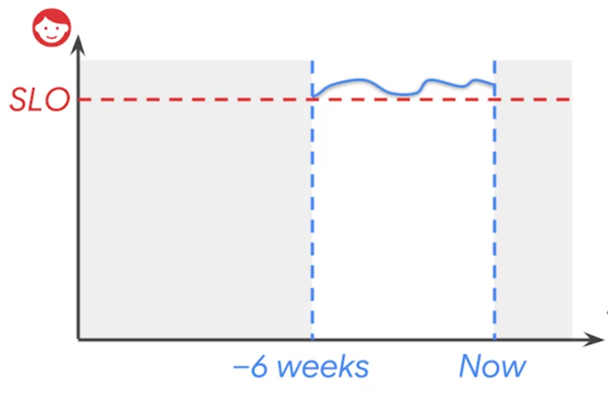

(6 weeks steady metrics)

(Outage Scenario)

**1.** Is our error budget **realistic**?

- _Can we expect to burn less than the budget if we consider longer time horizons over years instead of weeks or months when we taken into account large long-tail events?_

**2.** Which risks burn **most budget**?

- _Is there any low-hanging fruit that if fixed could allow our service to attain higher levels of availability for less engineering effort?_

- The practice of safety engineering begins with identifying a hazard, a condition that could lead to an accident. The risk of that accident happening can be modeled as the impact of the accident multiplied by the probability of the hazard causing the accident.

- The accident we're trying to prevent is missing our SLO targets. The hazards we deal with are the root causes of outages or unavailability, like the failure of one of our cloud providers availability zones. If we can quantify the probability of one of
these hazards occurring and the likely impact on our service, we can understand the risk to our SLO posed by that hazard.

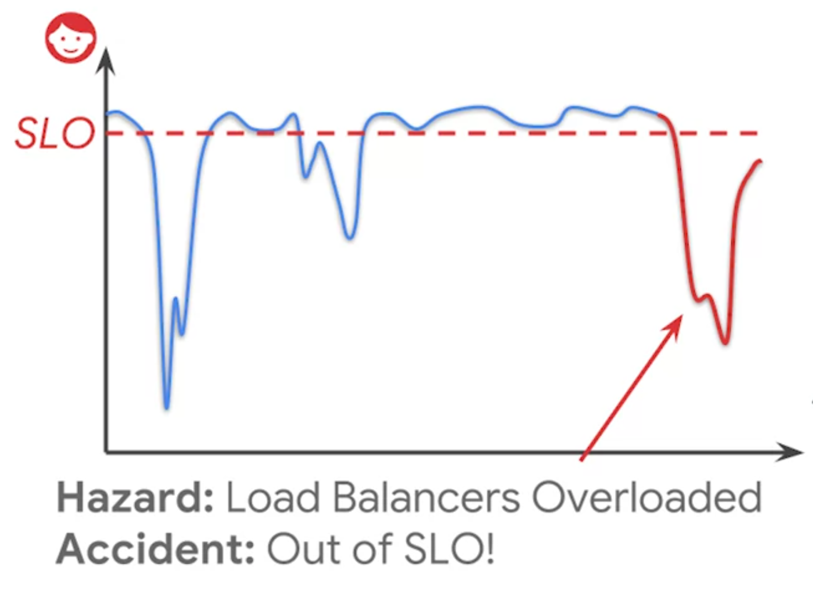

:white_check_mark: Brainstorm availability risks.

:white_check_mark: How can each piece of infrastructure fail?

:white_check_mark: Be pessimistic... ...but constructive.

:white_check_mark: Think about _classes_ of risk.

#

**Modeling Risks in our spreadsheet**

- **Risk**

  - _Risk A = Risk B?_

  - _Probability (Time to failure) x Impact (Service Downtime)_

  - _Risk = Bad Minutes/Year_

- **Downtime**

  - _1. Time to detection (ETTD)_

  - _2. Time to resolution (ETTR)_

  - _3. Percentage of users impacted_

#

**Analyzing Risk**

- **Risk**:  A new content release is super popular, causes overload of web servers or user profile database.

  - **Mitigations**

    - Add temporary capacity

    - Database replicas and cache

    - ***Write rates still a problem!*** :heavy_exclamation_mark:

- **Risk:** User profile database is deleted or corrupted, restore from backup is required.

  - **Mitigations**

    - LVM snapshot backups

    - Automated restore process

    - ***No validation/QA of restores*** :heavy_exclamation_mark:

- **Risk:** Database write performance is degraded (by a bad schema push, slow disk volumes, etc)

  - **Mitigations:**

    - SLO for write latency

    - ***Frequency still a problem*** :heavy_exclamation_mark:

- **Risk to fix:** Our regular release cycle (Mon-Thu) causes an increased level of errors as tasks restart.

- **Risk to fix** One of our three availability zones becomes unavailable.

#

### Consequences of SLO Misses

**No surprises**

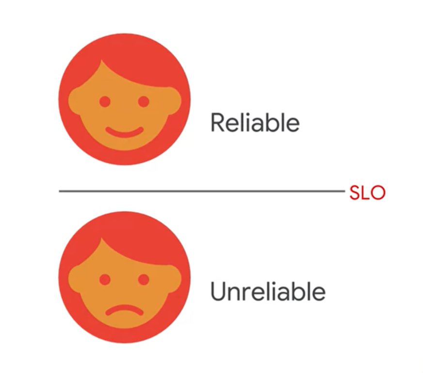

- **Documenting your SLO**

  - Why the threshold is where it is.

  - Why the SLIs are appropriate for measuring the SLO.

  - Identify monitoring data deliberately ***excluded*** from the SLIs.

- **SLO cycles of refinement**

  - Development

  - Testing

  - Paging

  
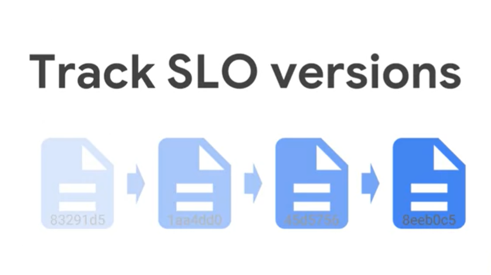

- Store metadata alongside monitoring configs

#

**Why an error budget policy?**

- _Fixing chronic reliability issues_ **+** _Improving organizational alignment_ **+** _Reducing finger pointing_ **=** **Happy Users**

- Where to store your error budget policy?

  - Somewhere high-level

  - Not within one app or one service

#

**Fundamentals of an error budget policy**

- **Error Budget Policy**

  - :white_check_mark: Result in engineering to improve reliability

  - :white_check_mark: Describe ***when*** this happens

  - :white_check_mark: Describe ***how*** this happens

  - :white_check_mark: Include consequences for this ***not*** happening

  - :white_check_mark: Be consistently applied

  - :white_check_mark: Document whom to escalate disagreements to

  - :white_check_mark: Be agreed upon and signed of by all parties

#

**How to draft an error budget policy**

- Tie greater unreliability to escalating consequences.

- Choose thresholds and consequences that align with business priorities.

- Start small: when to page on-call is still a threshold.

- Provide supporting material: rationale, worked examples, precedent.

- Expect ~~bike shedding~~ lots of negotiation.

#

**Example Policy Thresholds**

- Threshold 1: **Automated alerts** notify SRE of an at-risk SLO.

- Threshold 2: SREs conclude they need help to defend SLO and **escalate to devs**.

- Threshold 3: The 30-day error budget is exhausted and the root cause has not been found; **feature releases blocked**, dev team dedicates more resources.

- Threshold 4: The 90-day error budget is exhausted and the root cause has not been found; SRE **escalates to executive leadership** to obtain more engineering time for reliability work.

#

**A hypothetical policy scenario**

- Threshold 4: The 90-day error budget is exhausted and the root cause has not been found; SRE **escalates to executive leadership** to obtain more engineering time for reliability work.

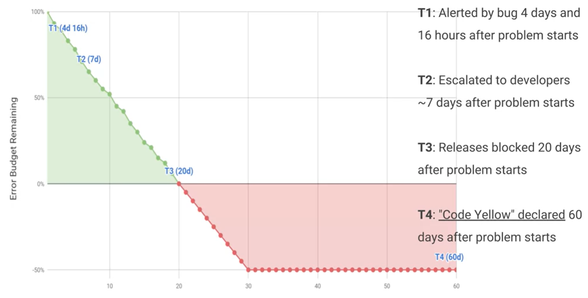

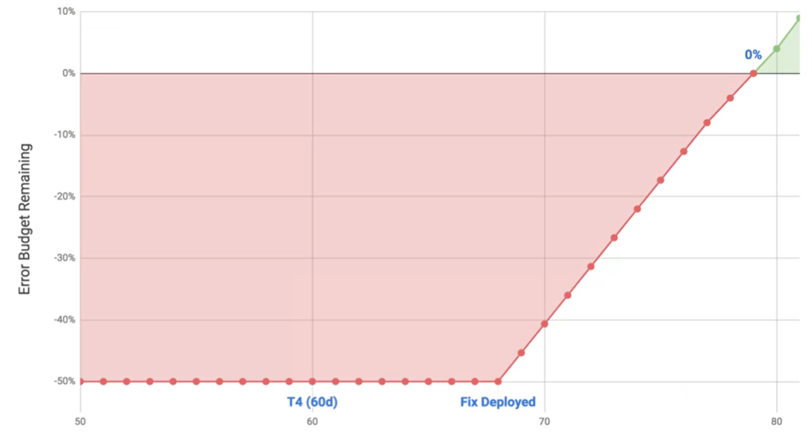

