## :elephant: Hadoop Platform and Application Framework :elephant:

### Big Data Hadoop Stack

- **Hadoop Stack Basics**
  - Hadoop moves computation to data
  - Hadoop provides reliability because HARDWARE FAILS!!!
  - We can keep all the data that we have, and we can take that data and analyze it in new interesting ways

- **The Apache Framework: Basic Modules**
  - There's 4 basic components in the Apache Framework:
    - Hadoop Common;
    - Hadoop Distributed File System (HDFS);
    - Hadoop MapReduce;
    - Hadoop Yarn;

  - Hadoop Common - contains libraries and utilities needed by other Hadoop modules.

  - HDFS - Hadoop Distributed File System is a distributed file system that stores data on a commodity machine. Providing very high aggregate bandwidth across the entire cluster.

  - Hadoop MapReduce - is a programming model that scales data across a lot of different processes.

  - Hadoop Yarn - is a resource management platform responsible for managing compute resources in the cluster and using them in order to schedule users and applications.

  <p align="center">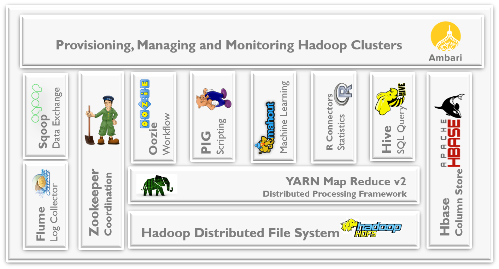</p>

- **HDFS - Hadoop Distributed File System**

  - It is a distributed, scalable, and portable file system written in Java in order to support the Hadoop framework.

  - Each node in Hadoop instance typically has a single name node, and a cluster of data nodes that formed this HDFS cluster.

<p align="center">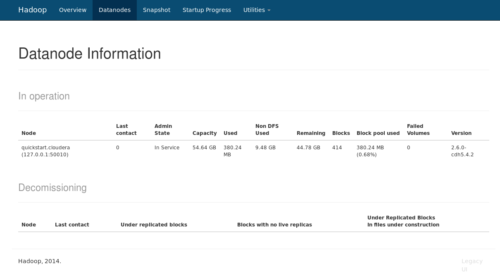</p>

  - Hadoop can achieve reliability by replicating the cross multiple hosts, and therefore does not require any range storage on hosts.

  - The HDFS file system encodes the so-called secondary NameNode.

  - The secondary NameNode regularly connects to the primary NameNode and builds snapshots of the primary's NameNodes, the rapture information, and remembers which system saves to the local and the remote directories.

  - About every one of the Hadoop based system sits some version of a MapReduce engine.

  - The typical MapReduce engine will consist of a job tracker, to which client applications can submit MapReduce jobs, and this job tracker typically pushes work out to all the available task trackers, now it's in the cluster.

  - YARN was born as a need to enable a broader array of interaction patterns for data stored in HDFS beyond the MapReduce kind of framework.

  - Yarn enhances the power of the Hadoop compute cluster, without being limited by the map produce kind of framework.

  - The processing power and data centers continue to grow quickly, because the YARN research manager focuses exclusively on scheduling. He can manage those very large clusters quite quickly and easily.

  - *YARN == MapReduce 2.0*

  <p align="center">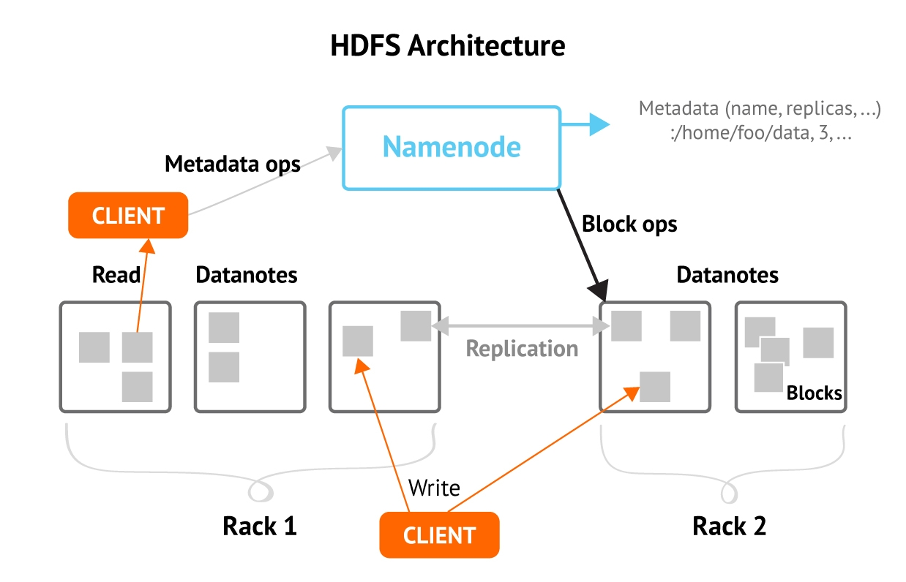</p>

- **The Hadoop Zoo**

  - *How do we scale and distribute and process very large amounts of data?*

  - Linkedin's Hadoop Stack Diagram

  <p align="center">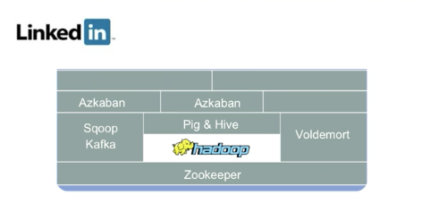</p>

  - Cloudera's Hadoop Stack Diagram

  <p align="center">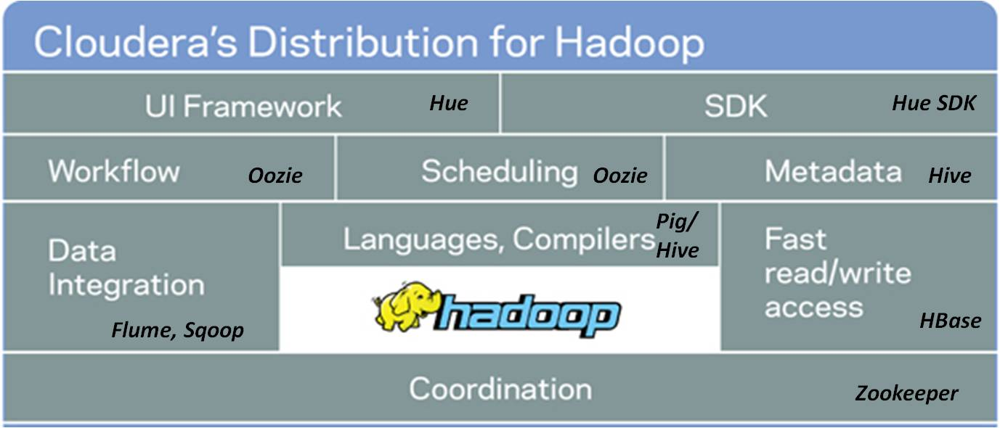</p>

- **Hadoop Ecosystem Major Components**

  - **Apache Sqoop** - A tool for transforming "SQL to Hadoop". Tool designed for efficiently transferring bulk data between Apache Hadoop and structured datastores such as relational databases.

  - **HBase** - It's a key component of the Hadoop Stack. It's a tool to provide really fast random access to significant data set. It can handle massive data tables combining billions and billions of rows and columns. It's a scalable data warehouse with support for large tables.

  - **Pig** - It's a scripting language, it's really a high level platform for creating MapReduce programs using Hadoop. The language is called Pig Latin. You can execute pig scripts in other languages. It's a high level data-flow language and execution framework for parallel computation.

  - **Apache Hive** - Data Warehouse software facilitates querying and managing large datasets residing in distributed file storage. It actually provides a mechanism to project structure on top of all of this data and allow us to use SQL like queries to access the data that we have stored in this data warehouse. This query language is called HiveQL.

  - **Oozie** - Workflow schedule system to manage Apache Hadoop Jobs.

  - **Zookeper** - A patch Zookeper provides operational services for the Hadoop Cluster.

  - **Flume** - Distributed, reliable and available service for efficiently collecting, aggregating and moving large amounts of log data. Flume is a scalable real-time ingest framework tha allows you to route, filter, aggregate, and do "mini-operations" on data on its way in to the scalable processing platform. Flume is the most common way to ingest web clickstream.

  - *Bonus* - **Spark** - Apache Spark is a fast and general engine for large-scale data processing. It's a fast and general compute engine for Hadoop data. Wide range of applications - ETL, Machine Learning, Stream Processing and graphic analytics.

#

- **[Tutorial] Running Hadoop Jobs**

  - Using Sqoop to export data from relational databases (in SQL format) into the HDFS (in Avro format). Launching the scoop job:

  `$ sqoop import-all-tables \ -m 1 \`

  - Command to confirm that your Avro data files exist in HDFS:

  `$ hadoop fs -ls /user/hive/warehouse`

  - Command to show a folder for each of the tables:

  `$ hadoop fs -ls /user/hive/warehouse/categories/`

  - Command to show the schema files created by Sqoop in your home directory:

  `$ ls -l *.avsc`

  - Apache Hive will need the schema files too, these are the commands to copy them into HDFS, where Hive can easily access them:

  ```     
     $ sudo -u hdfs hadoop fs -mkdir /user/examples
     $ sudo -u hdfs hadoop fs -chmod +rw /user/examples
     $ hadoop fs -copyFromLocal ~/*.avsc /user/examples
  ```

  - The next step is query structured data. We need to use Hue's Impala app to create the metadata for our tables in Hue, and then query then. We can access Hue in port 8888 of your Master Node (Ex: 10.2.5.15:8888).

  - Once we are inside Hue, we must click on Query Editors, and open the Impala Query Editor.

  - After we create and execute our queries, we can see all the tables created executing this query: `show tables;`.

  - The next step is create and execute structured queries in Impala.

  <p align="center">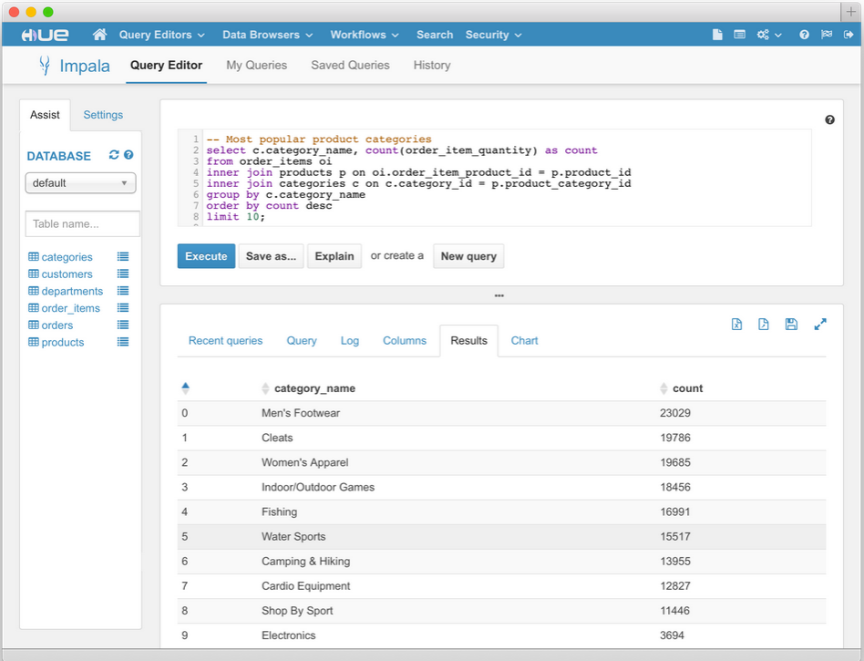</p>

  - Now we're gonna correlate structured data with instructured data.

  - Let's move this data from the localsystem, into HDFS, executing the following commands from your Master Node:

  ```
     $ sudo -u hdfs hadoop fs -mkdir /user/hive/warehouse/original_access_logs`
     $ sudo -u hdfs hadoop fs -copyFromLocal /opt/examples/log_files/access.log.2 /user/hive/warehouse/original_access_logs
  ```

  - Verify that your data is in HDFS with the following command:

  `$ hadoop fs -ls /user/hive/warehouse/original_access_logs`

  - Now we can build a table in Hive and query data via Impala and Hue. We'll build this table in 2 steps.

    - 1. We'll query Hive using a command-line JDBC client for Hive called Beeline. We can invoke ir from the terminal with the following command:

    `$ beeline -u jdbc:hive2://quickstart:10000/default -n admin -d org.apache.hive.jdbc.HiveDriver`

    - 2. Once the Beeline shell is connected, run the queries.

    - 3. You can see the newly created tables in Hue/Impala

#

### Overview of the Hadoop Stack

- Hadoop Stack Transition

<p align="center">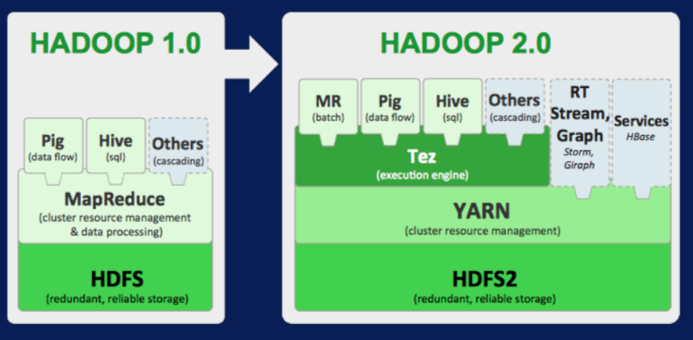</p>

- Hadoop Stack

<p align="center">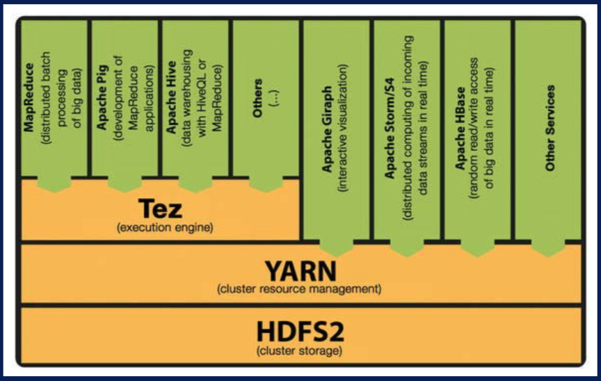</p>

#

- **HDFS and HDFS2**

  - **Original HDFS Design Goals**

    - Resilience to hardware failure

    - Streaming data access

    - Support for large dataset, scalability to hundreds/thousands of nodes with high aggragate bandwidht

    - Application locality to data

    - Portability across heterogeneous hardware anda software platforms

  - **Original HDFS Design**

    - _Single Namenode:_ a master server that manages the file system namespace and regulates access to files by clients.

    - _Multiple Datanodes:_ tipically one per node in the cluster. Functions:

      - Manage storage

      - Serving read/write requests from client

      - Block creation, deletion, replication based on instructions from NameNode.

  <p align="center">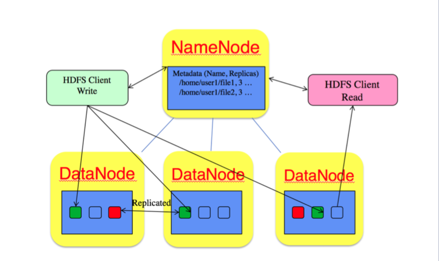</p>

#

  - **HDFS in Hadoop 2**

    - HDFS Federation

    - Multiple Namenode Servers

    - Multiple Namespaces

    - High Availability - redundant NameNodes

    - heterogeneous Storage and Archival Storage

      - ARCHIVE, DISK, SSD, RAM_DISK

  - **Benefits of Federation**

    - Allows namespace scalling

    - Scales up filesystem read/write throughput

    - Isolation

#

- Federation

  <p align="center">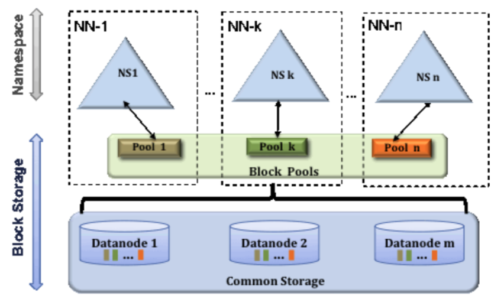</p>

- Federation Block Pools

  <p align="center">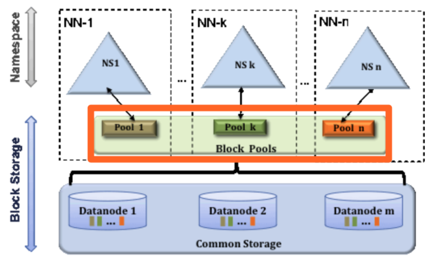</p>

- Federation brings performance improvements. Since you have multiple namespaces and namenodes, you can isolate essentially particular applications. If something is very intensive in metadata operations, it´s not going to impact everything else on the system.

- In Federation we have multiple namenode servers. We also have multiple namespaces, and the data is stored in block pools. So there is a pool associated with each namenode or namespace. And these pools are essentially spread out over all the data nodes.  

#

- **MapReduce Framework and Yarn**

  - Software Framework - *for writing parallel data processing applications*

  - MapReduce job split data into chunks.

  - Map tasks process data chunks.

  - Framework sorts map output.

  - Reduce tasks use sorted map data as input.

  - Typically compute and storage nodes are the same.

  - MapReduce tasks and HDFS running on the same nodes.

  - Map tasks and HDFS daemons are part of the data nodes.

  - Can schedule tasks on nodes with data already present.

- **Original MapReduce Framework**

  - Single master JobTracker.

  - JobTracker schedules, monitors, and re-executes failed tasks.

  - One slave TaskTracker per cluster node.

  - TaskTracker executes tasks per JobTracker requests.

#

- **Original Hadoop Architecture**

<p align="center">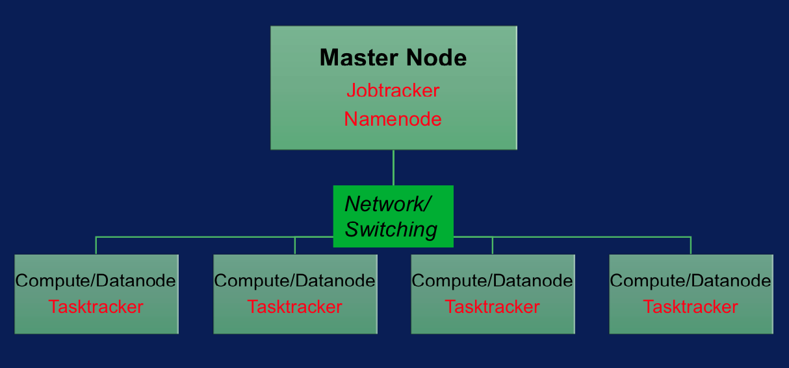</p>

#

- **Yarn: NextGen MapReduce**

<p align="center"></p>

  - The Resource Manager basically gets job requests from the clients node status from the Node Manager.

  - They're two components in the Resource Manager. There's a **scheduler** which is essentially responsible for allocating resources to the various applications that are running. So these are essentially with the constraints of capacities and
  the queues and things like that. And there are **policy plugins** that are available for the scheduling aspect effect, so you could have a capacity scheduler or you could have a fair share scheduler, things like that.

#

- **Additional Yarn Features**

  - High Availability ResourceManager;

  - Timeline Server;

  - Use of [Cgroups](http://man7.org/linux/man-pages/man7/cgroups.7.html);

  - Secure Containers;

  - YARN - Web Services / REST APIs.

#

### The Hadoop Execution Environment

- **The Hadoop Execution Environment**

  - **Recall Hadoop Architecture**

    - Data distributed across nodes;

    - Keep compute task on the node with data.

<p align="center"></p>

  - **MapReduce Execution Framework**

    - Software Framework;

    - Schedules, monitors and manages tasks;

    - Works with applications that fit MapReduce paradigm.

<p align="center">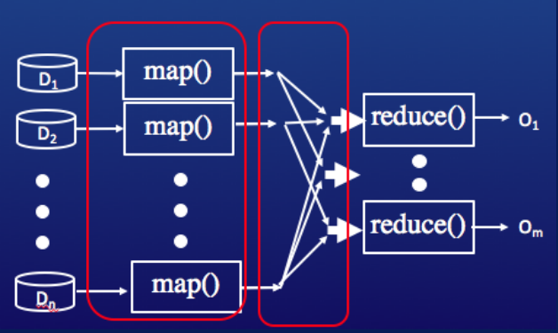</p>

#

- **Yarn, Tez and Spark**

  - **Yarn**

    - Supports the classic MapReduce framework;

    - Supports Open Source/Commercial Applications;

    - Supports user development applications;

    - Works with frameworks like Tez, Spark, Impala, etc.

<p align="center">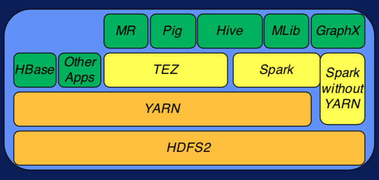</p>    

  - **Tez**

    - It can handle data flow graphs (Is the main component);

    - It lets you customize data formats;

    - Can run complex DAG (Directed Acyclic Graph) of tasks;

    - Dynamic DAG Changes;

    - Resource usage efficiency. With Tez, you could have essentially one container, and reuse it. This improves efficiency and makes things things much faster.

#    

  _HIVE on Tez Example_

  ```
  SELECT a.vendor, COUNT(*), AVG(c.cost) FROM a
  JOIN b ON (a.id = b.id)
  JOIN c ON (a.itemid = c.itemid)
  GROUP BY a.vendor        
  ```
#

_HIVE Example - Mapreduce **(Not so efficient)**_

<p align="center">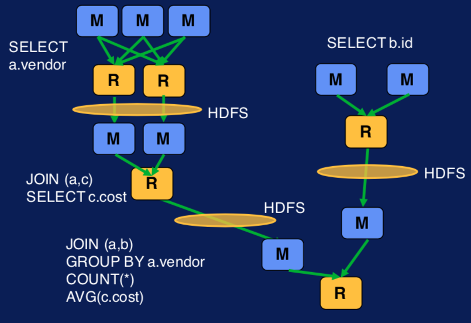</p>

_HIVE Example - Tez **(Efficiency improved)**_

<p align="center">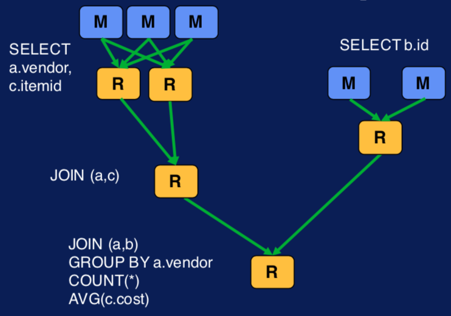</p>

#

  - **Spark**

    - Advanced DAG execution engine;

    - Supports cyclic data flow;

    - In-memory computing;

    - Supports Java, Scala, Python and R;

    - Existing optimized libraries.

    - [_Spark DAG Explanation_](https://www.quora.com/What-are-the-Apache-Spark-concepts-around-its-DAG-Directed-Acyclic-Graph-execution-engine-and-its-overall-architecture)

#

_Spark Example **(Logistic Regression Example - Using Python)**_

  ```
  points = spark.textFile(...).map(parsePoint).cache()
  w = numpy.random.ranf(size = D) # current separating plane
  for i in range(ITERATIONS):
    gradient = points.map(lambda p: (1 / (1 + exp(-p.y*(w.dot(p.x)))) - 1) * p.y * p.x).reduce(lambda a, b: a + b)
    w -= gradient
  print("Final separating plane: %s" %w)
  ```

#  

- **Hadoop Resource Scheduling**

  - What is the motivation for schedulers?

    - Various execution engines/options;

    - Scheduling, Performance;

    - Control of resources between components.

  - Schedulers:

    - Default - First In, First Out (FIFO);

    - Fairshare - In Fairshare, what you do is try to balance out the resource allocation accross applications over time;

    - Capacity - In capacity schedulers, you can have a guaranteed capacity for each application or group, and are safeguards to prevent a user or an application from taking down the whole cluster by running it out the resources.

#

- **Capacity Scheduler**

  - Queues and sub-queues;

  - Capacity guarantee with elasticity;

  - ACLs for security;

  - Runtime changes/draining apps;

  - Resource based scheduling.

<p align="center">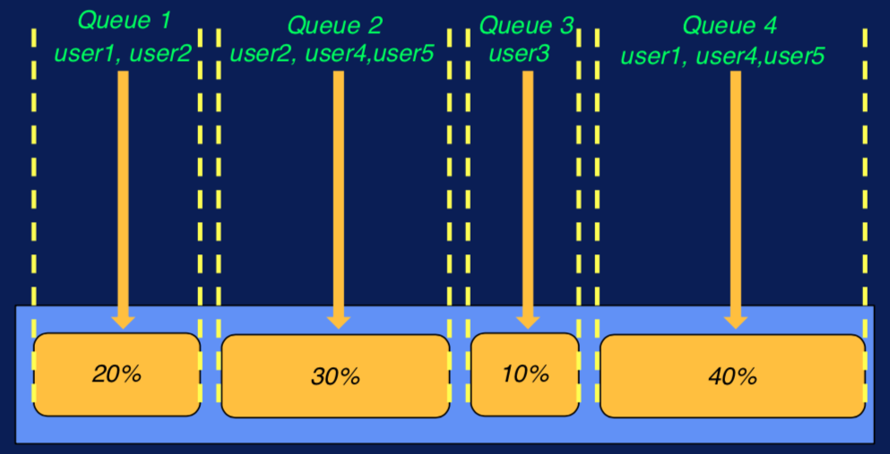</p>

#

- **Fairshare Scheduler**

  - Balances out resource allocation among apps over time;

  - Can organize into queues/sub-queues;

  - Guarantee minimum shares;

  - Limits per use/app;

  - Weighted app priorities;

<p align="center">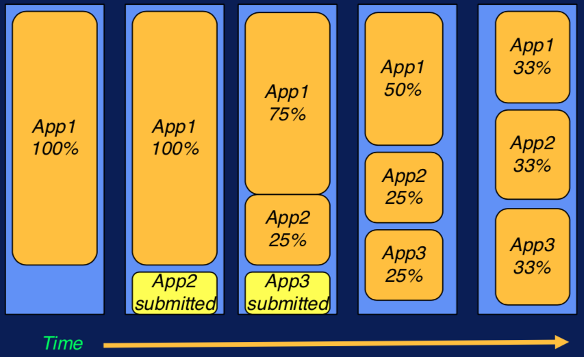</p>

#

### Overview of the Hadoop based Applications and Services

- **Hadoop-Based Applications**

  - **Databases/Stores**:

    - **Avro:** Data structures within context of Hadoop MapReduce jobs;

    - **HBase:** Distributed non-relational database;

    - **Cassandra:** Distributed data management system.

  - **Querying**

    - **Pig:** Platform for analyzing large data sets in HDFS;

    - **Hive:** Query and manage large data sets;

    - **Impala:** High-performance, low-latency SQL querying of data in Hadoop file formats;

    - **Spark:** General processing engine for streaming, SQL, machine learning and graph processing.

  - **Machine Learning, Graph Processing**

    - **Giraph:** Iterative graph processing using Hadoop framework;

    - **Mahout:** Framework for machine learning applications using Hadoop and Spark;

    - **Spark:** General processing engine for streaming, SQL, machine learning and graph processing.

#

- **Introduction to Apache Pig**

  - Two components: **Pig Latin** and **Infrastructure Layer**:

    - **Pig Latin:** Pig's high level scripting language;

    - **Infrastructure Layer:** Takes what was written in Pig Latin and transforms it into the backend MapReduce jobs or Tez jobs or other applications that are backend in Pig.

  - It's essentially a platform for data processing;

  - Pig execution environment: Local, MapReduce, Tez, Yarn, etc;

  - Pig has a lot of operators and functions;

  - It is extensible, you can write constant functions if you have complex processing to do;

  - It's a great tool to do _Extract, Transform and Load (ETL)_ operations;

  - It's a good tool to manipulating and analyzing "raw" data;

#

_Pig Example (In Cloudera VM)_

- **Step 1:** Load passwd file and work with data

`$ hdfs dfs -put /etc/passwd /user/cloudera`

- **Step 2:**

`$ pig -x mapreduce` _(This command puts you in "grunt" shell)_

- **Step 3:** Inside the "grunt" shell, load the file:

`grunt> A = load '/user/cloudera/passwd' using PigStorage(':');`

- **Step 4:** Still inside the "grunt" shell, pick subset os values:

```
grunt> B = foreach A generate $0, $4, $5 ;

grunt> dump B;
```

_OBS: These commands outputs username, full name and home directory path_

- **Step 5:** Still inside the "grunt" shell, store this process data in HDFS:

`grunt> store B in 'userinfo.out';`

- **Step 6:** Outside the grunt shell, verify the new data is in HDFS:

`$ hdfs dfs -ls /user/cloudera`

`$ hdfs dfs -ls /user/cloudera/userinfo.out`

#

- **Introduction to Apache HIVE**

  - Data Warehouse software;

  - HiveQL - SQL like language to structure and query data;

  - Execution Environment: MapReduce, Tez, Yarn, Spark, etc;

  - Works with data in HDFS and HBase;

  - Works with custom mappers/reducers;

  - Hive usage areas: Data mining, machine learning, Ad Hoc analysis and others.

#

_HIVE Example (In Cloudera VM)_

- **Step 1:** Copy passwd file to HDFS:

`$ hdfs dfs -put /etc/passwd /tmp/`

`$ hdfs dfs -ls /tmp`

- **Step 2:** Running interactively using beeline:

`$ beeline -u jdbc:hive2://`

- **Step 3:** Run the Create table command:

```
0: jdbc:hive2://> CREATE TABLE userinfo ( uname STRING, pswd STRING, uid INT, gid INT, fullname STRING, hdir STRING, shell STRING ) ROW FORMAT DELIMITED FIELDS TERMINATED BY ':' STORED AS TEXTFILE;
```

- **Step 4:** Load passwd file from HDFS:

`0: jdbc:hive2://> LOAD DATA INPATH '/tmp/passwd' OVERWRITE INTO TABLE userinfo;`

- **Step 5:** Select info - This launches the Hadoop job and outputs once its complete:

`0: jdbc:hive2://> SELECT uname, fullname, hdir FROM userinfo ORDER BY uname ;`

- **OBS:** Completed MapReduce jobs; output shows username, fullname and home directory.

#

- **Introduction to Apache HBase**

  - Scalable data store;

  - It works with non-relational distributed database;

  - It runs on top of HDFS;

  - It supports compression, which basically lets you lower the network traffic and also the size of the disk;

  - In-memory operations: MemStore and BlockCache.

- **Features of the Apache HBase**

  - Consistency (The transition of a table from one valid state to another happens directly without intermediate changes. So, the data won't disappear if you are doing an upgrade. This is important if you are looking at the consistency of what we are reading and what we are processing);

  - High Availability (It provides a lot of mechanisms to make sure that your data is available, doing range partition of keys across servers and spreading out the keys across various regions of your data in HDFS. It keeps read-only copies of data in secondary regions);

  - Automatic Sharding;

  - Replication (You can do different modes of replication with HBase servers);

  - Security;

  - SQL-like access (Hive, Spark, Impala);

#

_HBase Example_

- **Step 1:** Access HBase shell:

`$ hbase shell`

- **Step 2:** Create Table:

`hbase(main):002:0> create 'userinfotable',{NAME=>'username'},{NAME=>'fullname'},{NAME=>'homedir'}`

- **Step 3:** Add data:

```
hbase(main):002:0> put 'userinfotable','r1','username','vcsa'
hbase(main):002:0> put 'userinfotable','r2','username','sasuser'
hbase(main):002:0> put 'userinfotable','r3','username','postfix'
hbase(main):002:0> put 'userinfotable','r1','fullname','VirtualMachine Admin'
hbase(main):002:0> put 'userinfotable','r2','fullname','SAS Admin'
hbase(main):002:0> put 'userinfotable','r3','fullname','Postfix User'
hbase(main):002:0> put 'userinfotable','r1','homedir','/home/vcsa'
hbase(main):002:0> put 'userinfotable','r2','homedir','/var/sasuser'
hbase(main):002:0> put 'userinfotable','r3','homedir','/user/postfix'
```

- **Step 4:** Scan table after data entry:

`hbase(main):002:0> scan 'userinfotable'`

- **Step 5:** Select info from all rows corresponding to column 'fullname'

`hbase(main):002:0> scan 'userinfotable',{COLUMNS=>'fullname'}`

#

### Introduction to Hadoop Distributed File System (HDFS)

- **HDFS Architecture and Configuration**

- **Overview of HDFS Architecture**

  - **HDFS Design Concept**

    - Scalable distributed filesystem;

    - Distribute data on local disks on several nodes;

    - Low cost commodity hardware.

<p align="center">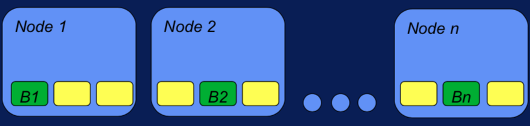</p>


  - **HDFS Design Factors**

    - Hundreds/Thousands of nodes => Need to handle node/disk failures;

    - Portability across heterogeneous hardware/software;

    - Handle large data sets;

    - High throughput.


  - **Aproach to meet HDFS design goals**

    - **Simplified coherency model** - Write once read many. That simplifies the number of operations you have to do to commit the write;

    - **Data replication** - Helps to handle hardware failures. So what you do is try to spread the data, same piece of data on different nodes;

    - **Move computation close to data** - That improves your performance and throughput;

    - **Relax [POSIX](https://whatis.techtarget.com/definition/POSIX-Portable-Operating-System-Interface) requirements** - increase throughput.

#

- **HDFS ARCHITECTURE**

<p align="center"></p>

  - There is a Namenode which essentially carries all the MetaData;

  - The data is spread out over DataNodes;

  - If you have a file that gets broken up into blocks and these blocks are placed on the DataNodes, they're replicated among the DataNodes;

#  

- **Summary of HDFS Architecture**

  - **Single NameNode:** a master server that manages the file system namespace and regulates access to files by clients.

  - **Multiple DataNodes:** tipically one per node in the cluster. Functions:

    - Manage storage;

    - Serving read/write requests from clients;

    - Block creation, deletion, replication based on instructions from NameNode.

#

- **The HDFS Performance Envelope**

  - **HDFS block size**

    - Default block size is 64MB;

    - Good for large files;

    - So a 10GB file will be broken into: _10x1024/64 = 160 blocks_.

  - **Importance of the number of blocks in a file**

    - **Namenode memory usage:** Every block represented as object (default replication this will be further increased 3X);

    - **Number of map tasks:** data tipically processed block at a time.

  - **Large number of small files: Impact on the NameNode**

    - **Memory usage:** circa 150 bytes per object. 1 billion object = 300GB memory!

    - **Network Load:** number of checks with datanodes proportional to number of blocks;

    - **Map Tasks:** depends on number of blocks. 10GB data, 32k file size = 327.680 map tasks;

      - Lots of queued tasks;

      - Large overhead of spin up/tear down for each task;

      - Inneficient disk I/O with small sizes.

      _So in all aspects, having too many map tasks is not good._

    - **HDFS optimized for large files**

      - **Key takeaway** - lots of small files is bad!

      - Solutions:

        - Merge/Concatenate files;

        - Sequence files;

        - HBase, HIVE configuration;

        - CombineFileInputFormat.

#

**Read/Write Processes in HDFS**

**Write process in HDFS**

- Client request to create file (With client side buffering/caching):

<p align="center">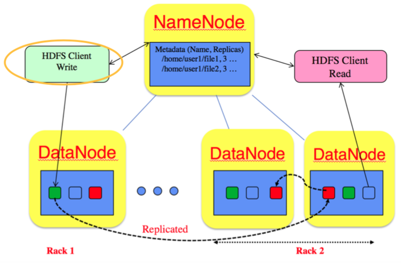</p>

- NameNode contacted once a block of data is accumulated:

<p align="center"></p>

- NameNode responds with list of DataNodes / Rack Aware:

<p align="center">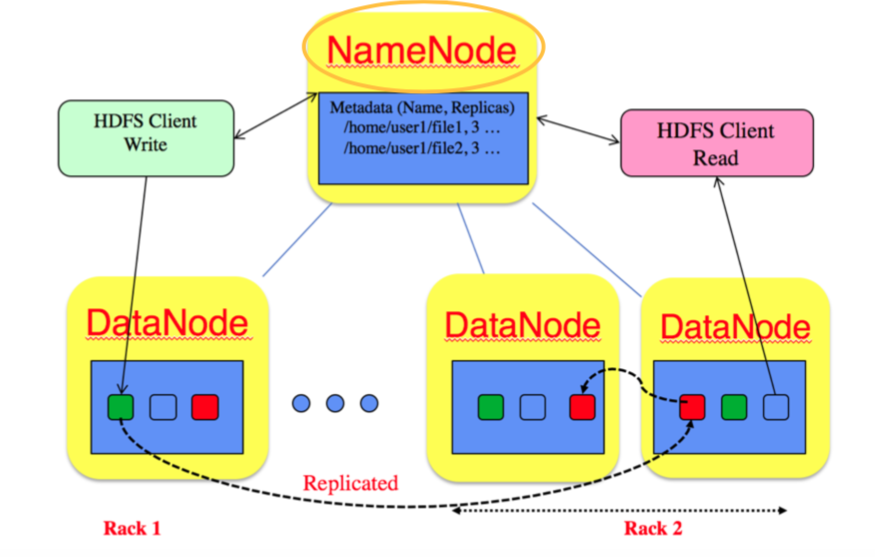</p>

- First DataNode receives data, writes to local and forwards to second DataNode:

<p align="center"></p>

<p align="center">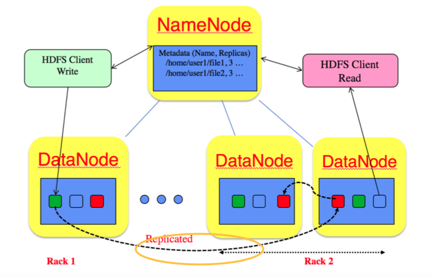</p>

- NameNode commits file creation into persistent store. Receives heartbeat and block reports:

<p align="center"></p>

- Client gets DataNode list from NameNode. Read from replica closest to reader:

<p align="center">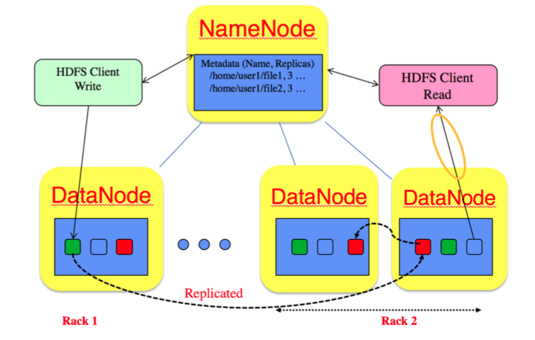</p>

#

**HDFS Performance and Tuning**

**HDFS Tuning Parameters**

- **HDFS configuration file**

  - Parameters are in _hdfs-site.xml_;

  - Commercial vendors have GUI based management consoles to make changes.

- **HDFS Block Size**

  - Impacts NameNode memory, number of map tasks and hence performance;

  - 64MB is the default. Can be changed in the workloads. Typically bumped up to 128MB;

  - dfs.blocksize or dfs.block.size _(Size parameters to be changed)_.

- **HDFS Replication**

  - Default replication is **3**;

  - Parameter: _dfs.replication_;

  - Tradeoffs:

    - Lower it to reduce replication cost;

    - Less robust;

    - Higher replication can make data local to more workers;

    - Lower replication **=>** more space;

- **HDFS most important parameters**

    - dfs.datanode.handler.count(10): _Sets the number of server threads on each datanode_;

    - dfs.namenodes.fs-limits.max-blocks-per-file: _Maximum number of blocks per file_.

**Full list:** http://hadoop.apache.org/docs/current/hadoop-project-dist/hadoop-hdfs/hdfs-default.xml

#

**HDFS Performance and Robustness**

- **Common Failures**

  - _DataNode Failures:_ Server can fail, disk can crash, data corruption;

  - _Network Failures_;

  - _NameNode Failures:_ Disk failure, node failure;

- **HDFS Robustness**

  - NameNode receives heartbeat and block reports from DataNodes.

<p align="center"></p>

- **Mitigation of common failures**

  - _Checksum computed_ on file creation;

  - _Checksums stored in HDFS namespace_;

  - Used to check retrieved data. _Re-read from alternate replica need_.

  - Multiple copies of central metadata structures;

  - Failover to standby NameNode - manual by default.

- **Performance**

  - Changing blocksize and replication factor can improve performance;

  - Hadoop distcp allows parallel transfer of files.

- **Replication trade offs w.r.t robustness**

  - Reducing replication has a trade off w.r.t robustness:

    - Might lose a node or local disk during the run - _cannot recover if there is no replication_;

    - If there is data corruption of a block from one of the datanodes - _again, cannot recover without replication_.

#

**HDFS Access, Commands, APIs and Applications**

- **Overview of HDFS Access, APIs and Applications**

- **HDFS Commands**

  - Invoked via bin/hdfs script;

  - User commands - filesystem shell commands for routine operations;

  - Administrator commands;

  - Debug commands;

  - Details at: https://hadoop.apache.org/docs/current//hadoop-project-dist/hadoop-hdfs/HDFSCommands.html

- **Application programming interfaces**

  - **Native Java API:** Base class org.apache.hadoop.fs.FileSystem;

  - **C API for HDFS:** libhdfs, header file (hdfs.h);

  - **WebHDFS REST API:** HTTP, Get, Put, Post and Delete operations.

- **HDFS NFS Gateway**

  - Mount HDFS as a filesystem on the client;

  - Browse files using regular filesystem commands;

  - Upload/Download files from HDFS;

  - Stream data to HDFS.

- **Several other options!**

  - **Apache Flume:** collecting, aggregating streaming data and moving into HDFS;

  - **Apache Sqoop:** Bulk transfer between Hadoop and datastores.

- **Applications using HDFS**

  - Can use API to interact with HDFS;

  - Core component of Hadoop Stack - used by all applications;

  - HBase is a good example of an application that runs on top of HDFS with good integration;

  - Spark can run directly on HDFS without other Hadoop components.

#

**HDFS Commands**

- **HDFS User Commands:**

  - List files in /: `$ hdfs dfs -ls /`

  - Make a directory: `$ hdfs dfs -mkdir /user/test`

  - Create a local file: `$ dd if=/dev/urandom of=sample.txt bs=64M count=16` _(Creates 1GB file called sample.txt on the local filesystem)_

  - Copy the created file to the user's directory in HDFS: `$ hdfs dfs -put sample.txt /user/test`

  - List the copied file in HDFS: `$ hdfs dfs -ls /user/test/sample.txt`

  _OBS1: Whatever files created in the quickstart (with dd command) aren't in HDFS, they are on a local file system on the node. So, we have to activate port tagging to the HDFS file system. The command to do that is: $ hdfs dfs -put sample.txt._

  _OBS2: The number after the permissions in file list, shows the file replication, as we can see marked in red in the image below:_

  <p align="center">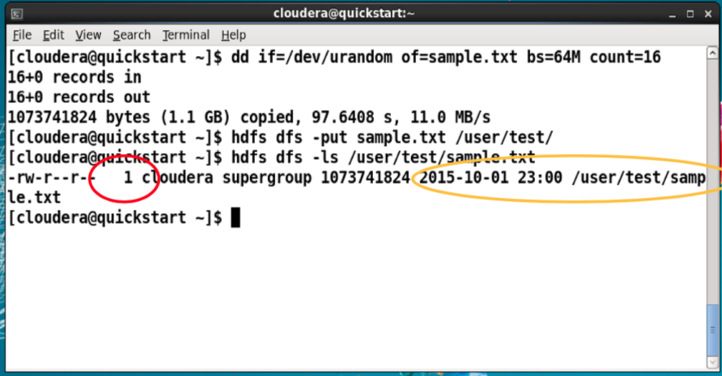</p>

  - HDFS fsck: `$ hdfs fsck /user/test/sample.txt` _(This command is not like linux's hdfs. It shows you the file information in HDFS)_

  - User commands:

  <p align="center">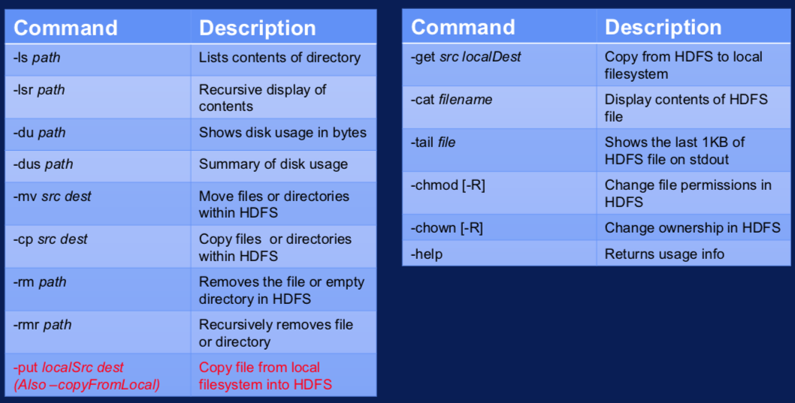</p>

- **HDFS Administrator Commands**

  - Summary report: `$ hdfs dfsadmin -report`

#

**Native Java API for HDFS**

- **FSDataInputStream Methods**

  - _read_: read bytes;

  - _readFully_: read from stream to buffer;

  - _seek_: seek to given offset;

  - _getPos_: get current position in stream.

- **FSDataOutputStream Methods**

  - _getPos_: get current position in stream;

  - _hflush_: flush out the data in client's user buffer;

  - _close_: close the underlying output stream.

- **Reading from HDFS using API**

  - _get_ an instance of FileSystem:

    `FileSystem fs = FileSystem.get(URI.create(uri),conf);`

  - _Open_ an input stream:

    `in = fs.open(new Path(uri));`

  - Use IO utilities to _copy_ from input stream:

    `IOUtils.copyBytes(in, System.out,4096,false);`

  - Close the stream:

    `IOUtils.closeStream(in);`

- **Writing to HDFS using API**

  - _get_ an instance of FileSystem:

    `FileSystem fs = FileSystem.get(URI.create(outuri),conf);`

  - _Create_ a file:

    `out = fs.create(new Path(outuri));`

  - Write to output stream:

    `out.write(buffer, 0, nbytes);`

  - Close the file:

    `out.close()`

- **REST API for HDFS**

  - **Enabling WebHDFS**

    - In _hdfs-site.xml_

      - dfs.webhdfs.enabled

      - dfs.webhdfs.authentication.kerberos.principal

      - dfs.webhdfs.authentication.kerberos.keytab  

  - **Accessing hdfs-site.xml**

      - Command: `$ more /etc/hadoop/conf/hdfs-site.xml`

  - _Example of dfs.webhdfs.enable configuration inside the /etc/haddop/conf/hdfs-site.xml)_

  ```
  <property>
     <name>dfs.webhdfs.enabled</name>
     <value>true</value>
  </property>
  ```

- **Authentication**

  - If security is off:

  `$ curl -i "http://<HOST>:<PORT>/webhdfs/v1/<PATH>?[user.name=<USER>&]op=..."`

  - Security on with Kerberos:

  `$ curl -i --negotiate -u : "http://<HOST>:<PORT/webhdfs/v1/<PATH>?op=..."`

  - Security on using Hadoop delegation token:

  `$ curl -i "http://<host>:<port>/webhdfs/v1/<PATH>?delegation=<TOKEN>&op=..."`

- **HTTP GET Requests**

  `$ curl -i "http://quickstart.cloudera:14000/webhdfs/v1/user/cloudera?user.name=cloudera&op=GETFILESTATUS"`

- **HTTP PUT Requests**

  `$ curl -i -X PUT "http://quickstart.cloudera:14000/webhdfs/v1/user/test?user.name=cloudera&op=MKDIRS&permission=755"`

- **HTTP GET request on status**

  `$ dd if=/dev/urandom of=sample.txt bs=64M count=16`

  `$ hdfs dfs -put sample.txt /user/test/`

  `$ curl -i "http://quickstart.cloudera:14000/wehdfs/v1/user/test?user.name=cloudera&op=GETCONTENTSUMMARY"`

- **HTTP Operations**

  - _HTTP GET:_ file status, checksums, attributes;

  - _HTTP PUT:_ create, change ownership, rename, permissions, snapshot;

  - _HTTP POST:_ append, concatenate;

  - _HTTP DELETE:_ delete files, snapshot.

- _Resources:_

  - Commands:https://hadoop.apache.org/docs/stable/hadoop-project-dist/hadoop-hdfs/HDFSCommands.html

  - JAVA API: http://hadoop.apache.org/docs/current/api/org/apache/hadoop/fs/FileSystem.html

  - C/libhdfs: https://hadoop.apache.org/docs/stable/hadoop-project-dist/hadoop-hdfs/LibHdfs.html

  - WebHDFS API:https://hadoop.apache.org/docs/stable/hadoop-project-dist/hadoop-hdfs/WebHDFS.html

#

### Introduction to Map/Reduce

**Introduction to Map/Reduce:**

- **The Problem:** Big data means lots of hard drives.

- **The Solution:** Lots of data means we should bring computation to data.

#

- **The Problem:** Lots of disks.

- **Possibility 1:** Data needs updating, so:

<p align="center">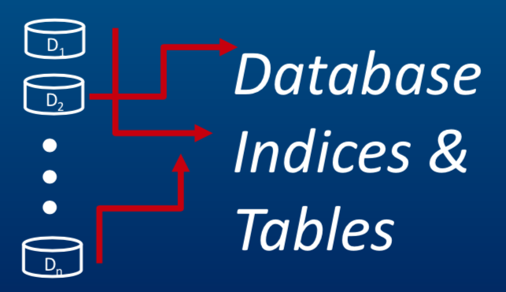</p>

- **Possibility 2:** Need to sweep through data, so:

<p align="center">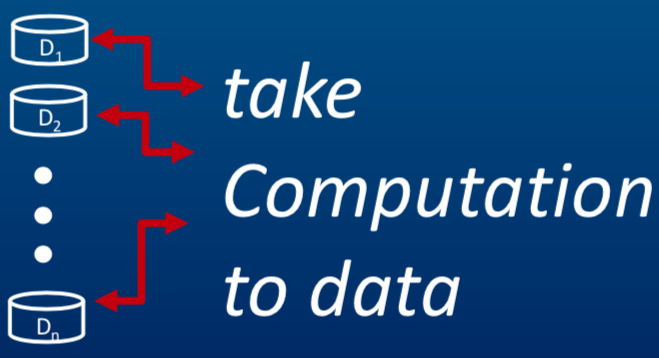</p>

#

**The Map/Reduce Framework**

- **The Framework:**

  - **User defines:**

    - A. <key, value>

    _Explanation: All our data is gonna be placed into key-value pairs. We could think of it as that a key-value pair is gonna become our basic unit of data and our unit of analysis._

    - B. Mapper and Reduce functions

    _Explanation: The user has to specify mapper and reducer functions. The mapper is the function that applied to the data, and the reducer is the function that is applied to the intermediate results that is gonna come from Hadoop._

  - **Hadoop handles the logistics:**

    _Explanation: Hadoop handles all the logistics of parallel execution, of the map and reduce functions, producing the intermediate results and communicating those results to the reducers._

  - **The Logistics:**

    - Hadoop handles the distribution and execution:

    _Explanation: Hadoop distributes the map functions to the data. Hadoop shuffles and groups data according to the key-value pairs. All pairs with the same key are grouped together and passed to the same reducer._

  - **Map/Reduce Flow**

    - User defines a map function:

      - _map()_

    - The function _map()_ reads data and outputs _<key,value>_:

      - _The function will read in the data and output a key-value pair._

<p align="center"></p>      
