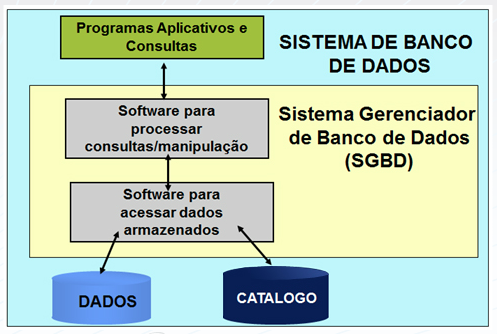
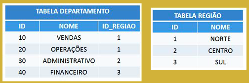
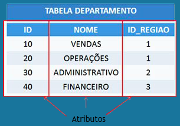
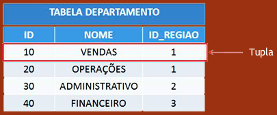

# [Estácio] Implementação de Banco de Dados

**Aula 1 - Modelo Relacional**

- **Sistemas tradicionais:** Nos Sistemas Tradicionais os dados são armazenados em arquivos que estão fisicamente armazenados, separados uns dos outros. O acesso é feito pelos programas de aplicação, utilizando o nome externo dos arquivos e definindo todo o registro, independente da utilização dos campos.

- **Sistemas de Banco de Dados:** Nos Sistemas de Banco de Dados os dados são definidos para o Sistema Gerenciador de Banco de Dados (SGBD), através da DDL (linguagem de definição de dados). Fisicamente estão armazenados em um único local, e o acesso só se realiza através do SGBD.  Nos programas de aplicação, é necessário apenas definir os campos a serem utilizados pelo programa.

- **Programas Aplicativos e Consultas:** Os programas são escritos em uma linguagem front-end (Java, Python, etc), possibilitando o acesso do usuário a informações contidas no banco. Já as consultas representam as informações solicitadas pelo usuário ao banco de dados.

- **Software para processar consultas/manipulação:** Módulo do SGBD responsável por determinar a forma de executar a consulta solicitada pelo usuário, via aplicação. Realiza a interpretação do comando (análise sintática, léxica e semântica) e elabora o plano de execução do comando, estabelecendo a forma de acessar fisicamente os dados.

- **Software para acessar dados armazenados:** Módulo do SGBD responsável pelo controle do acesso físico aos dados.

- **Dados:** Conjunto de valores armazenados pelo banco de dados em seus arquivos.

- **Catálogo:** Armazena meta-dados, ou seja, informações referentes ao tipo e organização dos dados do banco.

#

**Modelos de dados**

O Modelo de Dados é basicamente um conjunto de conceitos utilizados para descrever um banco de dados. Não existe uma única forma de representação deste modelo, porém qualquer forma que permita a correta compreensão das estruturas de dados compreendidas no banco de dados pode ser considerada adequada.

Os tipos de modelo são:

- **Alto nível ou modelo de dados conceitual:** Fornece uma visão mais próxima do modo como os usuários visualizam os dados realmente O modelo entidade-relacionamento e o funcional são exemplos deste tipo de abordagem.

- **Baixo nível ou modelo de dados físico:** Fornece uma visão mais detalhada do modo como os dados estão realmente armazenados no computador . O modelo relacional, o modelo de rede e o hierárquico e o orientado a objetos são exemplos deste tipo de representação.

**Esquemas e instâncias**

Em qualquer modelo de dados utilizado, é importante distinguir a “descrição” do banco de dados do “banco de dados” por si próprio. A descrição de um banco de dados é chamada de “esquema de um banco de dados” e é especificada durante o projeto do banco de dados. Geralmente, poucas mudanças ocorrem no esquema do banco de dados.

Os dados armazenados em um banco de dados em um determinado instante do tempo formam um conjunto chamado de “instância do banco de dados”. A instância altera toda vez que uma alteração no banco de dados é feita.

O SGBD é responsável por garantir que toda instância do banco de dados satisfaça ao esquema do banco de dados, respeitando sua estrutura e suas restrições.

**Arquitetura Três Esquemas:** Visando facilitar o desenvolvimento de sistemas e realçar as vantagens da utilização de Sistemas de Banco de Dados foi criada a Arquitetura Três Esquemas, cuja  principal meta é separar as aplicações do usuário do banco de dados físico.
 
Os esquemas podem ser definidos como:

- **Esquema EXTERNO (mapeamento externo/conceitual):** Descreve as visões do banco de dados para um grupo de usuários; cada visão descreve quais porções do banco de dados um grupo de usuários terá acesso.

- **Esquema CONCEITUAL (mapeamento conceitual/interno):** Descreve a estrutura do banco como um todo; é uma descrição global do banco de dados, que não fornece detalhes do modo com os dados estão fisicamente armazenados.

- **Esquema INTERNO:** Descreve a estrutura de armazenamento físico do banco de dados; utiliza um modelo de dados e descreve detalhadamente os dados armazenados e os caminhos de acesso ao banco de dados.

#

**Modelo Relacional:** O modelo relacional se propõe a representar os dados em uma coleção de relações. Desta forma, as relações são vistas como tabelas de valores, onde cada linha representa uma coleção de dados relacionados. Estes valores podem ser interpretados como fatos descrevendo uma instância de uma entidade ou de um relacionamento do mundo real.
Os nomes da tabela e das colunas são utilizados para facilitar a interpretação dos valores armazenados em cada linha da tabela.

  - **Relação:** No modelo relacional uma relação é uma tabela onde são armazenados dados. Por exemplo, podemos ter em nosso Banco de Dados as Relações Departamento e Região que armazenam respectivamente os dados dos departamentos e das regiões. As relações apresentam as seguintes características:

    1. Não há tuplas duplicadas em uma relação;

    2. Ordem das tuplas na relação não é relevante para diferenciar as relações;

    3. Os valores dos atributos devem ser atômicos, não sendo divisíveis em componentes.

    

  - **Atributo:** Os atributos de uma relação constituem as colunas da tabela. Por exemplo, na tabela Departamento temos os atributos ID, NOME e ID_REGIAO. É importante ressaltar que todo Atributo possui um Domínio. O conjunto dos atributos de uma tabela constituem o seu Esquema.

  

  - **Tupla:** As tuplas de uma relação constituem as linhas da tabela. Por exemplo, na Tabela Departamento, a linha do Departamento de Vendas constitui uma tupla da relação. O conjunto das Tuplas de uma tabela constituem a sua Instância.

  

