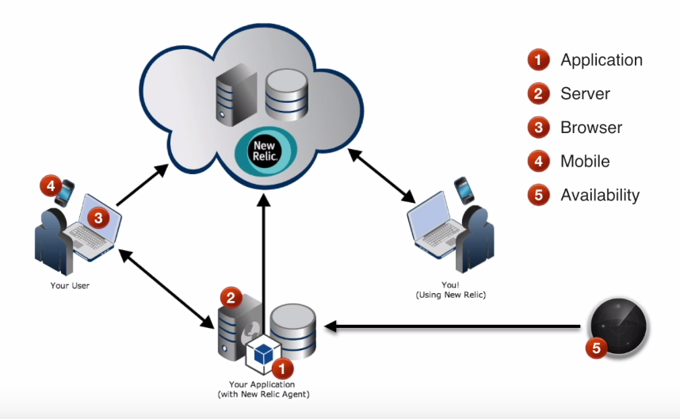

# New Relic

## 1. Introduction to New Relic APM

- New Relic provides five types of monitoring

**1** - Code Level Monitoring _(Using language agent)_

**2** - Server Monitoring _(Operating System level - Disk space, RAM, CPU)_

**3** - Browser Monitoring _(Using lightweight JavaScript agent running in end-users browser)_

**4** - Mobile Monitoring _(That can measure performance and capture crash dumped information for mobile applications via mobile agents)_

**5** - Availability Monitoring _(Using a geographically distributed network of pingers to check if a URL is available or not)_

## 2. Install the New Relic agent

[Video of install process](https://www.youtube.com/watch?v=xeFXvHuuNhY)

A New Relic **agent** is a piece of software that you install in your application or on a host to send performance data to New Relic. Agents are available for different products and coding languages; you only need to select the one you need. For example, if your application is written in Java, you will install the Java agent. Each language has specific instructions, so be sure to review the directions for your application's agent language.

Once your agent is properly installed and data is reporting to your application, you'll begin to see data about your application in the APM UI.

**Install your application:** Specific installation steps vary, based on your application's agent language, but they all have the same basic requirements.

1. Verify compatibility and other requirements for your agent.

2. From the APM UI, select the agent language, then follow the UI's installation workflow to download the agent.

3. Follow the step-by-step installation procedures for your agent:

  - Python installation procedures:

  1. Make sure you have your New Relic [license key](https://docs.newrelic.com/docs/accounts/install-new-relic/account-setup/license-key).

  2. Install the **newrelic** Python package using **pip** by running:

    `$ pip install newrelic`

  3. Generate the agent configuration file by running the command:

    `$ newrelic-admin generate-config YOUR_LICENSE_KEY newrelic.ini`

  4. If you control how your web application or WSGI server is started, use the following New Relic admin script command in front of your usual startup command options:

    `NEW_RELIC_CONFIG_FILE=newrelic.ini newrelic-admin run-program YOUR_COMMAND_OPTIONS`

    If you cannot run the admin script in this way, please read the [advanced install instructions](https://docs.newrelic.com/docs/agents/python-agent/installation-configuration/python-agent-installation) for more context and other install options.

  5. Start or restart your Python web application or WSGI server. Wait five minutes and look for data in your New Relic account.
