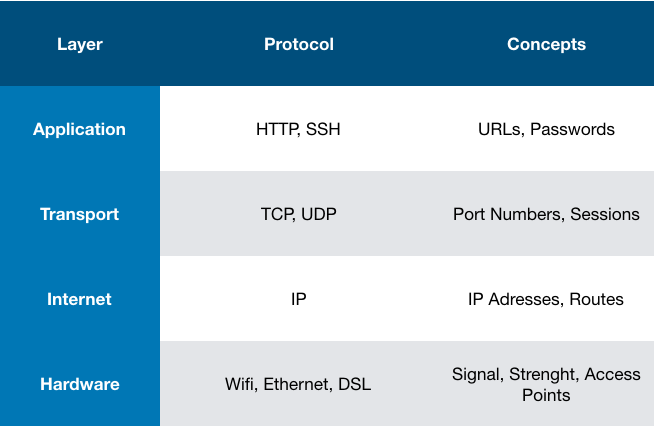

# Networking for Web Developers

*Based on the Udacity's course - [Networking for Web Developers]* (https://br.udacity.com/course/networking-for-web-developers--ud256)

#

```$ ping -c3 8.8.8.8``` *(ping three times to Google's DNS)*

```$ nc gmail-smtp-in.l.google.com 25``` *Talk to Google's SMTP using netcat command*

```$ nc -l 3456``` *Talk to 3456 port using netcat command*

[Ping Command Reference](http://man7.org/linux/man-pages/man8/ping.8.html)

[Netcat Command Reference](http://man7.org/linux/man-pages/man1/ncat.1.html)

#

## IETF Model

<p align="center"></p> 
