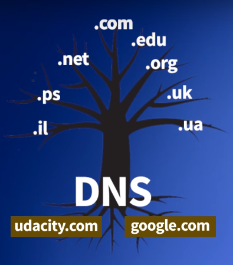

# Networking for Web Developers

*Based on the Udacity's course - [Networking for Web Developers]* (https://br.udacity.com/course/networking-for-web-developers--ud256)

#

```$ ping -c3 8.8.8.8``` *(ping three times to Google's DNS)*

```$ nc gmail-smtp-in.l.google.com 25``` *Talk to Google's SMTP using netcat command*

```$ nc -l 3456``` *Talk to 3456 port using netcat command*

[*Ping Command Reference*](http://man7.org/linux/man-pages/man8/ping.8.html)

[*Netcat Command Reference*](http://man7.org/linux/man-pages/man1/ncat.1.html)

#

## IETF Model

<p align="center"></p>

#

*Ports: 0 to 1023 - Ports reserved to root applications*

#

# DNS (Domain Name Server)

```$ host -t a google.com``` *(Looks for the Google's DNS - IPv4)*

```$ host -t aaaa google.com``` *(Looks for the Google's DNS - IPv6)*

```$ dig www.google.com``` *(Like host command, but with more details)*

[*Host Command Reference*](https://www.computerhope.com/unix/host.htm)

[*Dig Command Reference*](http://www.tutorialspoint.com/unix_commands/dig.htm)

#

# DNS Record Types

**Cname** :arrow_right: Canonical Name

**aaaa** :arrow_right: IPv6

**a** :arrow_right: IPv4

**NS** :arrow_right: Name Server

**TTL** :arrow_right: Time to Live

#

# DNS and HTTP

<p align="center"></p>

`Obs1: One single webserver can control requests from many sites. It splits the requests by their domain names`

`Obs2: SSL encryption certificates are issued for particular domains`

#

# Subdomains and FQDN´s

<p align="center"></p>

- example.com (_**domain**_) --> www.example.com (_**subdomain**_)
