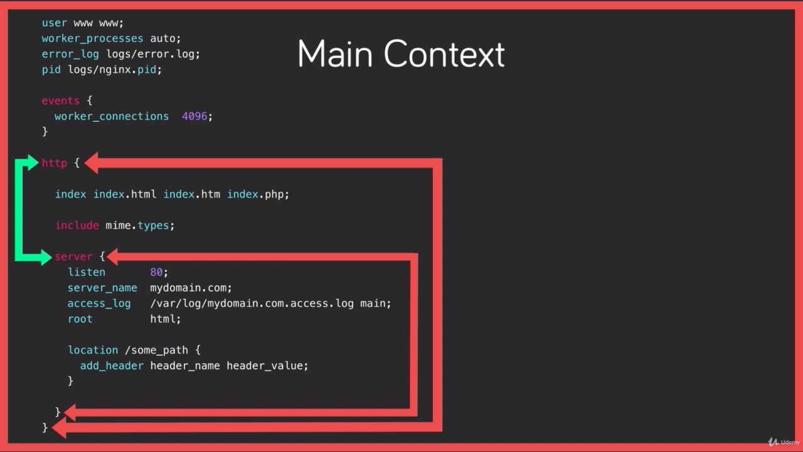

# NGINX Fundamentals

*Based on the Udemy´s course - [Nginx Fundamentals - High Performance Servers from Scratch]*
(https://www.udemy.com/nginx-fundamentals/)

#

## 1. About NGINX

- High Performance :truck:;

- High Concurrency :globe_with_meridians:;

- Low resource usage :battery:.

#

- **Basic HTML Virtual Host**

```
http {
    server {
        listen 80;
        server_name yourdomain.com;
        index index.html;

        location / {
            default_type "text/html";
            try_files $uri.html $uri /index.html;
        }

        # Adds Video Streaming
        location /video/ {
            mp4;
        }
    }
}
```

#

- **NGINX vs Apache**

  - **Apache:** By default, Apache is configured in what's called prefork mode, meaning that had spawned a set number of processors, each of which can serve a single request at a time regardless of whether that request is for a PHP script or an image.

  <p align="center"></p>

  - **NGINX:** NGINX deals with the requests asynchronously, meaning that a single NGINX process can serve multiple requests concurrently, with that number basically just depending on the system resources available to the NGINX process.

      NGINX, unlike Apache, can't embed server side programming languages into its own processes, meaning that all requests for Dynamic Content has to be dealt with by a completely separate process like PHP-FPM *(FastCGI Process Manager)* and then reverse proxy back to the client via NGINX.

  <p align="center"></p>

#

  - **Apache:** Apache accepts a preconfigured number of requests, rejecting the rest.

  <p align="center"></p>

  - **NGINX:** NGINX will serve static resources without the need to involve any server side languages. NGINX also can handle concurrent requests and potentially receive thousands of requests in a single processing thread, and respond to them as fast as it can without turning down any of those requests. These features make NGINX provides **faster static resources** and **higher concurrency** than Apache.  

  <p align="center"></p>

#

**How to install NGINX from Source Code with additional modules**

_The additional modules cannot be installed by package manager_

- Download the source code:

  `$ wget https://nginx.org/download/nginx-1.15.9.tar.gz`

- Extract the source code:

  `$ tar -xzvf nginx-1.15.9.tar.gz`

- Install the system dependencies:

  `$ apt install libpcre3 libpcre3-dev zlib1g zlib1g-dev libssl-dev`

  or

  `$ yum install libpcre3 libpcre3-dev zlib1g zlib1g-dev libssl-dev`

- Install NGINX with custom configuration:

  `$ ./configure --sbin-path=/usr/bin/nginx --conf-path=/etc/nginx/nginx.conf --error-log-path=/var/log/nginx/error.log --http-log-path=/var/log/nginx/access.log --with-pcre --pid-path=/var/run/nginx.pid --with-http_ssl_module`

  `$ make`

  `$ make install`

  `$ nginx -V` _Check the Nginx's version_

  `$ nginx` _Start the Nginx_

  `$ nginx -s <signal>` _Send a signal to Nginx, like stop, start, reload, etc._

#

**Adding an NGINX Service**

- Create the NGINX systemd service file:

  `$ touch /lib/systemd/system/nginx.service`

- Paste the content in the NGINX systemd service file _(https://www.nginx.com/resources/wiki/start/topics/examples/systemd/)_:

  ```
    [Unit]
    Description=The NGINX HTTP and reverse proxy server
    After=syslog.target network.target remote-fs.target nss-lookup.target

    [Service]
    Type=forking
    PIDFile=/var/run/nginx.pid
    ExecStartPre=/usr/bin/nginx -t
    ExecStart=/usr/bin/nginx
    ExecReload=/usr/bin/nginx -s reload
    ExecStop=/bin/kill -s QUIT $MAINPID
    PrivateTmp=true

    [Install]
    WantedBy=multi-user.target
  ```

- Start the NGINX service:

  `$ systemctl start nginx`

- Set NGINX to start in boot:

  `$ systemctl enable nginx`

#

**Understanding Configuration Terms**

- **Directives:**

  `server_name mydomain.com;`

- **Contexts:** Are the sections within the configuration where directives can be set for that given context.

  - **Main context:** Is where we configure global directives that apply to the master process.

  <p align="center"></p>

  - **HTTP Context:** It contains anything for HTTP related.

  ```
  http {
    index index.html;

    server {
      server_name www.domain1.com;
      access_log logs/domain1.access.log main;

      root /var/www/domain1.com/htdocs;
    }

    server {
      server_name www.domain2.com;
      access_log  logs/domain2.access.log main;

      root /var/www/domain2.com/htdocs;

      location /some_path {
        add_header header_name header_value;
      }
    }
  }
  ```

  - **Server context:** is where we define a virtual host similar to an Apache V host.

  ```
    server {
      server_name www.domain2.com;
      access_log  logs/domain2.access.log main;

      root /var/www/domain2.com/htdocs;

      location /some_path {
        add_header header_name header_value;
      }
    }
  ```

  - **Location context:** Is used for matching URI locations on incoming requests to the parent server context.

  ```
    location /some_path {
      add_header header_name header_value;
    }
  ```  

#
