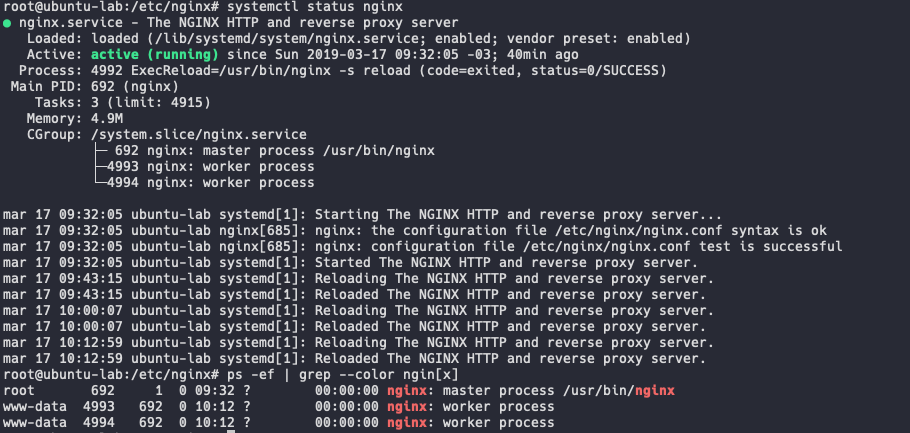
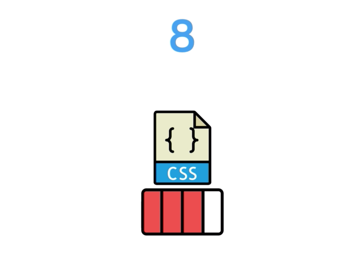

# NGINX Fundamentals

*Based on the Udemy´s course - [Nginx Fundamentals - High Performance Servers from Scratch]*
(https://www.udemy.com/nginx-fundamentals/)

#

## 1. About NGINX

- High Performance :truck:;

- High Concurrency :globe_with_meridians:;

- Low resource usage :battery:.

#

- **Basic HTML Virtual Host**

```
http {
    server {
        listen 80;
        server_name yourdomain.com;
        index index.html;

        location / {
            default_type "text/html";
            try_files $uri.html $uri /index.html;
        }

        # Adds Video Streaming
        location /video/ {
            mp4;
        }
    }
}
```

#

- **NGINX vs Apache**

  - **Apache:** By default, Apache is configured in what's called prefork mode, meaning that had spawned a set number of processors, each of which can serve a single request at a time regardless of whether that request is for a PHP script or an image.

  <p align="center"></p>

  - **NGINX:** NGINX deals with the requests asynchronously, meaning that a single NGINX process can serve multiple requests concurrently, with that number basically just depending on the system resources available to the NGINX process.

      NGINX, unlike Apache, can't embed server side programming languages into its own processes, meaning that all requests for Dynamic Content has to be dealt with by a completely separate process like PHP-FPM *(FastCGI Process Manager)* and then reverse proxy back to the client via NGINX.

  <p align="center"></p>

#

  - **Apache:** Apache accepts a preconfigured number of requests, rejecting the rest.

  <p align="center"></p>

  - **NGINX:** NGINX will serve static resources without the need to involve any server side languages. NGINX also can handle concurrent requests and potentially receive thousands of requests in a single processing thread, and respond to them as fast as it can without turning down any of those requests. These features make NGINX provides **faster static resources** and **higher concurrency** than Apache.  

  <p align="center"></p>

#

## 2. Installation

**How to install NGINX from Source Code with additional modules**

_The additional modules cannot be installed by package manager_

- Download the source code:

  `$ wget https://nginx.org/download/nginx-1.15.9.tar.gz`

- Extract the source code:

  `$ tar -xzvf nginx-1.15.9.tar.gz`

- Install the system dependencies:

  `$ apt install libpcre3 libpcre3-dev zlib1g zlib1g-dev libssl-dev`

  or

  `$ yum install libpcre3 libpcre3-dev zlib1g zlib1g-dev libssl-dev`

- Install NGINX with custom configuration:

  `$ ./configure --sbin-path=/usr/bin/nginx --conf-path=/etc/nginx/nginx.conf --error-log-path=/var/log/nginx/error.log --http-log-path=/var/log/nginx/access.log --with-pcre --pid-path=/var/run/nginx.pid --with-http_ssl_module`

  `$ make`

  `$ make install`

  `$ nginx -V` _Check the Nginx's version_

  `$ nginx` _Start the Nginx_

  `$ nginx -s <signal>` _Send a signal to Nginx, like stop, start, reload, etc._

#

**Adding an NGINX Service**

- Create the NGINX systemd service file:

  `$ touch /lib/systemd/system/nginx.service`

- Paste the content in the NGINX systemd service file _(https://www.nginx.com/resources/wiki/start/topics/examples/systemd/)_:

  ```
    [Unit]
    Description=The NGINX HTTP and reverse proxy server
    After=syslog.target network.target remote-fs.target nss-lookup.target

    [Service]
    Type=forking
    PIDFile=/var/run/nginx.pid
    ExecStartPre=/usr/bin/nginx -t
    ExecStart=/usr/bin/nginx
    ExecReload=/usr/bin/nginx -s reload
    ExecStop=/bin/kill -s QUIT $MAINPID
    PrivateTmp=true

    [Install]
    WantedBy=multi-user.target
  ```

- Start the NGINX service:

  `$ systemctl start nginx`

- Set NGINX to start in boot:

  `$ systemctl enable nginx`

#

## 3. Configuration

**Understanding Configuration Terms**

- **Directives:**

  `server_name mydomain.com;`

- **Contexts:** Are the sections within the configuration where directives can be set for that given context.

  [[Article] Understanding the Nginx Configuration File Structure and Configuration Contexts](https://www.digitalocean.com/community/tutorials/understanding-the-nginx-configuration-file-structure-and-configuration-contexts)

  - **Main context:** Is where we configure global directives that apply to the master process.

  <p align="center"></p>

  - **HTTP Context:** It contains anything for HTTP related.

  ```
  http {
    index index.html;

    server {
      server_name www.domain1.com;
      access_log logs/domain1.access.log main;

      root /var/www/domain1.com/htdocs;
    }

    server {
      server_name www.domain2.com;
      access_log  logs/domain2.access.log main;

      root /var/www/domain2.com/htdocs;

      location /some_path {
        add_header header_name header_value;
      }
    }
  }
  ```

  - **Server context:** is where we define a virtual host similar to an Apache V host.

  ```
    server {
      server_name www.domain2.com;
      access_log  logs/domain2.access.log main;

      root /var/www/domain2.com/htdocs;

      location /some_path {
        add_header header_name header_value;
      }
    }
  ```

  - **Location context:** Is used for matching URI locations on incoming requests to the parent server context.

  ```
    location /some_path {
      add_header header_name header_value;
    }
  ```  

#

**Creating a virtual host**

- /etc/nginx/nginx.conf

  ```
    events {}

      http {

        include mime.types;

          server {

            listen 80;
            server_name 167.99.93.26;

            root /sites/demo;
          }
      }
  ```

- Test Nginx's syntax:

  `$ nginx -t`

- Reload Nginx:

  `$ systemctl reload nginx`

- Test Nginx delivery with curl:

  `$ curl -I http://167.99.93.26/index.html`

#

**Location Blocks**

- Location Block basic syntax:

  ```
    server {
      location URI {
        ...handle response
      }
    }
  ```

- My Location Block conf example:

  ```
    events {}

    http {

      include mime.types;

      server {

        listen 80;
        server_name 172.31.95.110;

        root /sites/demo;

        location /healthcheck {
           return 200 'WORKING';
        }
      }
    }
  ```

- Course Location Block example:

  ```
    events {}

    http {

      include mime.types;

      server {

        listen 80;
        server_name 167.99.93.26;

        root /sites/demo;

        # Preferential Prefix match
        location ^~ /Greet2 {
          return 200 'Hello from NGINX "/greet" location.';
        }

        # # Exact match
        # location = /greet {
        #   return 200 'Hello from NGINX "/greet" location - EXACT MATCH.';
        # }

        # # REGEX match - case sensitive
        # location ~ /greet[0-9] {
        #   return 200 'Hello from NGINX "/greet" location - REGEX MATCH.';
        # }

        # REGEX match - case insensitive
        location ~* /greet[0-9] {
          return 200 'Hello from NGINX "/greet" location - REGEX MATCH INSENSITIVE.';
        }
      }
    }
  ```  

#

**Variables**

[Article [If is Evil]](https://www.nginx.com/resources/wiki/start/topics/depth/ifisevil/)

- **Configuration Variables:**

  - set $var 'something';

- **NGINX Module Variables:**

  - $http, $uri, $args

- **NGINX Alphabetical index of variables:**

- http://nginx.org/en/docs/varindex.html

  - **Variables conf example:**

    ```
      events {}

      http {

        include mime.types;

        server {

          listen 80;
          server_name 167.99.93.26;

          root /sites/demo;

          set $mon 'No';

          # Check if weekend
          if ( $date_local ~ 'Monday' ) {
            set $mon 'Yes';
          }


          location /is_monday {

            return 200 $mon;
          }
        }
      }
    ```  

#

**Rewrites and Redirects**

- **Rewrite directive:**

  `rewrite pattern URI`

- **Return directive:**

  `return status URI`

- The standard return statement takes a status code and a data or string sentence:

  _return_ **200** "Hello World",  

- If the response code being a **300** variant, which is for a redirect statement, the return directives behaviour changes and then excepts an URI as the second parameter A URI to which the client should be redirected:

  _return_ **307** /some/path;

- **Redirect example:**

    ```
    events {}

    http {

      include mime.types;

      server {

        listen 80;
        server_name 172.31.95.110;

        root /sites/demo;

        rewrite ^/user/\w+ /greet;

        location /greet {
            return 200 "Hello User";
        }
       }
    }
    ```

- **Difference between rewrites and redirects:**

  - **Redirects:** A redirect simply tells the client that performing the request where to go instead:

  <p align="center"></p>

  <p align="center"></p>

  - **Rewrites:** A rewrite mutates the URI internally:

  <p align="center"></p>

  <p align="center"></p>

  <p align="center"></p>

- **Redirect Example:**

    ```
      events {}

      http {

        include mime.types;

        server {

          listen 80;
          server_name 172.31.95.110;

          root /sites/demo;

          location /healthcheck {
             return 200 'WORKING';
          }

          location /logo {
             return 307 /thumb.png;
           }
         }
      }
    ```

- **Try-Files and Named Locations**

  - Try-Files as with the return and rewrite directives, can be used in the _server context_. Applying to all incoming requests or inside a location context.

  ```
    server {
      try_files path1 path2 final; (Server context)
      location / {
        try_files path1 path2 final; (Location context)
      }
    }
  ```

  - What Try-files allows us to do is have Nginx check for a resource to respond worth in number of locations relative to the root directory with a final argument that result in a rewrite and re-evaluation as the rewrite directive.

  - **Try-files example:**

    ```
      events {}

      http {

        include mime.types;

        server {

          listen 80;
          server_name 172.31.95.110;

          root /sites/demo;

          try_files $uri /cat.png /greet /friendly_404;

          location /friendly_404 {
             return 404 'Sorry, that file could not be found.';
          }

          location /greet {
             return 200 "Hello User";
           }
         }
      }
    ```

  - **Named Locations**

    - Named Location simply means assigning a name to a location context and using a directive, such as try-files. Use that location by its name, ensuring no re-evaluation has to happen on that final argument, but, instead, just a definitive call to the name location.

    ```
      events {}

      http {

        include mime.types;

        server {

          listen 80;
          server_name 167.99.93.26;

          root /sites/demo;


          try_files $uri /cat.png /greet @friendly_404;

          location @friendly_404 {
            return 404 "Sorry, that file could not be found.";
          }


          location /greet {
            return 200 "Hello User";
          }

        }
      }
    ```

#

**Logging**

  [[Article] Configuring Logging](https://docs.nginx.com/nginx/admin-guide/monitoring/logging/)

  - Nginx provides us two log files for standard: **access.log** and **error.log**.

  - **Log files:** _(As our installation)_

    - **error.log:** `--error-log-path=/var/log/nginx/error.log`

    - **access.log:** `--http-log-path=/var/log/nginx/access.log`

  _OBS:_ Keep in mind that 404 is a perfectly valid response and by no means an error in itself.

  - **Logging conf example:**

  ```
    events {}

    http {

      include mime.types;

      server {

        listen 80;
        server_name 167.99.93.26;

        root /sites/demo;

        location /secure {

          # Add context specific log
          access_log /var/log/nginx/secure.access.log;

          # Disable logs for context
          #access_log off;

          return 200 "Welcome to secure area.";
        }

      }
    }
  ```

#

**Inheritance and Directive Types**

 - We have three directive types:

  1. Array Directive

  2. Standard Directive

  3. Action Directive

 - **Inheritance Directives Example:**  

 ```
   events {}

   ######################
   # (1) Array Directive
   ######################
   # Can be specified multiple times without overriding a previous setting
   # Gets inherited by all child contexts
   # Child context can override inheritance by re-declaring directive
   access_log /var/log/nginx/access.log;
   access_log /var/log/nginx/custom.log.gz custom_format;

   http {

     # Include statement - non directive
     include mime.types;

     server {
       listen 80;
       server_name site1.com;

       # Inherits access_log from parent context (1)
     }

     server {
       listen 80;
       server_name site2.com;

       #########################
       # (2) Standard Directive
       #########################
       # Can only be declared once. A second declaration overrides the first
       # Gets inherited by all child contexts
       # Child context can override inheritance by re-declaring directive
       root /sites/site2;

       # Completely overrides inheritance from (1)
       access_log off;

       location /images {

         # Uses root directive inherited from (2)
         try_files $uri /stock.png;
       }

       location /secret {
         #######################
         # (3) Action Directive
         #######################
         # Invokes an action such as a rewrite or redirect
         # Inheritance does not apply as the request is either stopped (redirect/response) or re-evaluated (rewrite)
         return 403 "You do not have permission to view this.";
       }
     }
   }
  ```

#

**PHP Processing**

[[Article] Understanding and Implementing FastCGI Proxying in Nginx](https://www.digitalocean.com/community/tutorials/understanding-and-implementing-fastcgi-proxying-in-nginx)

- Nginx isn't able to embed its server side language processors. So, instead the, we need to configure a standalone PHP service named php-fpm, to which Nginx will pass the request for processing and then upon receiving the response, typically a html, returning that to the client.  

<p align="center"></p>

...

<p align="center"></p>

...

<p align="center"></p>

...

**Configuring the PHP:**

  1. _Install the latest stable version of php-fpm:_

  `$ apt install php-fpm -y`

  2. _Check the php-fpm installation:_

  `$ systemctl list-units | grep php`

  and

  `$ systemctl status php7.2-fpm`

  - **PHP Conf Example:**

  ```
    user www-data;

    events {}

    http {

      include mime.types;

      server {

        listen 80;
        server_name 167.99.93.26;

        root /sites/demo;

        index index.php index.html;

        location / {
          try_files $uri $uri/ =404;
        }

        location ~\.php$ {
          # Pass php requests to the php-fpm service (fastcgi)
          include fastcgi.conf;
          fastcgi_pass unix:/run/php/php7.1-fpm.sock;
        }

      }
    }
  ```

#

**Worker Processes**

- The master process is the actual Nginx service or software instance which we started. The master process or Nginx itself. Then spawns work processes which listens for and response to client requests. The default number of worker processes for Nginx is one.

<p align="center"></p>

- We have two directives: **worker_processes_ and **worker_connections**.

- The **worker_processes** directive: we can change the number of Nginx worker processes setting in the conf file (/etc/nginx/nginx.conf):

  `worker_processes 2;`

<p align="center"></p>

- Increasing the number of workers Nginx spawns doesn't necessarily results in better performance. Nginx workers handle the process requests assynchronously. They will handle incoming requests as fast as their hardware are capable of. Creating a second worker process simply does not increase the harware's performance. One core of a cpu cannot share processes. A single Nginx worker process can only ever run on a sigle CPU call. We can 99% of the time configure Nginx to run the exact number of processes as the server CPU has.

<p align="center"></p>

- If you are tempted to create a higher number of worker processes in the hope that your server will perform better, think of two worker processes on a single core as having two workers capable of only running at 50 percent.

<p align="center"></p>

- When we set the _worker_processes_ directive to _auto_, Nginx will spawn one worker for each cpu core, as we can see below.

  ```
    user www-data;

    worker_processes auto;

    events {}

    http {

      include mime.types;

      server {

        listen 80;
        server_name 167.99.93.26;

        root /sites/demo;

        index index.php index.html;

        location / {
          try_files $uri $uri/ =404;
        }

        location ~\.php$ {
          # Pass php requests to the php-fpm service (fastcgi)
          include fastcgi.conf;
          fastcgi_pass unix:/run/php/php7.2-fpm.sock;
        }

      }
    }
  ```

<p align="center"></p>

- _OBS:_ To discover how cpu's do we have in our server, we have to those commands:

  `$ nproc`

  or

  `$ lscpu`

- The **worker_connections** directive: sets the number of connections each worker process can accept. It's not a number that we can simply increase. The server has a limit that how many files can be opened at once. We can check the file limit running the command `$ ulimit -n`. We can set this directive to that number in order to really max out the server.

  ```
    user www-data;

      worker_processes auto;

      events {
        worker_connections 1024;
      }

      http {

        include mime.types;

        server {

          listen 80;
          server_name 167.99.93.26;

          root /sites/demo;

          index index.php index.html;

          location / {
            try_files $uri $uri/ =404;
          }

          location ~\.php$ {
            # Pass php requests to the php-fpm service (fastcgi)
            include fastcgi.conf;
            fastcgi_pass unix:/run/php/php7.2-fpm.sock;
          }

        }
      }
  ```

- We now also have the maximum number of concurrent requests our server should be able to accept. As each of those work_processes can open the set number of connections or requests. These two directives _(processes and connections)_ being the most important to understand in order to really optimize the Nginx's process for performance.

<p align="center"></p>

- **The PID directive:** This directive allow us to reconfigure the process ID _(PID)_ location via the configuration file.

  ```
    user www-data;

      #pid /var/run/new_nginx.pid;

      worker_processes auto;

      events {
        worker_connections 1024;
      }

      http {

        include mime.types;

        server {

          listen 80;
          server_name 167.99.93.26;

          root /sites/demo;

          index index.php index.html;

          location / {
            try_files $uri $uri/ =404;
          }

          location ~\.php$ {
            # Pass php requests to the php-fpm service (fastcgi)
            include fastcgi.conf;
            fastcgi_pass unix:/run/php/php7.2-fpm.sock;
          }

        }
    }
  ```

#

**Buffers and Timeouts**

[[Article] Configuration file measurement units](http://nginx.org/en/docs/syntax.html)

- **Buffering:** Buffer is when a process or an Nginx worker reads data into memory or RAM before writing to its next destination.

<p align="center"></p>

- Nginx receives  a request which it reads from a TCP port (80), writes that request data to memory, which is buffering. Or, if the buffer is too small for the amount of data being read, writes some of it to disk.

<p align="center"></p>

- **Timeouts:** They simply suggest a cut off time for a given event. If a receiving request froma client stops after a certain number of seconds, this preventing a client from sending an endless stream of data and eventually breaking the server.

<p align="center"></p>

- **Buffering directives:**

  - **client_body_buffer_size:** This directive sets the amount of memory to allocate for buffering the POST data from a client. Post data most likelly coming from a form submission which in this case is set to 10k _(Kilobytes)_.

    ```
      # Buffer size for POST submissions
      client_body_buffer_size 10K; <---
      client_max_body_size 8m;
    ```

  - **client_max_body_size:** This directive sets the maximum acceptable size of POST requests. In this case, meaning don´t accept POST requests of more than 8 megabytes. If it is large than 8 megabytes, the server will respond with a **413** error, which means **Request Entity too Large**. This being a safety measure to ensure a user doesn´t mistakenly or maliciously send a very large POST request, which could cause the server to slow down, use a lot of disk space, etc.

    ```
      # Buffer size for POST submissions
      client_body_buffer_size 10K;
      client_max_body_size 8m; <---
    ```

  - **client_header_buffer_size:** As the name suggests, the amount of memory to allocate to reading request headers. 1 kilobyte is more than enough for 99% of requests. It is typically  being a small amount of data.

    ```
      # Buffer size for Headers
      client_header_buffer_size 1k;
    ```

  - **client_body_timeout and client_header_timeout:** In this case, the body timeout does not refer to the time it takes to transmit the entire request body, but rather the time between consecutive read operations. Those reads that happen to the buffer. In the example, the setting means 12 milliseconds.

    ```
      # Max time to receive client headers/body
      client_body_timeout 12;
      client_header_timeout 12;
    ```  

  - _OBS: Nginx allows us to sit times as follows in example below._

   <p align="center"></p>

  - **keepalive_timeout:** This directive sets the amount of time Nginx should keep a connection client open for in case more data is on the way. This is extremely useful when a client is requesting a number of files and keeping a connection open reduces the time it takes to open another new connection. Equally not wanting to leave connections open for too long as this can result in a pool of max connections being used up. For the most part, there´s no reason a connection would have to stay open beyond a few milliseconds before continuing. The most clients will close connections properly, meaning this timeout won't even apply.

    ```
      # Max time to keep a connection open for
      keepalive_timeout 15;
    ```  

  - **send_timeout:** If a client does not receive any of the response data in this amount of time, doesn't have to be all of the response data, but none of it at all. A boughts ending the response all together.

    ```
      # Max time for the client accept/receive a response
      send_timeout 10;
    ```

  - **sendfile:** Meaning when sending a client data from disk, like static files like images, don't use a buffer. Read that data from the disk and write it directly to the response.

  ```
    # Skip buffering for static files
    sendfile on;
  ```

  <p align="center"></p>

  - **tcp_nopush:** Enables Nginx to optimize the size of those data packets being sent to the client.

  ```
    # Optimise sendfile packets
    tcp_nopush on;
  ```

- **Buffers and Timeouts conf example:**

  ```
  user www-data;

  worker_processes auto;

  events {
  worker_connections 1024;
  }

  http {

    include mime.types;

    # Buffer size for POST submissions
    client_body_buffer_size 10K;
    client_max_body_size 8m;

    # Buffer size for Headers
    client_header_buffer_size 1k;

    # Max time to receive client headers/body
    client_body_timeout 12;
    client_header_timeout 12;

    # Max time to keep a connection open for
    keepalive_timeout 15;

    # Max time for the client accept/receive a response
    send_timeout 10;

    # Skip buffering for static files
    sendfile on;

    # Optimise sendfile packets
    tcp_nopush on;

    server {

      listen 80;
      server_name 167.99.93.26;

      root /sites/demo;

      index index.php index.html;

      location / {
        try_files $uri $uri/ =404;
      }

      location ~\.php$ {
        # Pass php requests to the php-fpm service (fastcgi)
        include fastcgi.conf;
        fastcgi_pass unix:/run/php/php7.1-fpm.sock;
      }

    }
  }
  ```
#

**Adding Dynamic Modules**

[[Article] ngx_http_image_filter_module](http://nginx.org/en/docs/http/ngx_http_image_filter_module.html)

  - To add dynamic modules, we have to rebuild Nginx from source. Dynamic Modules are modules that we can load selectively from the Nginx configuration, unlike static modules, which are always loaded.

  <p align="center"></p>

  - **Installing Nginx Dynamic Modules:**

    `$ cd /root/nginx-1.15.0` _(Goes to Nginx downloaded source code directory)_

    `$ nginx -V` _(Shows the Nginx install parameters)_

    `$ ./configure --help` or `./configure --help | grep -i dynamic` _(Lists all the Nginx's install flags to available modules and configurations)_

    `$ apt install libgd-dev` _(Installs the required library)_

    `$ ./configure --sbin-path=/usr/bin/nginx --conf-path=/etc/nginx/nginx.conf --error-log-path=/var/log/nginx/error.log --http-log-path=/var/log/nginx/access.log --with-pcre --pid-path=/var/run/nginx.pid --with-http_ssl_module --with-http_image_filter_module=dynamic --modules-path=/etc/nginx/modules` _(Rebuilds the Nginx with http image filter dynamic module)_

    `$ make` _(Prepares the Nginx package to finish the installation)_

    `$ make install` _(Finishes the installation)_

    `$ nginx -V` _(Checks the Nginx installation)_

    `$ systemctl reload nginx` _(Reloads the Nginx)_

    `$ systemctl status nginx` _(Checks the Nginx status)_

  - **To load installed dynamic modules:**

    - Add the the module directive in the main context of Nginx's conf file:

      `load_module modules/<module name>`

      or

      `load_module modules/ngx_http_image_filter_module.so` _(Example)_

#

## 4. Performance

**Headers and Expires**

  - Expires headers are essentially a response header informing the client or browser how long it can cache that response for.

  <p align="center"></p>

  - We can tell the browser to cache a copy of an object for a relatively long time. And doing so avoid any future requests for that object drastically improving the website load times and often overlook a reduction in requests to our server.

  <p align="center"></p>

  <p align="center"></p>

  - **Headers and Expires conf example:**

    ```
    user www-data;

    worker_processes auto;

    events {
      worker_connections 1024;
    }

    http {

      include mime.types;

      server {

        listen 80;
        server_name 167.99.93.26;

        root /sites/demo;

        index index.php index.html;

        location / {
          try_files $uri $uri/ =404;
        }

        location ~\.php$ {
          # Pass php requests to the php-fpm service (fastcgi)
          include fastcgi.conf;
          fastcgi_pass unix:/run/php/php7.1-fpm.sock;
        }

        location ~* \.(css|js|jpg|png)$ {
          access_log off;
          add_header Cache-Control public;
          add_header Pragma public;
          add_header Vary Accept-Encoding;
          expires 1M;
        }

      }
    }
    ```
  <p align="center"></p>

#

**Compressed Responses with gzip**

[[Article] Module ngx_http_gzip_module](http://nginx.org/en/docs/http/ngx_http_gzip_module.html)

- When a client requests a resource, typically a static file such a JavaScript or a CSS, that client can indicate its ability to accept compressed data. All modern browsers are capable to this. We can compress a response on the server, typically using **gzip**, which drastically reduces its size and as a result, reduces the time it takes for the client to receive that response. The client or browser has the responsability of decompressing before rendering it.

<p align="center"></p>

- The gzip compression directives must be written in HTTP location. This is the default gzip compression directive: `gzip on;`.

- **Compression level:** We need to configure the compression we´ve just enable. The directive to set the level of compression is `gzip_comp_level`, which is the amount of the compression used. A lower number results in larger files, but, requiring less server resources:

<p align="center"></p>

- A larger number results in smaller files, but requiring more server resources:

<p align="center"></p>

- It´s important to note that at levels over 5, the reduction in file size or response size becomes very minor. Three or four are good options for a decent amount of compression:

<p align="center"></p>

- **Compressed Responses conf example:**

  ```
    user www-data;

    worker_processes auto;

    events {
      worker_connections 1024;
    }

    http {

      include mime.types;

      gzip on;
      gzip_comp_level 3;

      gzip_types text/css;
      gzip_types text/javascript;

      server {

        listen 80;
        server_name 167.99.93.26;

        root /sites/demo;

        index index.php index.html;

        location / {
          try_files $uri $uri/ =404;
        }

        location ~\.php$ {
          # Pass php requests to the php-fpm service (fastcgi)
          include fastcgi.conf;
          fastcgi_pass unix:/run/php/php7.1-fpm.sock;
        }

        location ~* \.(css|js|jpg|png)$ {
          access_log off;
          add_header Cache-Control public;
          add_header Pragma public;
          add_header Vary Accept-Encoding;
          expires 1M;
        }

      }
    }
  ```

#    

**FastCGI Cache (Micro Cache)**

[[Article] Module ngx_http_fastcgi_module](http://nginx.org/en/docs/http/ngx_http_fastcgi_module.html)

[[Resource] ab - Apache HTTP server benchmarking tool](https://httpd.apache.org/docs/2.4/programs/ab.html)

- An Nginx Micro Cache is a simple server side cache that allows us to store dynamic language responses, in order to avoid or, at least, minimize server side language processing. For websites relying heavily on server side languages and databases access such as PHP or MySQL, this cache can provide incredible performance benefits and drastically reduce server load.

<p align="center"></p>

- **Basic FastCGI configuration directives:**

  - _In HTTP context:_

  `fastcgi_cache_path /tmp/nginx_cache levels=1:2 keys_zone=ZONE_1:100m inactive=60m;`

  <p align="center"></p>

  `fastcgi_cache_key "$scheme$request_method$host$request_uri";`

  <p align="center"></p>

  - _In Server context:_

  ```
    fastcgi_cache ZONE_1;
    fastcgi_cache_valid 200 60m;
    fastcgi_cache_valid 404 10m;
  ```

- **Apache Bench:** HTTP server benchmarking tool _(A tool to test HTTP response time, with or without cache)_

  `$ apt install apache2-utils` or `yum install httpd-tools`

  - **How to test:**

  `$ ab -n 100 -c 10 http://167.99.93.26` _(Where "n" refers to requests and "c" refers to connections)_

- **FastCGI Cache conf example:**

  ```
    user www-data;

    worker_processes auto;

    events {
      worker_connections 1024;
    }

    http {

      include mime.types;

      # Configure microcache (fastcgi)
      fastcgi_cache_path /tmp/nginx_cache levels=1:2 keys_zone=ZONE_1:100m inactive=60m;
      fastcgi_cache_key "$scheme$request_method$host$request_uri";
      add_header X-Cache $upstream_cache_status;

      server {

        listen 80;
        server_name 167.99.93.26;

        root /sites/demo;

        index index.php index.html;

        # Cache by default
        set $no_cache 0;

        # Check for cache bypass
        if ($arg_skipcache = 1) {
          set $no_cache 1;
        }

        location / {
          try_files $uri $uri/ =404;
        }

        location ~\.php$ {
          # Pass php requests to the php-fpm service (fastcgi)
          include fastcgi.conf;
          fastcgi_pass unix:/run/php/php7.1-fpm.sock;

          # Enable cache
          fastcgi_cache ZONE_1;
          fastcgi_cache_valid 200 60m;
          fastcgi_cache_bypass $no_cache;
          fastcgi_no_cache $no_cache;
        }

      }
    }
  ```  

#

**HTTP2**

[[Article] How To Create a Self-Signed SSL Certificate for Nginx in Ubuntu 16.04](https://www.digitalocean.com/community/tutorials/how-to-create-a-self-signed-ssl-certificate-for-nginx-in-ubuntu-16-04)

- **HTTP2 definitions:**

  1. **Binary Protocol:**

      - HTTP2 is a binary protocol. HTTP1 is a textual protocol. Binary data is a far more compact way of transferring data and it greatly reduces the chance of errors during data transfer.

  2. **Compressed Headers:**

      - HTTP2 compresses response headers, which reduces response time.

  3. **Persistent Connections:**

      - HTTP2 uses persistent connections.

  4. **Multiplex Streaming:**

      - The HTTP2´s persistent connections are multiplexed, meaning that multiple assets, such as stylesheets _(css)_, scripts _(js)_ and html can be combined into a single stream of binary data and transmitted over a single connection. HTTP1 requires a dedicated connection for each resource.

  5. **Server Push:**

      - HTTP2 can perform a server push, meaning that the client _- the browser -_ can be informed if assets, such as scripts, images or stylesheets, along with the initial request for the page.

- **HTTP2 Connections:**

  - In HTTP1 we use three connections in total to load a very simple web page:

  <p align="center"></p>

  - In HTTP2 we use one connection in total to load a very simple web page:

  <p align="center"></p>

  - HTTPS we use two connections in total to load a very simple web page:

  <p align="center"></p>

- **How to install and enable HTTP2 and SSL modules (as root):**

  1. Go to the Nginx's source code directory:

      `$ cd /nginx-1.15.9`

  2. Check the Nginx's configure arguments:

      `$ nginx -V`

  3. Run configure with the help flag to list all the available HTTP2 configurations:

      `$ ./configure --help | grep -i http_v2`

  4. Run configure with all modules:

      `$ ./configure --sbin-path=/usr/bin/nginx --conf-path=/etc/nginx/nginx.conf --error-log-path=/var/log/nginx/error.log --http-log-path=/var/log/nginx/access.log --with-pcre --pid-path=/var/run/nginx.pid --with-http_ssl_module --with-http_image_filter_module=dynamic --modules-path=/etc/nginx/modules --with-http_v2_module`  

  5. Run make:

      `$ make`

  6. Complete the install:

      `$ make install`

  7. Restart the Nginx:

      `$ systemctl restart nginx`

  8. Create the ssl directory:

      `$ mkdir /etc/nginx/ssl`

  9. Generate the ssl certificates:

      `$ openssl req -x509 -days 10 -nodes -newkey rsa:2048 -keyout /etc/nginx/ssl/self.key -out /etc/nginx/ssl/self.crt`

  10. Edit the Nginx's conf file:

      - In the server context, add the follow lines:

        `listen 443 ssl http2;`

        `ssl_certificate /etc/nginx/ssl/self.crt;`

        `ssl_certificate_key /etc/nginx/ssl/self.key;`

  11. Reload Nginx:

        `$ systemctl reload nginx`  

- **HTTP2 conf example:**

  ```
    user www-data;

    worker_processes auto;

    events {
      worker_connections 1024;
    }

    http {

      include mime.types;

      server {

        listen 443 ssl http2;
        server_name 167.99.93.26;

        root /sites/demo;

        index index.php index.html;

        ssl_certificate /etc/nginx/ssl/self.crt;
        ssl_certificate_key /etc/nginx/ssl/self.key;

        location / {
          try_files $uri $uri/ =404;
        }

        location ~\.php$ {
          # Pass php requests to the php-fpm service (fastcgi)
          include fastcgi.conf;
          fastcgi_pass unix:/run/php/php7.1-fpm.sock;
        }

      }
    }
  ```  

#

**HTTP2 Server Push**

[[Article] Introducing HTTP/2 Server Push with NGINX 1.13.9](https://www.nginx.com/blog/nginx-1-13-9-http2-server-push/)

[[Resource] Nghttp2: HTTP/2 C Library](https://nghttp2.org/)

- Server push, which is defined in the HTTP/2 specification, allows a server to pre‑emptively push resources to a remote client, anticipating that the client may soon request those resources. By doing so, you can potentially reduce the number of RTTs (round trip time – the time needed for a request and response) in a page‑load operation by one RTT or more, providing faster response to the user.

- Server push can be used to prime a client with style sheets, images, and other resources that it will need to render a web page. You should take care to only push resources that are required; don’t push resources that a client is likely to already have cached.

  - **How to configure a server push:**

    - _Into the server context:_

      ```
        location = /index.html {
          http2_push /style.css;
          http2_push /thumb.png;
        }
      ```

  - **How to test a server push in Linux Ubuntu:**

    `$ apt install nghttp2-client`

    `$ nghttp -nys https://167.99.93.26/index.html`

  - **Server Push conf example:**

    ```
      user www-data;

      worker_processes auto;

      events {
        worker_connections 1024;
      }

      http {

        include mime.types;

        server {

          listen 443 ssl http2;
          server_name 167.99.93.26;

          root /sites/demo;

          index index.php index.html;

          ssl_certificate /etc/nginx/ssl/self.crt;
          ssl_certificate_key /etc/nginx/ssl/self.key;

          location = /index.html {
            http2_push /style.css;
            http2_push /thumb.png;
          }

          location / {
            try_files $uri $uri/ =404;
          }

          location ~\.php$ {
            # Pass php requests to the php-fpm service (fastcgi)
            include fastcgi.conf;
            fastcgi_pass unix:/run/php/php7.1-fpm.sock;
          }

        }
      }
    ```
#      

## 5. Security

**HTTPS(SSL)** _(Secure Sockets Layer)_

[[Article] Diffie–Hellman key exchange](https://en.wikipedia.org/wiki/Diffie%E2%80%93Hellman_key_exchange)

[[Article] Algorithms Explained: Diffie-Hellman](https://hackernoon.com/algorithms-explained-diffie-hellman-1034210d5100)

- HTTP2 is only available over SSL connections.

  - **How to redirect all traffic (HTTP requests) to HTTPS:**

  <p align="center"></p>

  ```
    server {
      listen 80;
      server_name 167.99.93.26;
      return 301 https://$host$request_uri;
    }
  ```

  - **How to improve the encryption and make the server more secure enabling TLS (Transport Layer Security) and other features:**

    - _In Server context:_

      ```
        #Disable SSL
        ssl_protocols TLSv1 TLSv1.1 TLSv1.2;

        #Optimize cipher suits
        ssl_prefer_server_ciphers on;
        ssl_ciphers ECDH+AESGCM:ECDH+AES256:ECDH+AES128:DH+3DES:!ADH:!AECDH:!MD5;

        #Enable DH (Diffie-Hellman) Parameters
        ssl_dhparam /etc/nginx/ssl/dhparam.pem;

        #Enable HSTS (HTTP Strict Transport Security)
        add_header Strict-Transport-Security "max-age=31536000";

        #SSl Sessions
        ssl_session_cache shared:SSL:40m;
        ssl_session_timeout 4h;
        ssl_session_tickets on;
      ```

      - _How to create DH Parameters: (Do it before syntax test and Nginx reload)_

        `$ openssl dhparam 2048 -out /etc/nginx/ssl/dhparam.pem`

    - Those features are the five parts of fine tuning and optimizing the SSL connection:

      - **Disable SSL (Use TLS only);**

      - **Optimize Cipher Suits;**

      - **Enable DH (Diffie-Hellman) Params;**

      - **Enable HSTS (HTTP Strict Transport Security);**

      - **Cache SSL Sessions.**

    - **HTTPS(SSL) conf example:**

      ```
        user www-data;

        worker_processes auto;

        events {
          worker_connections 1024;
        }

        http {

          include mime.types;

          # Redirect all traffic to HTTPS
          server {
            listen 80;
            server_name 167.99.93.26;
            return 301 https://$host$request_uri;
          }

          server {

            listen 443 ssl http2;
            server_name 167.99.93.26;

            root /sites/demo;

            index index.html;

            ssl_certificate /etc/nginx/ssl/self.crt;
            ssl_certificate_key /etc/nginx/ssl/self.key;

            # Disable SSL
            ssl_protocols TLSv1 TLSv1.1 TLSv1.2;

            # Optimise cipher suits
            ssl_prefer_server_ciphers on;
            ssl_ciphers ECDH+AESGCM:ECDH+AES256:ECDH+AES128:DH+3DES:!ADH:!AECDH:!MD5;

            # Enable DH Params
            ssl_dhparam /etc/nginx/ssl/dhparam.pem;

            # Enable HSTS
            add_header Strict-Transport-Security "max-age=31536000" always;

            # SSL sessions
            ssl_session_cache shared:SSL:40m;
            ssl_session_timeout 4h;
            ssl_session_tickets on;

            location / {
              try_files $uri $uri/ =404;
            }

            location ~\.php$ {
              # Pass php requests to the php-fpm service (fastcgi)
              include fastcgi.conf;
              fastcgi_pass unix:/run/php/php7.1-fpm.sock;
            }

          }
        }
      ```

#

**Rate Limiting**

[[Article] Siege: Load Testing Tool](https://www.joedog.org/siege-home/)

[[Article] NGINX rate-limiting in a nutshell](https://medium.freecodecamp.org/nginx-rate-limiting-in-a-nutshell-128fe9e0126c)

[[Article] Rate Limiting with NGINX and NGINX Plus](https://www.nginx.com/blog/rate-limiting-nginx/)

<p align="center"></p>

- Rate limiting a server implies _- rather than simply limiting -_ managing incoming connections to the server for a specific reasons. Common reasons to rate limit a server can add an extra layer of security against:

  - **Security** - _Brute Force Protection_

  - **Reliability** - _Prevent Traffic Spikes_

  - **Shaping** - _Service Priority_

- **How to efficiently test the Rate Limiting:**

  - _Install Siege:_

    `$ apt install siege` _Obs: In CentOS based distributions, you have to compile from source code._

  - _Test Rate Limiting using siege:_  

    `$ siege -v -r 2 -c 5 https://167.99.93.26/thumb.png` _(Meaning run 2 tests of 5 concurrent connections --> c5 * r2 = 10 connections)_

- **How to implement some basic rate limiting:**

  - _In HTTP context:_

    ```
      #Define Limit Zone
      limit_req_zone $request_uri zone=MYZONE:10m rate=1r/s;
    ```

  - _In the Location context:_

    `limit_req zone=MYZONE;`  

  - **Burst setting:** It changes the default behaviour of immediatly reject all requests, exceeding the limit to allow a number of requests to also be fulfilled.

    `limit_req zone=MYZONE burst=5`

    The server will now accept one plus five connections within the second (_1r/s + 5burst = 6 connections_). It does not however means that the five will be responded to immediatly. Instead, they will have to respect the specified limit. They will have to wait and won't be rejected. This feature provides us a bit of a buffer and rather than create hard limits. This allows us to implement more traffic shaping.

  - **Rate Limiting conf example:**

    ```
      `user www-data;

      worker_processes auto;

      events {
        worker_connections 1024;
      }

      http {

        include mime.types;

        # Define limit zone
        limit_req_zone $request_uri zone=MYZONE:10m rate=1r/s;

        # Redirect all traffic to HTTPS
        server {
          listen 80;
          server_name 167.99.93.26;
          return 301 https://$host$request_uri;
        }

        server {

          listen 443 ssl http2;
          server_name 167.99.93.26;

          root /sites/demo;

          index index.html;

          ssl_certificate /etc/nginx/ssl/self.crt;
          ssl_certificate_key /etc/nginx/ssl/self.key;

          # Disable SSL
          ssl_protocols TLSv1 TLSv1.1 TLSv1.2;

          # Optimise cipher suits
          ssl_prefer_server_ciphers on;
          ssl_ciphers ECDH+AESGCM:ECDH+AES256:ECDH+AES128:DH+3DES:!ADH:!AECDH:!MD5;

          # Enable DH Params
          ssl_dhparam /etc/nginx/ssl/dhparam.pem;

          # Enable HSTS
          add_header Strict-Transport-Security "max-age=31536000" always;

          # SSL sessions
          ssl_session_cache shared:SSL:40m;
          ssl_session_timeout 4h;
          ssl_session_tickets on;

          location / {
            limit_req zone=MYZONE burst=5 nodelay;
            try_files $uri $uri/ =404;
          }

          location ~\.php$ {
            # Pass php requests to the php-fpm service (fastcgi)
            include fastcgi.conf;
            fastcgi_pass unix:/run/php/php7.1-fpm.sock;
          }

        }
      }
    ```

#

**Basic Auth**

- Basic Auth provides a simple username and password layer to any part of your site.

<p align="center"></p>

- **How to provide a password file in the** `.htpasswd` **and implement a basic auth**:

  - _1. Install Apache Utils:_

    `$ apt install apache2-utils` or `$ yum install httpd-tools`

  - _2. Generate the password:_

    `$ htpasswd -c /etc/nginx/.htpasswd user1`

  - _3. Put this into the static location context:_

    ```
      auth_basic "Secure Area";
      auth_basic_user_file /etc/nginx/.htpasswd;
    ```

  - **Basic Auth conf example:**

    ```
      user www-data;

      worker_processes auto;

      events {
        worker_connections 1024;
      }

      http {

        include mime.types;

        # Define limit zone
        limit_req_zone $request_uri zone=MYZONE:10m rate=1r/s;

        # Redirect all traffic to HTTPS
        server {
          listen 80;
          server_name 167.99.93.26;
          return 301 https://$host$request_uri;
        }

        server {

          listen 443 ssl http2;
          server_name 167.99.93.26;

          root /sites/demo;

          index index.html;

          ssl_certificate /etc/nginx/ssl/self.crt;
          ssl_certificate_key /etc/nginx/ssl/self.key;

          # Disable SSL
          ssl_protocols TLSv1 TLSv1.1 TLSv1.2;

          # Optimise cipher suits
          ssl_prefer_server_ciphers on;
          ssl_ciphers ECDH+AESGCM:ECDH+AES256:ECDH+AES128:DH+3DES:!ADH:!AECDH:!MD5;

          # Enable DH Params
          ssl_dhparam /etc/nginx/ssl/dhparam.pem;

          # Enable HSTS
          add_header Strict-Transport-Security "max-age=31536000" always;

          # SSL sessions
          ssl_session_cache shared:SSL:40m;
          ssl_session_timeout 4h;
          ssl_session_tickets on;

          location / {
            auth_basic "Secure Area";
            auth_basic_user_file /etc/nginx/.htpasswd;
            try_files $uri $uri/ =404;
          }

          location ~\.php$ {
            # Pass php requests to the php-fpm service (fastcgi)
            include fastcgi.conf;
            fastcgi_pass unix:/run/php/php7.1-fpm.sock;
          }

        }
      }
    ```

#

**Hardening Nginx**

  - **How to Harden Nginx:**

    - _Disable Nginx's version from headers (Into the http context):_

      `server_tokens off;`

    - _How to avoid Clickjacking (Into the server context):_

      ```
        add_header X-Frame-Options "SAMEORIGIN";
        add_header X-XSS-Protection "1, mode=block";
      ```

    - _How to remove or disable unused or dangerous Nginx's modules:_

    1. Enter the Nginx's Source Code directory:

        `$ cd ~/nginx-1.15.9`

    2. Search the modules directives to disable:

        `$ ./configure --help | grep -i without`

    3. Check the Nginx's current configuration:

        `$ nginx -V`

    4. Re-compile Nginx disabling http_autoindex_module (_--without-http_autoindex_module_):

        `$ ./configure --sbin-path=/usr/bin/nginx --conf-path=/etc/nginx/nginx.conf --error-log-path=/var/log/nginx/error.log --http-log-path=/var/log/nginx/access.log --with-pcre --pid-path=/var/run/nginx.pid --with-http_ssl_module --with-http_image_filter_module=dynamic --modules-path=/etc/nginx/modules --with-http_v2_module --without-http_autoindex_module`

        `$ make`

        `$ make install`

  - **Hardening Nginx conf example:**

    ```
      user www-data;

      worker_processes auto;

      events {
        worker_connections 1024;
      }

      http {

        include mime.types;

        server_tokens off;

        # Redirect all traffic to HTTPS
        server {
          listen 80;
          server_name 167.99.93.26;
          return 301 https://$host$request_uri;
        }

        server {

          listen 443 ssl http2;
          server_name 167.99.93.26;

          root /sites/demo;

          index index.html;

          add_header X-Frame-Options "SAMEORIGIN";
          add_header X-XSS-Protection "1; mode=block";

          ssl_certificate /etc/nginx/ssl/self.crt;
          ssl_certificate_key /etc/nginx/ssl/self.key;

          # Disable SSL
          ssl_protocols TLSv1 TLSv1.1 TLSv1.2;

          # Optimise cipher suits
          ssl_prefer_server_ciphers on;
          ssl_ciphers ECDH+AESGCM:ECDH+AES256:ECDH+AES128:DH+3DES:!ADH:!AECDH:!MD5;

          # Enable DH Params
          ssl_dhparam /etc/nginx/ssl/dhparam.pem;

          # Enable HSTS
          add_header Strict-Transport-Security "max-age=31536000" always;

          # SSL sessions
          ssl_session_cache shared:SSL:40m;
          ssl_session_timeout 4h;
          ssl_session_tickets on;

          location / {
            try_files $uri $uri/ =404;
          }

          location ~\.php$ {
            # Pass php requests to the php-fpm service (fastcgi)
            include fastcgi.conf;
            fastcgi_pass unix:/run/php/php7.1-fpm.sock;
          }

        }
      }
    ```

#

**Let´s Encrypt - SSL Certificates**

- **Links:**

  - [Let´s Encrypt](https://letsencrypt.org/)

  - [Certbot](https://certbot.eff.org/)

  - [Why ninety-day lifetimes for certificates?](https://letsencrypt.org/2015/11/09/why-90-days.html)

  - [Certbot Documentation](https://certbot.eff.org/docs/)

  - [Let´s Encrypt Tutorial](https://letsecure.me/secure-web-deployment-with-lets-encrypt-and-nginx/)

#

## 6. Reverse Proxy and Load Balancing

**Prerequisites**

[[Article] Built-in web server](https://www.php.net/manual/en/features.commandline.webserver.php)

[[Article] Big list of http static server one-liners](https://gist.github.com/willurd/5720255)

  - **Configure Nginx to respond 8888 port in your machine (No VM!):** _(/usr/local/etc/nginx/nginx.conf)_

    ```
      events {}

        http {

        server {

          listen 8888;

          location / {

            return 200 "Hello From Nginx\n";
          }
        }  
      }
    ```

  - **Test the Nginx Server:**

    `$ nginx -t` _Test the Nginx conf syntax_

    `$ nginx -c /usr/local/etc/nginx/nginx.conf` _Start the Nginx with the specific conf_

    `$ curl http://localhost:8888`

  - **Create file to respond by PHP:**

    `$ touch /Users/<your_user>/resp.txt && echo "Hello from PHP server" > /Users/<your_user>/resp.txt`

  - **Start the PHP Server:**

    `$ php -S http://localhost:9999 resp.txt`

  - **Test the PHP Server response:**

    `$ curl http://localhost:9999`

#

**Reverse Proxy**

[[Article] NGINX Reverse Proxy Documentation](https://docs.nginx.com/nginx/admin-guide/web-server/reverse-proxy/)

[[Article] ngx_http_proxy_module Documentation](http://nginx.org/en/docs/http/ngx_http_proxy_module.html)

  - Reverse Proxy act as an intermediary between a client _(the browser)_ and the resource itself.

    <p align="center"></p>

  - **How to configure a basic proxy reverse to respond PHP:** _(Into server context)_

    ```
      location /php {

        proxy_pass 'http://localhost:9999/';
      }
    ```

  - **How to configure a basic proxy reverse to respond an external content:** _(Into server context)_

    ```
      location /nginxorg {

        proxy_pass 'https://nginx.org/';
      }
    ```

    _OBS: Unless we specify a proxy path, Nginx assumes the original request path._

- **How to pass custom headers to the client using standard "add" directive:**

  ```
    location /php {

      add_header proxied nginx;
      proxy_pass 'http://localhost:9999/';
    }
  ```

  `$ curl -I http://localhost:8888/php` _(Test the headers)_

    <p align="center"></p>

  - **Reverse Proxy conf example:**

    ```
      events {}

        http {

        server {

          listen 8888;

          location / {

            return 200 "Hello From Nginx\n";
          }

          location /php {

            add_header proxied nginx;
            proxy_pass 'http://localhost:9999/';
          }

          location /nginxorg {

              proxy_pass 'https://nginx.org/';
            }  
          }  
        }
      ```
#

**Load Balancer**

[[Article] Using Nginx as a Load Balancer](http://nginx.org/en/docs/http/load_balancing.html)
[[Article] Nginx Load Balancing Guide](https://docs.nginx.com/nginx/admin-guide/load-balancer/http-load-balancer/)
[[Article] ngx_http_upstream_module Documentation](http://nginx.org/en/docs/http/ngx_http_upstream_module.html)

- A Load Balancer should achieve two objectives:

  **1.** Distribute requests to multiple servers thus reducing the load on those individual servers.

  <p align="center"></p>

  **2.** Provide redundancy when one or more of our load balancers servers fail for whichever reason. The load balancer should be able to recognize that and redirect the requests to any of the remaining available servers.

  <p align="center"></p>

- **How to configure and test Load Balancer:**

  - **Create the files and run the PHP servers (In separate terminals):**

      `$ echo 'PHP Server 1' > s1`

      `$ echo 'PHP Server 2' > s2`

      `$ echo 'PHP Server 3' > s3`

      `$ php -S localhost:10001 s1`

      `$ php -S localhost:10002 s2`

      `$ php -S localhost:10003 s3`

  - **Create a new Nginx conf file:** _(In /usr/local/etc/nginx/load-balancer.conf)_

      `$ touch load-balancer.conf`

      - **Paste the content of the conf file:**

        ```
          events {}

            http {

            server {

              listen 8888;

              location / {
                proxy_pass 'http://localhost:10001/';

              }
            }
          }
        ```
    - **Run the Nginx with the exact conf location:**

      `$ nginx -c /usr/local/etc/nginx/load-balancer.conf`

    - **Test Nginx with this specifically conf:**  

      `$ curl http://localhost:8888/` _(Should be return "PHP Server 1")_

  - **Let´s implement the Load Balancing:**

      - **Implement Upstream Module:**

      _(Into the HTTP context)_

      ```
        upstream php_servers {
          server localhost:10001;
          server localhost:10002;
          server localhost:10003;
        }
      ```

      _(Into the "location /" directive)_

      `proxy_pass http://php_servers;`

    - **Load Balancing conf example:**

      ```
        events {}

        http {
          upstream php_servers{
            server localhost:10001;
            server localhost:10002;
            server localhost:10003;
                }

          server {

                  listen 8888;

                  location / {
            proxy_pass http://php_servers;
            }
          }
        }
      ```  

  - **Reload the configuration file:**

    `$ nginx -s reload`

  - **Test the Load Balancing (Obs: This is the Round-Robin rule)**

    `$ while sleep 1; do curl http://localhost:8888; done` _(Should be alternate between PHP Servers 1, 2 and 3)_  

  - _OBS: You can test killing one or two php servers and restarting them..._   

#

**Load Balancer Options**

[[Article] How to configure load balancing using Nginx](https://upcloud.com/community/tutorials/configure-load-balancing-nginx/)

  - **Sticky Sessions (ip hash):** A request is bound to a user's IP address and always when possibly proxy to the same server. This allows to maintain user sessions for things like login state, etc. This is very useful for load balancing websites or services that rely heavily on server sessions or session state.

    - **Add the following instruction into the upstream directive:**

      `ip_hash;`

  - **Least-Conn:** This method directs the requests to the server with the least active connections at that time. It works more fairly than round-robin would with applications where requests might sometimes take longer to complete.    

    - **Add the following instruction into the upstream directive:**

      `least_conn;`

#

**GeoIP**

[[Article] Nginx HTTP GeoIP Module](http://nginx.org/en/docs/http/ngx_http_geoip_module.html)

- **Install the GeoIP Lib:**

  `$ apt install libgeoip-dev -y`

- **Reconfigure Nginx with the GeoIP module:**

  `$ ./configure --sbin-path=/usr/bin/nginx --conf-path=/etc/nginx/nginx.conf --error-log-path=/var/log/nginx/error.log --http-log-path=/var/log/nginx/access.log --with-pcre --pid-path=/var/run/nginx.pid --with-http_ssl_module --with-http_image_filter_module=dynamic --modules-path=/etc/nginx/modules --with-http_v2_module --without-http_autoindex_module --with-http_geoip_module`

  `$ make`

  `$ make install`

- **Reload Nginx:**

  `$ systemctl reload nginx` or `$ nginx -s reload`

- **Download the MaxMind GeoIP Database:**

  `$ mkdir /etc/nginx/geoip`

  `$ cd /etc/nginx/geoip`

- **Download GeoLite2 City and GeoLite2 Country from MaxMind website** (https://dev.maxmind.com/geoip/geoip2/geolite2/):

  `$ wget https://geolite.maxmind.com/download/geoip/database/GeoLite2-City.tar.gz`

  `$ wget https://geolite.maxmind.com/download/geoip/database/GeoLite2-Country.tar.gz`

- **Extract the tar files:**

  `$ tar -xzvf ...`

- **Configure the GeoIP module:** _(Into the HTTP context)_

  ```
    #GEOIP
    geoip_country /etc/nginx/geoip/GeoLite2-Country_20190409/GeoLite2-Country.mmdb;
    geoip_city /etc/nginx/geoip/GeoLite2-City_20190409/GeoLite2-City.mmdb;
  ```  

- **Test Nginx:**

  `$ nginx -t`

- **Reload Nginx:**

  `$ systemctl reload nginx` or `$ nginx -s reload`

- **Add the Nginx GeoIP Variables:** _(As a location directive)_

  ```
    location /geo_country {
      return 200 "Visiting from $geoip_country_name";
    }
  ```

  ```
    location /geo_city {
      return 200 "Visiting from $geoip_city_name";
    }
  ```
- **Reload Nginx:**

  `$ systemctl reload nginx` or `$ nginx -s reload`  

#

**Video Streaming**

[[Article] Nginx HTTP mp4 Module](http://nginx.org/en/docs/http/ngx_http_mp4_module.html)

- **Reconfigure Nginx with the http mp4 module:**

  `$ ./configure --sbin-path=/usr/bin/nginx --conf-path=/etc/nginx/nginx.conf --error-log-path=/var/log/nginx/error.log --http-log-path=/var/log/nginx/access.log --with-pcre --pid-path=/var/run/nginx.pid --with-http_ssl_module --with-http_image_filter_module=dynamic --modules-path=/etc/nginx/modules --with-http_v2_module --without-http_autoindex_module --with-http_geoip_module --with-http_mp4_module`

  `$ make`

  `$ make install`

- **Add the mp4 instructions to the Nginx conf file:** _(As a location directive)_

  ```
    location ~ \.mp4$ {
      root /sites/downloads/;
      mp4;
      mp4_buffer_size 4M;
      mp4_max_buffer_size 10M;

    }
  ```

- **Reload Nginx:**

  `$ systemctl reload nginx` or `$ nginx -s reload`  
